# Problem 1-What causes what?

### 1.

### Because from city to city, we don’t know what kind of strategy the government promulgates. The government may hire more police to deal with the higher crime rate. But based on the data, we don’t know whether the increase in crime leads to the increase in the number of police or more police leads to crime.

### 2.

### First, researchers at the University of Pennsylvania collected crime data from Washington, D.C., which has a terrorism alert system, so they chose to associate that data with days when the alert for potential terrorist attacks was higher. The researchers then controlled for metro ridership and set the high-alert days as a dummy variable. As we can see from Table 2, the crime rate in Washington is lower on high-security days, so the coefficient must be negative.

### 3.

### In Washington, D.C., normally people don’t go out on high alert days. And if people don’t get out and about on high alert days, there’s less chance of crime and therefore less crime, but it’s not because there are more police.

### 4.

### In Table 4, the researchers allow the analysis to be more specific. They created interactive variables such as high alert and District 1, as well as high alert days and other districts. It was then possible to analyse whether the effect of high alert days on crime was the same in all parts of district. The results showed that the effect was significant only in District 1. This makes sense, since most potential terrorist targets in Washington are in District 1, which is most likely to have more police deployed and thus show lower crime rates.

\#Problem 2-Tree modeling: dengue cases

\#\#\#CART Model
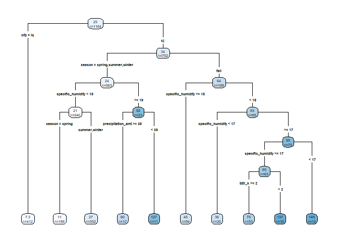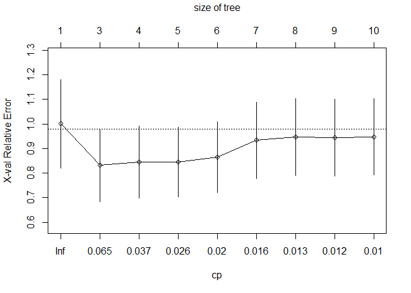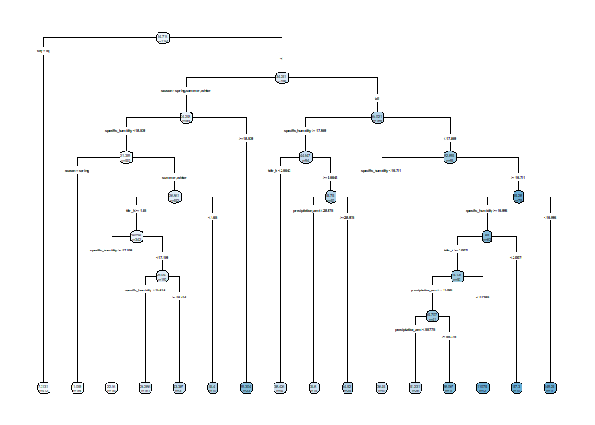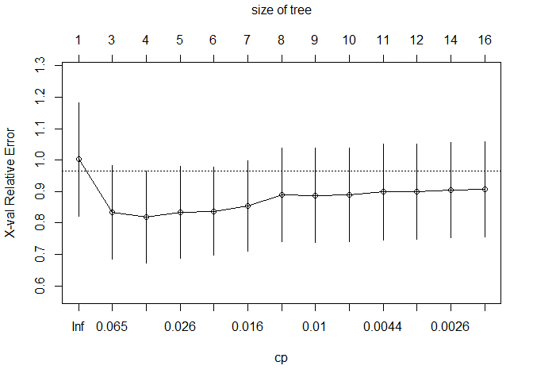

\#\#\#random forest

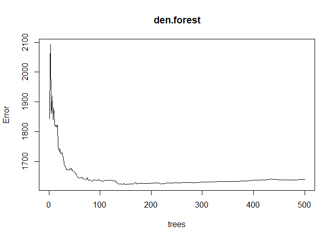

\#\#\#gradient-boosted trees

    ## Distribution not specified, assuming gaussian ...

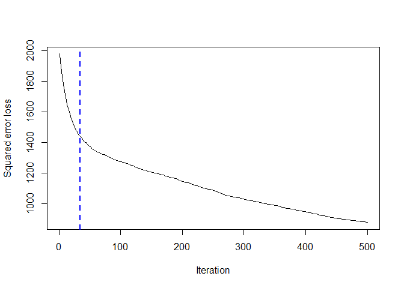

    ## [1] 34
    ## attr(,"smoother")
    ## Call:
    ## loess(formula = object$oobag.improve ~ x, enp.target = min(max(4, 
    ##     length(x)/10), 50))
    ## 
    ## Number of Observations: 500 
    ## Equivalent Number of Parameters: 39.85 
    ## Residual Standard Error: 2.033

\#\#\#Compare RMSE

    ## [1] 33.15642

    ## [1] 33.10716

    ## [1] 36.70296

\#\#\#According to the comparison of the above three RMSE values, we can
see that the RMSE of random forest is the smallest, which means that it
has a good performance in the testing data

\#\#\#Three partial dependence plots
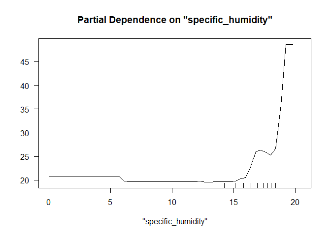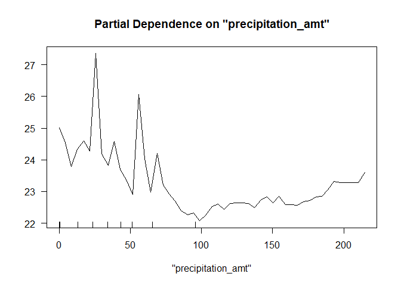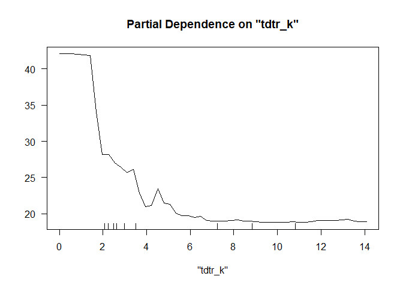

# Problem 3 - Predictive model building: green certification

### In this problem, we have to choose the best model to predict the rental renvenue from the variables provided. We plan to use modify the data in different models and then compare them to determine whether the model is a good option. We decided to use 5 models, including 1 regression model, and 4 tree models to perform the prediction. Once we have completed all the things, we will compare the rmse it generated and use some other analysis to help us make the final decision.

### The first thing we need to do is to clean the data by removing the non-exsiting data and create the variable “Revenue” that we want to use.

### Then we separate the data into testing group and training group in order to do the prediction better.

### We choose to use the stepwise method to perform the regression model

### model1: stepwise selection

    ## Start:  AIC=29308.49
    ## revenue ~ size + empl_gr + stories + age + renovated + class_a + 
    ##     class_b + green_rating + amenities + total_dd_07 + Precipitation + 
    ##     Gas_Costs + Electricity_Costs + City_Market_Rent
    ## 
    ##                                      Df Sum of Sq     RSS   AIC
    ## + size:City_Market_Rent               1     28410  645843 29041
    ## + size:Electricity_Costs              1     23538  650716 29088
    ## + stories:City_Market_Rent            1     17615  656639 29145
    ## + stories:Electricity_Costs           1     10722  663532 29210
    ## + class_a:City_Market_Rent            1      7120  667133 29244
    ## + amenities:City_Market_Rent          1      6290  667963 29252
    ## + size:total_dd_07                    1      4578  669675 29268
    ## + amenities:Electricity_Costs         1      4322  669931 29270
    ## + Electricity_Costs:City_Market_Rent  1      2968  671286 29283
    ## + empl_gr:Electricity_Costs           1      2951  671302 29283
    ## + stories:renovated                   1      2703  671550 29285
    ## + class_a:Electricity_Costs           1      2599  671655 29286
    ## + class_b:City_Market_Rent            1      2523  671730 29287
    ## + size:renovated                      1      2183  672071 29290
    ## + age:City_Market_Rent                1      2173  672081 29290
    ## + stories:total_dd_07                 1      2147  672106 29291
    ## + total_dd_07:Precipitation           1      1984  672269 29292
    ## + empl_gr:Gas_Costs                   1      1128  673125 29300
    ## + size:amenities                      1      1115  673139 29300
    ## + size:green_rating                   1      1098  673155 29300
    ## + green_rating:amenities              1      1031  673223 29301
    ## + class_a:total_dd_07                 1      1007  673247 29301
    ## + class_b:Electricity_Costs           1       903  673351 29302
    ## + empl_gr:class_a                     1       865  673389 29302
    ## + amenities:total_dd_07               1       844  673409 29303
    ## + empl_gr:total_dd_07                 1       793  673460 29303
    ## + age:renovated                       1       768  673485 29303
    ## + stories:green_rating                1       723  673531 29304
    ## + size:Gas_Costs                      1       680  673574 29304
    ## + stories:amenities                   1       651  673602 29304
    ## + stories:age                         1       642  673611 29305
    ## + empl_gr:class_b                     1       639  673615 29305
    ## + amenities:Gas_Costs                 1       633  673620 29305
    ## + Precipitation:Electricity_Costs     1       603  673651 29305
    ## + size:class_b                        1       583  673670 29305
    ## + renovated:Precipitation             1       575  673678 29305
    ## + green_rating:total_dd_07            1       537  673716 29305
    ## + renovated:amenities                 1       501  673753 29306
    ## + age:Precipitation                   1       498  673755 29306
    ## + renovated:class_a                   1       475  673778 29306
    ## + age:class_b                         1       461  673792 29306
    ## + class_a:amenities                   1       438  673816 29306
    ## - age                                 1         7  674260 29307
    ## - empl_gr                             1         8  674261 29307
    ## - Precipitation                       1        29  674282 29307
    ## - renovated                           1        41  674294 29307
    ## + age:class_a                         1       348  673905 29307
    ## + empl_gr:City_Market_Rent            1       339  673914 29307
    ## + amenities:Precipitation             1       333  673921 29307
    ## + green_rating:Precipitation          1       331  673923 29307
    ## - stories                             1       111  674364 29308
    ## + class_b:total_dd_07                 1       319  673934 29308
    ## + empl_gr:amenities                   1       314  673939 29308
    ## + Gas_Costs:City_Market_Rent          1       314  673939 29308
    ## + class_a:green_rating                1       304  673949 29308
    ## + size:stories                        1       304  673950 29308
    ## + empl_gr:Precipitation               1       251  674002 29308
    ## + age:green_rating                    1       249  674004 29308
    ## + stories:Gas_Costs                   1       241  674013 29308
    ## + stories:class_a                     1       240  674014 29308
    ## + renovated:City_Market_Rent          1       229  674025 29308
    ## <none>                                             674253 29308
    ## + class_a:Gas_Costs                   1       208  674045 29309
    ## + age:Electricity_Costs               1       195  674059 29309
    ## + class_b:amenities                   1       188  674065 29309
    ## + class_b:green_rating                1       181  674073 29309
    ## + green_rating:Electricity_Costs      1       180  674074 29309
    ## + empl_gr:age                         1       159  674094 29309
    ## + size:class_a                        1       143  674111 29309
    ## + class_a:Precipitation               1       121  674132 29309
    ## + age:amenities                       1       120  674133 29309
    ## + Precipitation:City_Market_Rent      1       114  674139 29309
    ## + age:Gas_Costs                       1       109  674144 29309
    ## + empl_gr:green_rating                1        95  674158 29310
    ## + Gas_Costs:Electricity_Costs         1        94  674160 29310
    ## + green_rating:City_Market_Rent       1        85  674169 29310
    ## + Precipitation:Gas_Costs             1        75  674178 29310
    ## + size:age                            1        74  674180 29310
    ## + stories:Precipitation               1        54  674199 29310
    ## + stories:class_b                     1        43  674211 29310
    ## + green_rating:Gas_Costs              1        40  674214 29310
    ## + renovated:Electricity_Costs         1        36  674217 29310
    ## + total_dd_07:Gas_Costs               1        27  674227 29310
    ## + class_b:Gas_Costs                   1        24  674229 29310
    ## + class_b:Precipitation               1        19  674235 29310
    ## + age:total_dd_07                     1        17  674236 29310
    ## + renovated:class_b                   1        17  674237 29310
    ## + total_dd_07:City_Market_Rent        1        12  674241 29310
    ## + renovated:green_rating              1        12  674241 29310
    ## + empl_gr:stories                     1        11  674242 29310
    ## + renovated:total_dd_07               1        11  674242 29310
    ## + size:Precipitation                  1         6  674248 29310
    ## + empl_gr:renovated                   1         5  674248 29310
    ## + renovated:Gas_Costs                 1         4  674250 29310
    ## + total_dd_07:Electricity_Costs       1         2  674251 29310
    ## + size:empl_gr                        1         0  674253 29310
    ## - green_rating                        1       960  675213 29315
    ## - Gas_Costs                           1      1144  675398 29317
    ## - amenities                           1      1978  676231 29325
    ## - Electricity_Costs                   1      2433  676686 29329
    ## - total_dd_07                         1      3911  678165 29343
    ## - size                                1      5952  680206 29361
    ## - class_b                             1      6312  680566 29365
    ## - class_a                             1     10531  684785 29403
    ## - City_Market_Rent                    1    407878 1082132 32266
    ## 
    ## Step:  AIC=29041.17
    ## revenue ~ size + empl_gr + stories + age + renovated + class_a + 
    ##     class_b + green_rating + amenities + total_dd_07 + Precipitation + 
    ##     Gas_Costs + Electricity_Costs + City_Market_Rent + size:City_Market_Rent
    ## 
    ##                                      Df Sum of Sq    RSS   AIC
    ## + empl_gr:Electricity_Costs           1    2254.6 643589 29021
    ## + size:Precipitation                  1    1861.1 643982 29025
    ## + size:Electricity_Costs              1    1283.1 644560 29031
    ## + stories:class_a                     1    1273.0 644570 29031
    ## + empl_gr:class_a                     1    1113.7 644730 29032
    ## + empl_gr:total_dd_07                 1    1051.2 644792 29033
    ## + size:stories                        1    1036.9 644806 29033
    ## + stories:Precipitation               1     999.2 644844 29034
    ## + total_dd_07:City_Market_Rent        1     958.9 644884 29034
    ## + size:amenities                      1     958.9 644884 29034
    ## + green_rating:amenities              1     846.2 644997 29035
    ## + amenities:Electricity_Costs         1     840.7 645003 29035
    ## + empl_gr:class_b                     1     788.7 645055 29036
    ## + size:total_dd_07                    1     787.4 645056 29036
    ## + amenities:Gas_Costs                 1     745.8 645098 29036
    ## + size:green_rating                   1     720.3 645123 29036
    ## + stories:renovated                   1     718.0 645125 29036
    ## + size:class_a                        1     709.6 645134 29036
    ## + stories:class_b                     1     669.3 645174 29037
    ## + class_a:Precipitation               1     658.7 645185 29037
    ## + empl_gr:City_Market_Rent            1     618.8 645225 29037
    ## + empl_gr:Gas_Costs                   1     607.9 645235 29037
    ## + Electricity_Costs:City_Market_Rent  1     586.1 645257 29038
    ## + age:renovated                       1     584.8 645258 29038
    ## + Precipitation:City_Market_Rent      1     576.8 645267 29038
    ## + stories:amenities                   1     529.4 645314 29038
    ## + stories:green_rating                1     445.2 645398 29039
    ## + renovated:Precipitation             1     444.9 645398 29039
    ## + renovated:City_Market_Rent          1     412.9 645430 29039
    ## - renovated                           1       0.9 645844 29039
    ## + empl_gr:Precipitation               1     401.5 645442 29039
    ## + class_a:amenities                   1     383.6 645460 29040
    ## + stories:Electricity_Costs           1     364.8 645479 29040
    ## + empl_gr:amenities                   1     361.7 645482 29040
    ## + age:City_Market_Rent                1     361.0 645482 29040
    ## + amenities:Precipitation             1     360.6 645483 29040
    ## + total_dd_07:Electricity_Costs       1     355.4 645488 29040
    ## + total_dd_07:Precipitation           1     329.6 645514 29040
    ## - Precipitation                       1      97.2 645941 29040
    ## + age:Precipitation                   1     312.1 645531 29040
    ## - empl_gr                             1     101.4 645945 29040
    ## + amenities:City_Market_Rent          1     306.9 645536 29040
    ## + green_rating:Precipitation          1     283.7 645560 29040
    ## - age                                 1     153.1 645996 29041
    ## + renovated:amenities                 1     255.7 645588 29041
    ## + class_a:total_dd_07                 1     253.7 645590 29041
    ## + green_rating:total_dd_07            1     252.9 645590 29041
    ## + age:green_rating                    1     249.0 645594 29041
    ## + class_b:amenities                   1     224.9 645618 29041
    ## + empl_gr:age                         1     223.2 645620 29041
    ## <none>                                            645843 29041
    ## + Precipitation:Gas_Costs             1     204.0 645639 29041
    ## + size:class_b                        1     200.0 645643 29041
    ## + class_a:green_rating                1     191.7 645652 29041
    ## + stories:total_dd_07                 1     179.5 645664 29041
    ## + Gas_Costs:Electricity_Costs         1     159.8 645683 29042
    ## + class_b:Precipitation               1     157.4 645686 29042
    ## + size:empl_gr                        1     151.1 645692 29042
    ## + class_a:Gas_Costs                   1     150.9 645692 29042
    ## + Gas_Costs:City_Market_Rent          1     135.8 645708 29042
    ## + renovated:class_a                   1     135.4 645708 29042
    ## - Gas_Costs                           1     278.6 646122 29042
    ## + empl_gr:green_rating                1     101.3 645742 29042
    ## + amenities:total_dd_07               1      94.5 645749 29042
    ## + age:class_b                         1      93.6 645750 29042
    ## + class_b:green_rating                1      93.6 645750 29042
    ## + stories:age                         1      86.4 645757 29042
    ## + class_b:total_dd_07                 1      77.7 645766 29042
    ## + renovated:class_b                   1      75.1 645768 29042
    ## + age:total_dd_07                     1      74.4 645769 29043
    ## + class_a:City_Market_Rent            1      69.8 645773 29043
    ## + renovated:total_dd_07               1      66.1 645777 29043
    ## + size:renovated                      1      63.2 645780 29043
    ## + age:Electricity_Costs               1      58.1 645785 29043
    ## + green_rating:Electricity_Costs      1      53.0 645790 29043
    ## + total_dd_07:Gas_Costs               1      49.3 645794 29043
    ## + green_rating:Gas_Costs              1      48.3 645795 29043
    ## + Precipitation:Electricity_Costs     1      40.6 645803 29043
    ## + class_a:Electricity_Costs           1      39.1 645804 29043
    ## + renovated:green_rating              1      29.9 645813 29043
    ## + stories:Gas_Costs                   1      29.8 645813 29043
    ## + age:Gas_Costs                       1      29.1 645814 29043
    ## + class_b:City_Market_Rent            1      12.9 645830 29043
    ## + size:Gas_Costs                      1      10.8 645833 29043
    ## + stories:City_Market_Rent            1       7.4 645836 29043
    ## + renovated:Gas_Costs                 1       6.1 645837 29043
    ## + empl_gr:stories                     1       5.6 645838 29043
    ## + empl_gr:renovated                   1       5.2 645838 29043
    ## + green_rating:City_Market_Rent       1       4.2 645839 29043
    ## + renovated:Electricity_Costs         1       3.0 645840 29043
    ## + class_b:Electricity_Costs           1       1.1 645842 29043
    ## + age:class_a                         1       1.0 645842 29043
    ## + size:age                            1       0.2 645843 29043
    ## + age:amenities                       1       0.0 645843 29043
    ## + class_b:Gas_Costs                   1       0.0 645843 29043
    ## - Electricity_Costs                   1     521.9 646365 29044
    ## - stories                             1     537.5 646381 29044
    ## - green_rating                        1     999.8 646843 29049
    ## - total_dd_07                         1    1336.8 647180 29052
    ## - amenities                           1    2104.5 647948 29060
    ## - class_b                             1    6367.4 652211 29101
    ## - class_a                             1    9809.4 655653 29134
    ## - size:City_Market_Rent               1   28410.1 674253 29309
    ## 
    ## Step:  AIC=29021.29
    ## revenue ~ size + empl_gr + stories + age + renovated + class_a + 
    ##     class_b + green_rating + amenities + total_dd_07 + Precipitation + 
    ##     Gas_Costs + Electricity_Costs + City_Market_Rent + size:City_Market_Rent + 
    ##     empl_gr:Electricity_Costs
    ## 
    ##                                      Df Sum of Sq    RSS   AIC
    ## + size:Precipitation                  1    2141.6 641447 29002
    ## + total_dd_07:City_Market_Rent        1    1378.4 642210 29010
    ## + stories:class_a                     1    1334.0 642255 29010
    ## + size:Electricity_Costs              1    1237.0 642352 29011
    ## + stories:Precipitation               1    1142.3 642446 29012
    ## + size:stories                        1    1066.8 642522 29013
    ## + size:amenities                      1     875.7 642713 29015
    ## + amenities:Electricity_Costs         1     834.3 642754 29015
    ## + empl_gr:class_a                     1     819.6 642769 29015
    ## + size:total_dd_07                    1     796.6 642792 29016
    ## + green_rating:amenities              1     771.2 642818 29016
    ## + size:class_a                        1     719.6 642869 29016
    ## + empl_gr:class_b                     1     714.9 642874 29016
    ## + size:green_rating                   1     690.6 642898 29017
    ## + stories:class_b                     1     688.6 642900 29017
    ## + Precipitation:City_Market_Rent      1     667.5 642921 29017
    ## + stories:renovated                   1     656.6 642932 29017
    ## + class_a:Precipitation               1     641.2 642948 29017
    ## + amenities:Gas_Costs                 1     571.4 643017 29018
    ## + age:renovated                       1     555.0 643034 29018
    ## + empl_gr:Precipitation               1     519.7 643069 29018
    ## + size:empl_gr                        1     509.1 643080 29018
    ## + stories:amenities                   1     501.1 643088 29018
    ## + class_a:amenities                   1     500.6 643088 29018
    ## + age:City_Market_Rent                1     475.3 643113 29019
    ## + renovated:Precipitation             1     446.5 643142 29019
    ## + stories:green_rating                1     444.7 643144 29019
    ## - renovated                           1      17.7 643606 29020
    ## + green_rating:Precipitation          1     371.3 643217 29020
    ## + renovated:City_Market_Rent          1     369.5 643219 29020
    ## + class_a:total_dd_07                 1     367.9 643221 29020
    ## + stories:Electricity_Costs           1     353.6 643235 29020
    ## + Electricity_Costs:City_Market_Rent  1     345.8 643243 29020
    ## + amenities:Precipitation             1     342.7 643246 29020
    ## + age:Precipitation                   1     299.5 643289 29020
    ## + Gas_Costs:City_Market_Rent          1     277.3 643311 29021
    ## + amenities:City_Market_Rent          1     272.1 643317 29021
    ## + total_dd_07:Electricity_Costs       1     253.9 643335 29021
    ## + class_b:amenities                   1     248.3 643340 29021
    ## + Precipitation:Electricity_Costs     1     247.7 643341 29021
    ## + age:green_rating                    1     245.3 643343 29021
    ## + green_rating:total_dd_07            1     239.8 643349 29021
    ## + renovated:amenities                 1     238.8 643350 29021
    ## + empl_gr:amenities                   1     238.7 643350 29021
    ## <none>                                            643589 29021
    ## + size:class_b                        1     204.0 643385 29021
    ## + class_b:Precipitation               1     190.5 643398 29021
    ## - age                                 1     240.1 643829 29022
    ## + empl_gr:green_rating                1     164.4 643424 29022
    ## + stories:total_dd_07                 1     164.4 643424 29022
    ## + class_a:Gas_Costs                   1     160.3 643428 29022
    ## + empl_gr:stories                     1     156.7 643432 29022
    ## + amenities:total_dd_07               1     154.4 643434 29022
    ## - Precipitation                       1     267.5 643856 29022
    ## + class_a:green_rating                1     140.8 643448 29022
    ## + renovated:class_a                   1     134.3 643454 29022
    ## + class_b:total_dd_07                 1     108.8 643480 29022
    ## + stories:age                         1     105.6 643483 29022
    ## + age:class_b                         1     104.7 643484 29022
    ## + renovated:total_dd_07               1      87.7 643501 29022
    ## + Precipitation:Gas_Costs             1      85.1 643504 29023
    ## + class_a:City_Market_Rent            1      82.2 643507 29023
    ## - Gas_Costs                           1     333.7 643922 29023
    ## + class_b:green_rating                1      76.4 643512 29023
    ## + renovated:class_b                   1      76.1 643513 29023
    ## + class_a:Electricity_Costs           1      66.9 643522 29023
    ## + green_rating:Gas_Costs              1      56.0 643533 29023
    ## + size:renovated                      1      50.2 643538 29023
    ## + green_rating:Electricity_Costs      1      47.2 643541 29023
    ## + stories:Gas_Costs                   1      45.9 643543 29023
    ## + empl_gr:age                         1      42.9 643546 29023
    ## + age:total_dd_07                     1      40.4 643548 29023
    ## + total_dd_07:Precipitation           1      38.5 643550 29023
    ## + age:Electricity_Costs               1      29.4 643559 29023
    ## + stories:City_Market_Rent            1      28.0 643561 29023
    ## + age:Gas_Costs                       1      21.5 643567 29023
    ## + renovated:green_rating              1      21.5 643567 29023
    ## + Gas_Costs:Electricity_Costs         1      18.7 643570 29023
    ## + empl_gr:Gas_Costs                   1      16.2 643572 29023
    ## + empl_gr:City_Market_Rent            1      15.5 643573 29023
    ## + renovated:Gas_Costs                 1      12.2 643577 29023
    ## + total_dd_07:Gas_Costs               1      12.1 643577 29023
    ## + empl_gr:total_dd_07                 1       6.9 643582 29023
    ## + empl_gr:renovated                   1       5.0 643584 29023
    ## + class_b:City_Market_Rent            1       4.8 643584 29023
    ## + renovated:Electricity_Costs         1       4.2 643585 29023
    ## + size:Gas_Costs                      1       2.8 643586 29023
    ## + age:amenities                       1       2.2 643586 29023
    ## + green_rating:City_Market_Rent       1       1.2 643587 29023
    ## + age:class_a                         1       1.1 643588 29023
    ## + size:age                            1       0.7 643588 29023
    ## + class_b:Gas_Costs                   1       0.0 643589 29023
    ## + class_b:Electricity_Costs           1       0.0 643589 29023
    ## - stories                             1     483.8 644073 29024
    ## - total_dd_07                         1     529.4 644118 29024
    ## - green_rating                        1     897.1 644486 29028
    ## - empl_gr:Electricity_Costs           1    2254.6 645843 29041
    ## - amenities                           1    2379.6 645968 29042
    ## - class_b                             1    6064.7 649653 29078
    ## - class_a                             1    9691.7 653280 29113
    ## - size:City_Market_Rent               1   27713.2 671302 29283
    ## 
    ## Step:  AIC=29002.44
    ## revenue ~ size + empl_gr + stories + age + renovated + class_a + 
    ##     class_b + green_rating + amenities + total_dd_07 + Precipitation + 
    ##     Gas_Costs + Electricity_Costs + City_Market_Rent + size:City_Market_Rent + 
    ##     empl_gr:Electricity_Costs + size:Precipitation
    ## 
    ##                                      Df Sum of Sq    RSS   AIC
    ## + total_dd_07:City_Market_Rent        1    1439.4 640008 28990
    ## + size:Gas_Costs                      1    1310.0 640137 28992
    ## + stories:class_a                     1    1299.6 640147 28992
    ## + amenities:Gas_Costs                 1    1038.1 640409 28994
    ## + stories:Gas_Costs                   1     965.5 640481 28995
    ## + Precipitation:City_Market_Rent      1     900.0 640547 28996
    ## + size:green_rating                   1     842.7 640604 28996
    ## + green_rating:amenities              1     807.7 640639 28997
    ## + size:class_a                        1     714.2 640733 28998
    ## + size:stories                        1     677.5 640770 28998
    ## + size:amenities                      1     674.6 640772 28998
    ## + stories:class_b                     1     671.0 640776 28998
    ## + empl_gr:class_a                     1     645.2 640802 28998
    ## + empl_gr:class_b                     1     629.2 640818 28998
    ## + class_a:Gas_Costs                   1     615.9 640831 28998
    ## + stories:renovated                   1     595.2 640852 28999
    ## + age:renovated                       1     554.1 640893 28999
    ## + stories:green_rating                1     534.4 640913 28999
    ## + Gas_Costs:City_Market_Rent          1     529.2 640918 28999
    ## + class_a:amenities                   1     517.0 640930 28999
    ## + renovated:City_Market_Rent          1     477.1 640970 29000
    ## + amenities:Electricity_Costs         1     457.4 640990 29000
    ## + empl_gr:Precipitation               1     410.0 641037 29000
    ## + stories:amenities                   1     405.7 641041 29001
    ## - renovated                           1       9.0 641456 29001
    ## + total_dd_07:Electricity_Costs       1     396.8 641050 29001
    ## + renovated:Precipitation             1     385.8 641061 29001
    ## + Precipitation:Electricity_Costs     1     380.4 641067 29001
    ## + age:City_Market_Rent                1     364.3 641083 29001
    ## + Electricity_Costs:City_Market_Rent  1     319.9 641127 29001
    ## + class_b:amenities                   1     285.3 641162 29002
    ## - stories                             1     160.1 641607 29002
    ## + age:green_rating                    1     224.6 641222 29002
    ## + green_rating:total_dd_07            1     223.1 641224 29002
    ## + renovated:amenities                 1     219.3 641228 29002
    ## + size:class_b                        1     213.4 641234 29002
    ## + green_rating:Precipitation          1     206.2 641241 29002
    ## <none>                                            641447 29002
    ## + size:Electricity_Costs              1     202.1 641245 29003
    ## + amenities:City_Market_Rent          1     190.2 641257 29003
    ## + size:empl_gr                        1     172.0 641275 29003
    ## + class_a:green_rating                1     153.1 641294 29003
    ## + empl_gr:amenities                   1     140.6 641306 29003
    ## - age                                 1     271.4 641718 29003
    ## + stories:age                         1     132.2 641315 29003
    ## + empl_gr:green_rating                1     127.7 641319 29003
    ## + age:total_dd_07                     1     126.0 641321 29003
    ## + age:class_b                         1     121.7 641325 29003
    ## + age:Electricity_Costs               1     120.1 641327 29003
    ## + renovated:class_a                   1     106.2 641341 29003
    ## + stories:total_dd_07                 1      92.0 641355 29004
    ## + stories:City_Market_Rent            1      85.7 641361 29004
    ## + class_a:total_dd_07                 1      85.6 641361 29004
    ## + Precipitation:Gas_Costs             1      84.0 641363 29004
    ## + class_b:green_rating                1      83.0 641364 29004
    ## + renovated:class_b                   1      81.3 641366 29004
    ## + renovated:total_dd_07               1      78.5 641369 29004
    ## + stories:Precipitation               1      77.9 641369 29004
    ## + class_b:Gas_Costs                   1      61.7 641385 29004
    ## + class_a:City_Market_Rent            1      51.2 641396 29004
    ## + empl_gr:Gas_Costs                   1      50.5 641397 29004
    ## + empl_gr:City_Market_Rent            1      47.7 641399 29004
    ## + size:renovated                      1      40.7 641406 29004
    ## + renovated:green_rating              1      29.5 641418 29004
    ## + age:Precipitation                   1      29.3 641418 29004
    ## + empl_gr:age                         1      26.0 641421 29004
    ## + empl_gr:stories                     1      25.8 641421 29004
    ## + green_rating:Gas_Costs              1      23.1 641424 29004
    ## + class_b:total_dd_07                 1      22.7 641424 29004
    ## + green_rating:Electricity_Costs      1      21.7 641425 29004
    ## + class_a:Precipitation               1      21.0 641426 29004
    ## + empl_gr:total_dd_07                 1      18.4 641429 29004
    ## + class_b:Electricity_Costs           1      14.6 641432 29004
    ## + renovated:Gas_Costs                 1      13.3 641434 29004
    ## + amenities:total_dd_07               1      12.5 641435 29004
    ## + total_dd_07:Gas_Costs               1      12.2 641435 29004
    ## + age:amenities                       1      11.9 641435 29004
    ## + size:age                            1       8.7 641438 29004
    ## + Gas_Costs:Electricity_Costs         1       7.7 641439 29004
    ## + age:Gas_Costs                       1       7.0 641440 29004
    ## + stories:Electricity_Costs           1       5.8 641441 29004
    ## + empl_gr:renovated                   1       5.6 641441 29004
    ## + class_b:City_Market_Rent            1       3.5 641444 29004
    ## + size:total_dd_07                    1       2.7 641444 29004
    ## + renovated:Electricity_Costs         1       1.0 641446 29004
    ## + class_a:Electricity_Costs           1       0.9 641446 29004
    ## + amenities:Precipitation             1       0.8 641446 29004
    ## + total_dd_07:Precipitation           1       0.5 641446 29004
    ## + class_b:Precipitation               1       0.4 641447 29004
    ## + age:class_a                         1       0.3 641447 29004
    ## + green_rating:City_Market_Rent       1       0.3 641447 29004
    ## - Gas_Costs                           1     440.4 641887 29005
    ## - total_dd_07                         1     578.1 642025 29006
    ## - green_rating                        1     781.8 642229 29008
    ## - size:Precipitation                  1    2141.6 643589 29021
    ## - amenities                           1    2183.3 643630 29022
    ## - empl_gr:Electricity_Costs           1    2535.1 643982 29025
    ## - class_b                             1    6285.5 647733 29061
    ## - class_a                             1    9350.8 650798 29091
    ## - size:City_Market_Rent               1   29852.6 671300 29285
    ## 
    ## Step:  AIC=28990.39
    ## revenue ~ size + empl_gr + stories + age + renovated + class_a + 
    ##     class_b + green_rating + amenities + total_dd_07 + Precipitation + 
    ##     Gas_Costs + Electricity_Costs + City_Market_Rent + size:City_Market_Rent + 
    ##     empl_gr:Electricity_Costs + size:Precipitation + total_dd_07:City_Market_Rent
    ## 
    ##                                      Df Sum of Sq    RSS   AIC
    ## + size:Gas_Costs                      1    1324.9 638683 28979
    ## + stories:class_a                     1    1219.4 638788 28981
    ## + amenities:Gas_Costs                 1    1159.4 638848 28981
    ## + stories:Gas_Costs                   1     893.9 639114 28984
    ## + green_rating:amenities              1     871.0 639137 28984
    ## + size:green_rating                   1     832.0 639176 28984
    ## + size:stories                        1     706.2 639301 28986
    ## + size:class_a                        1     684.8 639323 28986
    ## + size:amenities                      1     680.4 639327 28986
    ## + empl_gr:class_a                     1     679.9 639328 28986
    ## + empl_gr:class_b                     1     671.2 639336 28986
    ## + class_a:Gas_Costs                   1     656.7 639351 28986
    ## + stories:renovated                   1     613.4 639394 28986
    ## + stories:class_b                     1     604.7 639403 28987
    ## + class_a:amenities                   1     540.2 639467 28987
    ## + stories:green_rating                1     539.1 639469 28987
    ## + age:renovated                       1     532.3 639475 28987
    ## + amenities:Electricity_Costs         1     416.0 639592 28988
    ## + empl_gr:Precipitation               1     412.7 639595 28988
    ## - renovated                           1       4.9 640013 28988
    ## + renovated:City_Market_Rent          1     400.8 639607 28989
    ## + stories:amenities                   1     396.7 639611 28989
    ## + age:Electricity_Costs               1     327.2 639680 28989
    ## + class_b:amenities                   1     314.8 639693 28989
    ## + age:total_dd_07                     1     268.7 639739 28990
    ## + renovated:Precipitation             1     242.3 639765 28990
    ## + green_rating:Precipitation          1     231.0 639777 28990
    ## + age:green_rating                    1     222.2 639785 28990
    ## + size:Electricity_Costs              1     219.4 639788 28990
    ## - stories                             1     199.6 640207 28990
    ## <none>                                            640008 28990
    ## + renovated:amenities                 1     198.0 639810 28991
    ## + size:empl_gr                        1     197.4 639810 28991
    ## + green_rating:total_dd_07            1     193.7 639814 28991
    ## + size:class_b                        1     193.6 639814 28991
    ## + total_dd_07:Precipitation           1     180.4 639827 28991
    ## + class_a:green_rating                1     178.2 639829 28991
    ## + age:class_b                         1     157.2 639850 28991
    ## + empl_gr:green_rating                1     147.0 639861 28991
    ## + empl_gr:amenities                   1     142.4 639865 28991
    ## + stories:age                         1     127.3 639880 28991
    ## + amenities:City_Market_Rent          1     119.6 639888 28991
    ## + class_b:green_rating                1     101.4 639906 28991
    ## + stories:Precipitation               1     101.0 639907 28991
    ## + renovated:class_b                   1      93.6 639914 28992
    ## + renovated:class_a                   1      82.8 639925 28992
    ## + age:City_Market_Rent                1      82.5 639925 28992
    ## + Electricity_Costs:City_Market_Rent  1      73.1 639935 28992
    ## + class_b:Gas_Costs                   1      68.3 639939 28992
    ## - age                                 1     348.3 640356 28992
    ## + class_b:City_Market_Rent            1      59.6 639948 28992
    ## + empl_gr:Gas_Costs                   1      49.0 639959 28992
    ## + Gas_Costs:Electricity_Costs         1      47.9 639960 28992
    ## + class_b:Electricity_Costs           1      45.0 639963 28992
    ## + stories:total_dd_07                 1      41.3 639966 28992
    ## + empl_gr:age                         1      40.4 639967 28992
    ## + Precipitation:Electricity_Costs     1      39.1 639968 28992
    ## + stories:Electricity_Costs           1      36.8 639971 28992
    ## + size:renovated                      1      36.1 639972 28992
    ## + renovated:green_rating              1      32.8 639975 28992
    ## + Precipitation:Gas_Costs             1      31.2 639976 28992
    ## + green_rating:Gas_Costs              1      25.6 639982 28992
    ## + empl_gr:City_Market_Rent            1      24.4 639983 28992
    ## + empl_gr:stories                     1      24.2 639983 28992
    ## + renovated:Gas_Costs                 1      22.2 639985 28992
    ## + Gas_Costs:City_Market_Rent          1      20.7 639987 28992
    ## + size:total_dd_07                    1      20.1 639987 28992
    ## + green_rating:City_Market_Rent       1      19.7 639988 28992
    ## + class_a:total_dd_07                 1      18.8 639989 28992
    ## + empl_gr:total_dd_07                 1      17.6 639990 28992
    ## + amenities:total_dd_07               1      16.3 639991 28992
    ## + renovated:total_dd_07               1      16.0 639992 28992
    ## + age:Precipitation                   1      13.7 639994 28992
    ## + age:Gas_Costs                       1      11.7 639996 28992
    ## + renovated:Electricity_Costs         1      10.9 639997 28992
    ## + age:class_a                         1       9.0 639999 28992
    ## + class_a:Electricity_Costs           1       8.9 639999 28992
    ## + age:amenities                       1       8.5 639999 28992
    ## + Precipitation:City_Market_Rent      1       7.9 640000 28992
    ## + size:age                            1       7.4 640000 28992
    ## + empl_gr:renovated                   1       5.5 640002 28992
    ## + green_rating:Electricity_Costs      1       5.0 640003 28992
    ## + amenities:Precipitation             1       1.8 640006 28992
    ## + class_b:total_dd_07                 1       1.5 640006 28992
    ## + class_a:Precipitation               1       1.4 640006 28992
    ## + class_b:Precipitation               1       1.3 640006 28992
    ## + stories:City_Market_Rent            1       1.2 640006 28992
    ## + total_dd_07:Gas_Costs               1       1.1 640006 28992
    ## + class_a:City_Market_Rent            1       0.8 640007 28992
    ## + total_dd_07:Electricity_Costs       1       0.4 640007 28992
    ## - Gas_Costs                           1     726.4 640734 28996
    ## - green_rating                        1     757.9 640765 28996
    ## - total_dd_07:City_Market_Rent        1    1439.4 641447 29002
    ## - size:Precipitation                  1    2202.7 642210 29010
    ## - amenities                           1    2389.5 642397 29012
    ## - empl_gr:Electricity_Costs           1    2990.4 642998 29018
    ## - class_b                             1    6295.2 646303 29050
    ## - class_a                             1    9014.4 649022 29076
    ## - size:City_Market_Rent               1   31279.9 671288 29287
    ## 
    ## Step:  AIC=28979.42
    ## revenue ~ size + empl_gr + stories + age + renovated + class_a + 
    ##     class_b + green_rating + amenities + total_dd_07 + Precipitation + 
    ##     Gas_Costs + Electricity_Costs + City_Market_Rent + size:City_Market_Rent + 
    ##     empl_gr:Electricity_Costs + size:Precipitation + total_dd_07:City_Market_Rent + 
    ##     size:Gas_Costs
    ## 
    ##                                      Df Sum of Sq    RSS   AIC
    ## + stories:class_a                     1      1317 637365 28969
    ## + size:green_rating                   1       928 637755 28972
    ## + green_rating:amenities              1       894 637788 28973
    ## + size:class_a                        1       828 637855 28973
    ## + stories:class_b                     1       703 637980 28975
    ## + empl_gr:class_b                     1       605 638077 28976
    ## + class_a:amenities                   1       597 638086 28976
    ## + empl_gr:class_a                     1       584 638099 28976
    ## + stories:green_rating                1       572 638111 28976
    ## + amenities:Gas_Costs                 1       572 638111 28976
    ## + size:amenities                      1       556 638127 28976
    ## + age:renovated                       1       551 638132 28976
    ## + stories:renovated                   1       479 638204 28977
    ## + renovated:City_Market_Rent          1       414 638269 28977
    ## + size:stories                        1       408 638275 28977
    ## + age:Electricity_Costs               1       406 638276 28977
    ## - renovated                           1         5 638688 28978
    ## + class_b:amenities                   1       396 638287 28978
    ## + empl_gr:Precipitation               1       356 638327 28978
    ## + stories:amenities                   1       322 638361 28978
    ## + amenities:Electricity_Costs         1       318 638365 28978
    ## - stories                             1       112 638795 28979
    ## + size:class_b                        1       288 638395 28979
    ## + age:total_dd_07                     1       269 638413 28979
    ## + age:green_rating                    1       249 638434 28979
    ## + green_rating:Precipitation          1       247 638435 28979
    ## + renovated:Precipitation             1       223 638459 28979
    ## + green_rating:total_dd_07            1       213 638470 28979
    ## <none>                                            638683 28979
    ## + class_a:green_rating                1       179 638504 28980
    ## + stories:age                         1       171 638512 28980
    ## + renovated:amenities                 1       160 638523 28980
    ## + stories:total_dd_07                 1       156 638526 28980
    ## + age:class_b                         1       152 638531 28980
    ## + total_dd_07:Precipitation           1       136 638546 28980
    ## + amenities:City_Market_Rent          1       127 638555 28980
    ## + empl_gr:green_rating                1       123 638560 28980
    ## + class_a:Gas_Costs                   1       118 638565 28980
    ## + age:City_Market_Rent                1       107 638576 28980
    ## + class_b:green_rating                1       102 638581 28980
    ## + stories:Gas_Costs                   1       100 638582 28980
    ## + size:empl_gr                        1       100 638583 28980
    ## + renovated:class_b                   1        96 638586 28981
    ## + empl_gr:amenities                   1        95 638588 28981
    ## + renovated:Gas_Costs                 1        77 638606 28981
    ## + stories:Precipitation               1        77 638606 28981
    ## + empl_gr:Gas_Costs                   1        75 638608 28981
    ## + renovated:class_a                   1        71 638611 28981
    ## + class_a:Electricity_Costs           1        62 638621 28981
    ## + class_b:Electricity_Costs           1        57 638626 28981
    ## - age                                 1       352 639035 28981
    ## + class_b:City_Market_Rent            1        49 638634 28981
    ## + empl_gr:City_Market_Rent            1        48 638635 28981
    ## + Precipitation:Gas_Costs             1        45 638638 28981
    ## + Electricity_Costs:City_Market_Rent  1        42 638641 28981
    ## + Precipitation:Electricity_Costs     1        42 638641 28981
    ## + age:Gas_Costs                       1        39 638643 28981
    ## + class_a:Precipitation               1        39 638644 28981
    ## + size:age                            1        36 638646 28981
    ## + green_rating:Gas_Costs              1        36 638647 28981
    ## + Gas_Costs:City_Market_Rent          1        35 638648 28981
    ## + size:total_dd_07                    1        34 638649 28981
    ## + age:Precipitation                   1        33 638650 28981
    ## + renovated:green_rating              1        31 638651 28981
    ## + empl_gr:age                         1        31 638652 28981
    ## + Precipitation:City_Market_Rent      1        23 638660 28981
    ## + renovated:total_dd_07               1        22 638661 28981
    ## + green_rating:City_Market_Rent       1        21 638661 28981
    ## + class_a:total_dd_07                 1        19 638664 28981
    ## + amenities:Precipitation             1        18 638665 28981
    ## + amenities:total_dd_07               1        12 638670 28981
    ## + age:amenities                       1        12 638671 28981
    ## + empl_gr:total_dd_07                 1        11 638672 28981
    ## + age:class_a                         1        11 638672 28981
    ## + green_rating:Electricity_Costs      1        10 638673 28981
    ## + size:renovated                      1         8 638675 28981
    ## + stories:Electricity_Costs           1         7 638675 28981
    ## + empl_gr:renovated                   1         7 638676 28981
    ## + class_a:City_Market_Rent            1         6 638677 28981
    ## + class_b:Gas_Costs                   1         4 638679 28981
    ## + total_dd_07:Electricity_Costs       1         3 638680 28981
    ## + Gas_Costs:Electricity_Costs         1         3 638680 28981
    ## + class_b:Precipitation               1         2 638680 28981
    ## + class_b:total_dd_07                 1         2 638681 28981
    ## + empl_gr:stories                     1         1 638682 28981
    ## + total_dd_07:Gas_Costs               1         1 638682 28981
    ## + renovated:Electricity_Costs         1         0 638682 28981
    ## + size:Electricity_Costs              1         0 638683 28981
    ## + stories:City_Market_Rent            1         0 638683 28981
    ## - green_rating                        1       751 639434 28985
    ## - size:Gas_Costs                      1      1325 640008 28990
    ## - total_dd_07:City_Market_Rent        1      1454 640137 28992
    ## - amenities                           1      2300 640983 29000
    ## - empl_gr:Electricity_Costs           1      3015 641698 29007
    ## - size:Precipitation                  1      3525 642208 29012
    ## - class_b                             1      6048 644731 29036
    ## - class_a                             1      8179 646862 29057
    ## - size:City_Market_Rent               1     31632 670314 29280
    ## 
    ## Step:  AIC=28968.51
    ## revenue ~ size + empl_gr + stories + age + renovated + class_a + 
    ##     class_b + green_rating + amenities + total_dd_07 + Precipitation + 
    ##     Gas_Costs + Electricity_Costs + City_Market_Rent + size:City_Market_Rent + 
    ##     empl_gr:Electricity_Costs + size:Precipitation + total_dd_07:City_Market_Rent + 
    ##     size:Gas_Costs + stories:class_a
    ## 
    ##                                      Df Sum of Sq    RSS   AIC
    ## + stories:renovated                   1       819 636547 28963
    ## + green_rating:amenities              1       796 636569 28963
    ## + size:green_rating                   1       694 636672 28964
    ## + amenities:Gas_Costs                 1       639 636727 28964
    ## + age:renovated                       1       531 636834 28965
    ## + empl_gr:Precipitation               1       490 636875 28966
    ## + empl_gr:class_b                     1       486 636879 28966
    ## + empl_gr:class_a                     1       453 636912 28966
    ## + renovated:City_Market_Rent          1       447 636919 28966
    ## - renovated                           1         1 637366 28967
    ## + age:Electricity_Costs               1       407 636959 28967
    ## + stories:green_rating                1       364 637002 28967
    ## + amenities:Electricity_Costs         1       322 637044 28967
    ## + age:total_dd_07                     1       310 637055 28968
    ## + age:green_rating                    1       294 637071 28968
    ## + size:amenities                      1       277 637088 28968
    ## + age:class_b                         1       274 637092 28968
    ## + class_a:amenities                   1       257 637108 28968
    ## + class_a:green_rating                1       229 637137 28968
    ## + stories:class_b                     1       222 637144 28968
    ## + renovated:Precipitation             1       217 637149 28968
    ## + green_rating:Precipitation          1       215 637151 28968
    ## + renovated:class_b                   1       205 637160 28969
    ## <none>                                            637365 28969
    ## + total_dd_07:Precipitation           1       203 637163 28969
    ## + renovated:amenities                 1       198 637167 28969
    ## + class_a:Electricity_Costs           1       186 637179 28969
    ## + green_rating:total_dd_07            1       171 637194 28969
    ## + class_b:amenities                   1       169 637196 28969
    ## + class_b:green_rating                1       151 637214 28969
    ## + class_b:Electricity_Costs           1       148 637217 28969
    ## + amenities:City_Market_Rent          1       136 637230 28969
    ## + stories:Gas_Costs                   1       123 637242 28969
    ## + class_a:Gas_Costs                   1       122 637243 28969
    ## + stories:total_dd_07                 1       120 637246 28969
    ## + empl_gr:green_rating                1       109 637257 28969
    ## + class_b:City_Market_Rent            1       107 637259 28970
    ## + size:class_b                        1        99 637267 28970
    ## + stories:Precipitation               1        91 637275 28970
    ## + empl_gr:Gas_Costs                   1        88 637277 28970
    ## + Electricity_Costs:City_Market_Rent  1        81 637284 28970
    ## + age:Gas_Costs                       1        81 637284 28970
    ## + size:age                            1        80 637285 28970
    ## + age:City_Market_Rent                1        78 637287 28970
    ## + stories:amenities                   1        78 637288 28970
    ## + renovated:Gas_Costs                 1        75 637291 28970
    ## + size:empl_gr                        1        73 637293 28970
    ## + age:class_a                         1        67 637298 28970
    ## + empl_gr:amenities                   1        66 637300 28970
    ## + class_b:total_dd_07                 1        60 637305 28970
    ## + size:stories                        1        53 637312 28970
    ## + stories:age                         1        52 637313 28970
    ## + Gas_Costs:City_Market_Rent          1        45 637321 28970
    ## + green_rating:Gas_Costs              1        38 637328 28970
    ## + empl_gr:City_Market_Rent            1        37 637329 28970
    ## + Precipitation:Gas_Costs             1        36 637329 28970
    ## + class_a:total_dd_07                 1        31 637334 28970
    ## + green_rating:City_Market_Rent       1        31 637335 28970
    ## + age:Precipitation                   1        30 637335 28970
    ## + Precipitation:Electricity_Costs     1        30 637336 28970
    ## + size:renovated                      1        29 637336 28970
    ## + class_b:Precipitation               1        27 637339 28970
    ## + empl_gr:age                         1        27 637339 28970
    ## + empl_gr:total_dd_07                 1        27 637339 28970
    ## + size:total_dd_07                    1        25 637340 28970
    ## + stories:City_Market_Rent            1        25 637341 28970
    ## + renovated:green_rating              1        23 637342 28970
    ## + size:class_a                        1        16 637349 28970
    ## + Precipitation:City_Market_Rent      1        14 637352 28970
    ## + renovated:class_a                   1        13 637353 28970
    ## + amenities:Precipitation             1        12 637353 28970
    ## + amenities:total_dd_07               1        12 637354 28970
    ## + class_b:Gas_Costs                   1        11 637354 28970
    ## + renovated:total_dd_07               1        11 637355 28970
    ## + Gas_Costs:Electricity_Costs         1         9 637357 28970
    ## + empl_gr:renovated                   1         7 637358 28970
    ## + green_rating:Electricity_Costs      1         6 637360 28970
    ## + class_a:City_Market_Rent            1         3 637363 28971
    ## + stories:Electricity_Costs           1         2 637364 28971
    ## + class_a:Precipitation               1         1 637364 28971
    ## + total_dd_07:Electricity_Costs       1         1 637365 28971
    ## + total_dd_07:Gas_Costs               1         0 637365 28971
    ## + empl_gr:stories                     1         0 637365 28971
    ## + size:Electricity_Costs              1         0 637365 28971
    ## + age:amenities                       1         0 637365 28971
    ## + renovated:Electricity_Costs         1         0 637365 28971
    ## - age                                 1       450 637815 28971
    ## - green_rating                        1       638 638003 28973
    ## - stories:class_a                     1      1317 638683 28979
    ## - total_dd_07:City_Market_Rent        1      1371 638737 28980
    ## - size:Gas_Costs                      1      1423 638788 28981
    ## - amenities                           1      1589 638954 28982
    ## - empl_gr:Electricity_Costs           1      3068 640433 28997
    ## - size:Precipitation                  1      3582 640948 29002
    ## - class_b                             1      4988 642353 29015
    ## - size:City_Market_Rent               1     32640 670006 29279
    ## 
    ## Step:  AIC=28962.46
    ## revenue ~ size + empl_gr + stories + age + renovated + class_a + 
    ##     class_b + green_rating + amenities + total_dd_07 + Precipitation + 
    ##     Gas_Costs + Electricity_Costs + City_Market_Rent + size:City_Market_Rent + 
    ##     empl_gr:Electricity_Costs + size:Precipitation + total_dd_07:City_Market_Rent + 
    ##     size:Gas_Costs + stories:class_a + stories:renovated
    ## 
    ##                                      Df Sum of Sq    RSS   AIC
    ## + size:renovated                      1     984.5 635562 28955
    ## + size:green_rating                   1     864.8 635682 28956
    ## + green_rating:amenities              1     849.0 635698 28956
    ## + amenities:Gas_Costs                 1     655.5 635891 28958
    ## + renovated:class_b                   1     534.3 636012 28959
    ## + empl_gr:Precipitation               1     524.7 636022 28959
    ## + stories:green_rating                1     495.6 636051 28960
    ## + empl_gr:class_b                     1     475.9 636071 28960
    ## + empl_gr:class_a                     1     447.2 636099 28960
    ## + renovated:Precipitation             1     386.1 636161 28961
    ## + renovated:City_Market_Rent          1     354.3 636192 28961
    ## + amenities:Electricity_Costs         1     342.1 636204 28961
    ## + age:class_b                         1     339.1 636208 28961
    ## + age:Electricity_Costs               1     330.4 636216 28961
    ## + age:green_rating                    1     319.6 636227 28961
    ## + age:renovated                       1     284.6 636262 28962
    ## + class_a:green_rating                1     257.4 636289 28962
    ## + green_rating:Precipitation          1     238.4 636308 28962
    ## + class_a:amenities                   1     236.1 636310 28962
    ## + age:total_dd_07                     1     232.6 636314 28962
    ## + stories:class_b                     1     219.5 636327 28962
    ## <none>                                            636547 28963
    ## + class_a:Electricity_Costs           1     202.7 636344 28963
    ## + green_rating:total_dd_07            1     201.7 636345 28963
    ## + total_dd_07:Precipitation           1     192.1 636355 28963
    ## + size:amenities                      1     186.4 636360 28963
    ## + class_b:green_rating                1     175.3 636371 28963
    ## + class_b:Electricity_Costs           1     157.1 636389 28963
    ## + class_b:amenities                   1     156.0 636391 28963
    ## + size:class_b                        1     156.0 636391 28963
    ## + amenities:City_Market_Rent          1     154.5 636392 28963
    ## + age:class_a                         1     149.0 636398 28963
    ## + class_a:Gas_Costs                   1     131.7 636415 28963
    ## + renovated:class_a                   1     127.4 636419 28963
    ## + stories:total_dd_07                 1     126.3 636420 28963
    ## + empl_gr:green_rating                1     112.6 636434 28963
    ## + class_b:City_Market_Rent            1     105.4 636441 28963
    ## + age:City_Market_Rent                1     105.3 636441 28963
    ## + stories:Gas_Costs                   1      99.3 636447 28964
    ## + size:empl_gr                        1      87.8 636459 28964
    ## + stories:Precipitation               1      87.0 636460 28964
    ## + renovated:total_dd_07               1      80.5 636466 28964
    ## + age:Gas_Costs                       1      78.9 636468 28964
    ## + empl_gr:Gas_Costs                   1      76.6 636470 28964
    ## + Electricity_Costs:City_Market_Rent  1      69.8 636477 28964
    ## + empl_gr:amenities                   1      61.8 636485 28964
    ## + renovated:Gas_Costs                 1      58.2 636488 28964
    ## + class_b:total_dd_07                 1      57.8 636489 28964
    ## + age:Precipitation                   1      45.9 636501 28964
    ## + stories:amenities                   1      38.0 636509 28964
    ## + green_rating:Gas_Costs              1      37.8 636509 28964
    ## + Gas_Costs:City_Market_Rent          1      35.6 636511 28964
    ## + class_a:total_dd_07                 1      34.8 636512 28964
    ## + empl_gr:City_Market_Rent            1      34.8 636512 28964
    ## + class_b:Precipitation               1      30.3 636516 28964
    ## + empl_gr:total_dd_07                 1      29.1 636518 28964
    ## + Precipitation:Gas_Costs             1      27.5 636519 28964
    ## + empl_gr:age                         1      26.8 636520 28964
    ## + size:total_dd_07                    1      26.4 636520 28964
    ## + size:age                            1      23.0 636524 28964
    ## + Precipitation:Electricity_Costs     1      21.0 636526 28964
    ## + green_rating:City_Market_Rent       1      20.6 636526 28964
    ## + renovated:green_rating              1      16.9 636530 28964
    ## + renovated:Electricity_Costs         1      14.3 636532 28964
    ## + amenities:total_dd_07               1      13.6 636533 28964
    ## + green_rating:Electricity_Costs      1      12.9 636534 28964
    ## + amenities:Precipitation             1      11.3 636535 28964
    ## + class_b:Gas_Costs                   1      10.2 636536 28964
    ## + renovated:amenities                 1       9.7 636537 28964
    ## + Precipitation:City_Market_Rent      1       9.4 636537 28964
    ## + Gas_Costs:Electricity_Costs         1       8.1 636539 28964
    ## + size:stories                        1       7.3 636539 28964
    ## + age:amenities                       1       5.5 636541 28964
    ## + stories:Electricity_Costs           1       5.4 636541 28964
    ## + stories:City_Market_Rent            1       5.1 636542 28964
    ## + class_a:City_Market_Rent            1       3.7 636543 28964
    ## + class_a:Precipitation               1       3.7 636543 28964
    ## + stories:age                         1       3.7 636543 28964
    ## + empl_gr:renovated                   1       2.4 636544 28964
    ## + total_dd_07:Electricity_Costs       1       2.3 636544 28964
    ## + size:class_a                        1       1.5 636545 28964
    ## + total_dd_07:Gas_Costs               1       0.8 636546 28965
    ## + size:Electricity_Costs              1       0.3 636546 28965
    ## + empl_gr:stories                     1       0.1 636546 28965
    ## - green_rating                        1     573.6 637120 28966
    ## - age                                 1     647.7 637194 28967
    ## - stories:renovated                   1     818.9 637365 28969
    ## - size:Gas_Costs                      1    1255.9 637802 28973
    ## - total_dd_07:City_Market_Rent        1    1379.9 637927 28974
    ## - amenities                           1    1579.6 638126 28976
    ## - stories:class_a                     1    1657.2 638204 28977
    ## - empl_gr:Electricity_Costs           1    2991.5 639538 28990
    ## - size:Precipitation                  1    3335.8 639882 28993
    ## - class_b                             1    4776.6 641323 29007
    ## - size:City_Market_Rent               1   30702.0 667249 29255
    ## 
    ## Step:  AIC=28954.78
    ## revenue ~ size + empl_gr + stories + age + renovated + class_a + 
    ##     class_b + green_rating + amenities + total_dd_07 + Precipitation + 
    ##     Gas_Costs + Electricity_Costs + City_Market_Rent + size:City_Market_Rent + 
    ##     empl_gr:Electricity_Costs + size:Precipitation + total_dd_07:City_Market_Rent + 
    ##     size:Gas_Costs + stories:class_a + stories:renovated + size:renovated
    ## 
    ##                                      Df Sum of Sq    RSS   AIC
    ## + green_rating:amenities              1       848 634714 28948
    ## + size:green_rating                   1       758 634804 28949
    ## + amenities:Gas_Costs                 1       680 634882 28950
    ## + empl_gr:Precipitation               1       492 635070 28952
    ## + empl_gr:class_b                     1       492 635070 28952
    ## + empl_gr:class_a                     1       471 635091 28952
    ## + age:renovated                       1       461 635101 28952
    ## + stories:green_rating                1       457 635105 28952
    ## + renovated:class_b                   1       455 635107 28952
    ## + renovated:City_Market_Rent          1       381 635181 28953
    ## + age:Electricity_Costs               1       367 635195 28953
    ## + amenities:Electricity_Costs         1       344 635218 28953
    ## + renovated:Precipitation             1       339 635223 28953
    ## + class_a:Electricity_Costs           1       306 635256 28954
    ## + age:green_rating                    1       275 635287 28954
    ## + stories:class_b                     1       275 635287 28954
    ## + age:class_b                         1       272 635290 28954
    ## + age:total_dd_07                     1       271 635291 28954
    ## + class_a:green_rating                1       246 635316 28954
    ## + class_b:Electricity_Costs           1       246 635316 28954
    ## + green_rating:Precipitation          1       222 635340 28955
    ## + class_a:amenities                   1       208 635354 28955
    ## <none>                                            635562 28955
    ## + total_dd_07:Precipitation           1       179 635383 28955
    ## + green_rating:total_dd_07            1       169 635393 28955
    ## + size:amenities                      1       168 635394 28955
    ## + class_b:green_rating                1       166 635396 28955
    ## + size:class_b                        1       159 635403 28955
    ## + class_b:City_Market_Rent            1       158 635404 28955
    ## + amenities:City_Market_Rent          1       131 635431 28956
    ## + class_b:total_dd_07                 1       119 635443 28956
    ## + class_b:amenities                   1       118 635444 28956
    ## + stories:total_dd_07                 1       117 635445 28956
    ## + empl_gr:green_rating                1       116 635447 28956
    ## + class_a:Gas_Costs                   1        95 635468 28956
    ## + age:City_Market_Rent                1        93 635469 28956
    ## + size:empl_gr                        1        91 635471 28956
    ## + age:Gas_Costs                       1        89 635473 28956
    ## + age:class_a                         1        89 635473 28956
    ## + empl_gr:Gas_Costs                   1        84 635478 28956
    ## + class_a:total_dd_07                 1        72 635490 28956
    ## + size:age                            1        69 635493 28956
    ## + empl_gr:amenities                   1        65 635497 28956
    ## + renovated:class_a                   1        54 635508 28956
    ## + renovated:total_dd_07               1        54 635508 28956
    ## + renovated:amenities                 1        54 635508 28956
    ## + stories:Gas_Costs                   1        54 635509 28956
    ## + age:Precipitation                   1        48 635515 28956
    ## + renovated:Gas_Costs                 1        47 635515 28956
    ## + stories:Precipitation               1        46 635516 28956
    ## + empl_gr:City_Market_Rent            1        46 635516 28956
    ## + stories:amenities                   1        44 635518 28956
    ## + renovated:green_rating              1        41 635521 28956
    ## + Electricity_Costs:City_Market_Rent  1        41 635522 28956
    ## + green_rating:Gas_Costs              1        36 635526 28956
    ## + empl_gr:age                         1        34 635528 28956
    ## + Precipitation:Gas_Costs             1        33 635529 28957
    ## + size:stories                        1        33 635530 28957
    ## + empl_gr:total_dd_07                 1        31 635531 28957
    ## + class_b:Precipitation               1        31 635531 28957
    ## + Precipitation:Electricity_Costs     1        29 635534 28957
    ## + green_rating:City_Market_Rent       1        28 635534 28957
    ## + stories:Electricity_Costs           1        25 635537 28957
    ## + class_a:City_Market_Rent            1        20 635542 28957
    ## + Gas_Costs:City_Market_Rent          1        20 635542 28957
    ## + amenities:Precipitation             1        18 635544 28957
    ## + stories:age                         1        16 635546 28957
    ## + amenities:total_dd_07               1        16 635546 28957
    ## + Precipitation:City_Market_Rent      1        16 635547 28957
    ## + size:total_dd_07                    1        16 635547 28957
    ## + Gas_Costs:Electricity_Costs         1        12 635550 28957
    ## + stories:City_Market_Rent            1        11 635552 28957
    ## + renovated:Electricity_Costs         1         7 635555 28957
    ## + green_rating:Electricity_Costs      1         7 635555 28957
    ## + class_b:Gas_Costs                   1         4 635558 28957
    ## + age:amenities                       1         3 635559 28957
    ## + class_a:Precipitation               1         2 635560 28957
    ## + total_dd_07:Electricity_Costs       1         1 635561 28957
    ## + empl_gr:renovated                   1         1 635561 28957
    ## + size:Electricity_Costs              1         1 635561 28957
    ## + size:class_a                        1         0 635562 28957
    ## + total_dd_07:Gas_Costs               1         0 635562 28957
    ## + empl_gr:stories                     1         0 635562 28957
    ## - age                                 1       628 636191 28959
    ## - green_rating                        1       630 636192 28959
    ## - size:renovated                      1       984 636547 28963
    ## - size:Gas_Costs                      1      1353 636916 28966
    ## - total_dd_07:City_Market_Rent        1      1445 637007 28967
    ## - amenities                           1      1508 637070 28968
    ## - stories:renovated                   1      1774 637336 28970
    ## - stories:class_a                     1      1953 637515 28972
    ## - empl_gr:Electricity_Costs           1      2995 638557 28982
    ## - size:Precipitation                  1      3393 638955 28986
    ## - class_b                             1      4725 640287 28999
    ## - size:City_Market_Rent               1     31675 667238 29257
    ## 
    ## Step:  AIC=28948.43
    ## revenue ~ size + empl_gr + stories + age + renovated + class_a + 
    ##     class_b + green_rating + amenities + total_dd_07 + Precipitation + 
    ##     Gas_Costs + Electricity_Costs + City_Market_Rent + size:City_Market_Rent + 
    ##     empl_gr:Electricity_Costs + size:Precipitation + total_dd_07:City_Market_Rent + 
    ##     size:Gas_Costs + stories:class_a + stories:renovated + size:renovated + 
    ##     green_rating:amenities
    ## 
    ##                                      Df Sum of Sq    RSS   AIC
    ## + amenities:Gas_Costs                 1     639.3 634075 28944
    ## + empl_gr:class_b                     1     472.9 634241 28946
    ## + empl_gr:Precipitation               1     466.5 634248 28946
    ## + empl_gr:class_a                     1     438.6 634276 28946
    ## + renovated:class_b                   1     424.8 634289 28946
    ## + age:renovated                       1     423.2 634291 28946
    ## + age:Electricity_Costs               1     401.6 634313 28947
    ## + size:green_rating                   1     389.7 634325 28947
    ## + renovated:City_Market_Rent          1     384.3 634330 28947
    ## + amenities:Electricity_Costs         1     383.1 634331 28947
    ## + renovated:Precipitation             1     328.3 634386 28947
    ## + class_a:Electricity_Costs           1     315.8 634398 28947
    ## + age:total_dd_07                     1     301.3 634413 28948
    ## + age:class_b                         1     238.5 634476 28948
    ## + class_b:Electricity_Costs           1     235.7 634478 28948
    ## + stories:class_b                     1     230.8 634483 28948
    ## + age:green_rating                    1     221.4 634493 28948
    ## <none>                                            634714 28948
    ## + total_dd_07:Precipitation           1     201.4 634513 28948
    ## + stories:green_rating                1     172.3 634542 28949
    ## + size:class_b                        1     170.3 634544 28949
    ## + class_b:City_Market_Rent            1     170.1 634544 28949
    ## + green_rating:Precipitation          1     163.7 634550 28949
    ## + green_rating:total_dd_07            1     144.3 634570 28949
    ## + amenities:City_Market_Rent          1     119.2 634595 28949
    ## + size:amenities                      1     115.5 634599 28949
    ## + class_b:total_dd_07                 1     106.3 634608 28949
    ## + stories:total_dd_07                 1     105.6 634609 28949
    ## + renovated:amenities                 1     104.2 634610 28949
    ## + class_a:Gas_Costs                   1     104.0 634610 28949
    ## + empl_gr:Gas_Costs                   1      86.6 634628 28950
    ## + age:class_a                         1      83.0 634631 28950
    ## + empl_gr:green_rating                1      82.2 634632 28950
    ## + size:empl_gr                        1      80.8 634633 28950
    ## + size:age                            1      79.6 634635 28950
    ## + age:Gas_Costs                       1      78.8 634635 28950
    ## + age:City_Market_Rent                1      78.2 634636 28950
    ## + class_a:amenities                   1      77.6 634637 28950
    ## + empl_gr:amenities                   1      75.2 634639 28950
    ## + class_a:total_dd_07                 1      71.4 634643 28950
    ## + stories:Gas_Costs                   1      57.5 634657 28950
    ## + renovated:class_a                   1      52.7 634662 28950
    ## + Electricity_Costs:City_Market_Rent  1      52.1 634662 28950
    ## + renovated:total_dd_07               1      50.5 634664 28950
    ## + green_rating:Gas_Costs              1      49.9 634664 28950
    ## + class_b:amenities                   1      49.2 634665 28950
    ## + stories:amenities                   1      48.5 634666 28950
    ## + stories:Precipitation               1      44.0 634670 28950
    ## + empl_gr:City_Market_Rent            1      42.9 634671 28950
    ## + renovated:Gas_Costs                 1      40.4 634674 28950
    ## + age:Precipitation                   1      36.4 634678 28950
    ## + size:stories                        1      36.4 634678 28950
    ## + amenities:total_dd_07               1      34.2 634680 28950
    ## + Precipitation:Gas_Costs             1      33.9 634680 28950
    ## + class_b:Precipitation               1      31.7 634683 28950
    ## + amenities:Precipitation             1      31.2 634683 28950
    ## + empl_gr:age                         1      29.6 634685 28950
    ## + class_a:City_Market_Rent            1      26.6 634688 28950
    ## + stories:Electricity_Costs           1      26.2 634688 28950
    ## + class_a:green_rating                1      24.0 634690 28950
    ## + Precipitation:Electricity_Costs     1      23.5 634691 28950
    ## + Gas_Costs:City_Market_Rent          1      22.6 634692 28950
    ## + empl_gr:total_dd_07                 1      21.7 634692 28950
    ## + renovated:green_rating              1      18.5 634696 28950
    ## + green_rating:City_Market_Rent       1      15.9 634698 28950
    ## + Precipitation:City_Market_Rent      1      14.6 634700 28950
    ## + age:amenities                       1      14.5 634700 28950
    ## + Gas_Costs:Electricity_Costs         1      14.0 634700 28950
    ## + stories:City_Market_Rent            1      11.4 634703 28950
    ## + size:total_dd_07                    1      11.3 634703 28950
    ## + stories:age                         1      10.5 634704 28950
    ## + class_b:green_rating                1       7.7 634706 28950
    ## + class_b:Gas_Costs                   1       6.1 634708 28950
    ## + renovated:Electricity_Costs         1       4.9 634709 28950
    ## + class_a:Precipitation               1       4.8 634709 28950
    ## + empl_gr:renovated                   1       2.0 634712 28950
    ## + total_dd_07:Electricity_Costs       1       0.6 634714 28950
    ## + total_dd_07:Gas_Costs               1       0.4 634714 28950
    ## + green_rating:Electricity_Costs      1       0.2 634714 28950
    ## + empl_gr:stories                     1       0.1 634714 28950
    ## + size:class_a                        1       0.1 634714 28950
    ## + size:Electricity_Costs              1       0.0 634714 28950
    ## - age                                 1     568.1 635282 28952
    ## - green_rating:amenities              1     847.9 635562 28955
    ## - size:renovated                      1     983.4 635698 28956
    ## - size:Gas_Costs                      1    1367.4 636082 28960
    ## - total_dd_07:City_Market_Rent        1    1510.8 636225 28961
    ## - stories:renovated                   1    1817.1 636531 28964
    ## - stories:class_a                     1    1845.3 636559 28965
    ## - empl_gr:Electricity_Costs           1    2914.6 637629 28975
    ## - size:Precipitation                  1    3443.8 638158 28980
    ## - class_b                             1    4566.1 639280 28991
    ## - size:City_Market_Rent               1   31509.4 666224 29250
    ## 
    ## Step:  AIC=28944.12
    ## revenue ~ size + empl_gr + stories + age + renovated + class_a + 
    ##     class_b + green_rating + amenities + total_dd_07 + Precipitation + 
    ##     Gas_Costs + Electricity_Costs + City_Market_Rent + size:City_Market_Rent + 
    ##     empl_gr:Electricity_Costs + size:Precipitation + total_dd_07:City_Market_Rent + 
    ##     size:Gas_Costs + stories:class_a + stories:renovated + size:renovated + 
    ##     green_rating:amenities + amenities:Gas_Costs
    ## 
    ##                                      Df Sum of Sq    RSS   AIC
    ## + amenities:Precipitation             1       717 633358 28939
    ## + empl_gr:class_b                     1       454 633621 28942
    ## + empl_gr:class_a                     1       428 633646 28942
    ## + age:renovated                       1       415 633660 28942
    ## + empl_gr:Precipitation               1       407 633668 28942
    ## + renovated:class_b                   1       403 633672 28942
    ## + size:green_rating                   1       402 633673 28942
    ## + renovated:Precipitation             1       398 633677 28942
    ## + renovated:City_Market_Rent          1       348 633727 28943
    ## + age:Electricity_Costs               1       298 633777 28943
    ## + stories:Gas_Costs                   1       287 633788 28943
    ## + amenities:Electricity_Costs         1       260 633815 28944
    ## + stories:class_b                     1       254 633821 28944
    ## + total_dd_07:Precipitation           1       242 633833 28944
    ## + age:class_b                         1       240 633835 28944
    ## + age:total_dd_07                     1       228 633847 28944
    ## + age:green_rating                    1       223 633852 28944
    ## <none>                                            634075 28944
    ## + green_rating:Precipitation          1       193 633882 28944
    ## + class_a:Gas_Costs                   1       182 633892 28944
    ## + stories:green_rating                1       181 633894 28944
    ## + class_a:Electricity_Costs           1       180 633895 28944
    ## + class_b:City_Market_Rent            1       169 633906 28945
    ## + green_rating:total_dd_07            1       169 633906 28945
    ## + size:amenities                      1       149 633926 28945
    ## + class_b:Electricity_Costs           1       147 633928 28945
    ## + class_a:amenities                   1       141 633934 28945
    ## + size:class_b                        1       141 633934 28945
    ## + stories:total_dd_07                 1       119 633956 28945
    ## + Gas_Costs:City_Market_Rent          1       110 633965 28945
    ## + amenities:total_dd_07               1       108 633967 28945
    ## + class_b:total_dd_07                 1        98 633977 28945
    ## + empl_gr:Gas_Costs                   1        96 633978 28945
    ## + age:Precipitation                   1        94 633981 28945
    ## + stories:amenities                   1        93 633982 28945
    ## + class_b:amenities                   1        83 633992 28945
    ## + renovated:amenities                 1        83 633992 28945
    ## + empl_gr:green_rating                1        83 633992 28945
    ## + age:class_a                         1        80 633995 28945
    ## + amenities:City_Market_Rent          1        74 634001 28945
    ## + size:age                            1        73 634002 28945
    ## + empl_gr:amenities                   1        73 634002 28945
    ## + stories:Precipitation               1        67 634007 28946
    ## + renovated:total_dd_07               1        67 634008 28946
    ## + size:empl_gr                        1        65 634010 28946
    ## + empl_gr:City_Market_Rent            1        63 634012 28946
    ## + Electricity_Costs:City_Market_Rent  1        59 634016 28946
    ## + age:Gas_Costs                       1        59 634016 28946
    ## + age:City_Market_Rent                1        59 634016 28946
    ## + green_rating:Gas_Costs              1        55 634020 28946
    ## + class_b:Gas_Costs                   1        51 634024 28946
    ## + renovated:class_a                   1        46 634029 28946
    ## + size:stories                        1        45 634030 28946
    ## + class_a:total_dd_07                 1        41 634034 28946
    ## + empl_gr:age                         1        35 634040 28946
    ## + class_b:Precipitation               1        32 634043 28946
    ## + class_a:green_rating                1        32 634043 28946
    ## + total_dd_07:Gas_Costs               1        27 634048 28946
    ## + class_a:City_Market_Rent            1        27 634048 28946
    ## + Gas_Costs:Electricity_Costs         1        25 634050 28946
    ## + renovated:green_rating              1        24 634051 28946
    ## + Precipitation:City_Market_Rent      1        23 634052 28946
    ## + empl_gr:total_dd_07                 1        16 634059 28946
    ## + size:total_dd_07                    1        15 634060 28946
    ## + class_b:green_rating                1        12 634063 28946
    ## + green_rating:City_Market_Rent       1        11 634064 28946
    ## + stories:City_Market_Rent            1         9 634066 28946
    ## + renovated:Gas_Costs                 1         7 634068 28946
    ## + stories:age                         1         7 634068 28946
    ## + renovated:Electricity_Costs         1         3 634072 28946
    ## + age:amenities                       1         3 634072 28946
    ## + Precipitation:Gas_Costs             1         2 634073 28946
    ## + empl_gr:stories                     1         2 634073 28946
    ## + size:class_a                        1         2 634073 28946
    ## + empl_gr:renovated                   1         1 634073 28946
    ## + Precipitation:Electricity_Costs     1         1 634073 28946
    ## + total_dd_07:Electricity_Costs       1         1 634074 28946
    ## + stories:Electricity_Costs           1         1 634074 28946
    ## + size:Electricity_Costs              1         1 634074 28946
    ## + class_a:Precipitation               1         0 634075 28946
    ## + green_rating:Electricity_Costs      1         0 634075 28946
    ## - age                                 1       562 634637 28948
    ## - amenities:Gas_Costs                 1       639 634714 28948
    ## - size:Gas_Costs                      1       747 634822 28950
    ## - green_rating:amenities              1       807 634882 28950
    ## - size:renovated                      1      1007 635082 28952
    ## - total_dd_07:City_Market_Rent        1      1600 635675 28958
    ## - stories:renovated                   1      1856 635931 28960
    ## - stories:class_a                     1      1933 636008 28961
    ## - empl_gr:Electricity_Costs           1      2740 636815 28969
    ## - size:Precipitation                  1      3295 637370 28975
    ## - class_b                             1      4487 638562 28986
    ## - size:City_Market_Rent               1     31964 666039 29250
    ## 
    ## Step:  AIC=28939.05
    ## revenue ~ size + empl_gr + stories + age + renovated + class_a + 
    ##     class_b + green_rating + amenities + total_dd_07 + Precipitation + 
    ##     Gas_Costs + Electricity_Costs + City_Market_Rent + size:City_Market_Rent + 
    ##     empl_gr:Electricity_Costs + size:Precipitation + total_dd_07:City_Market_Rent + 
    ##     size:Gas_Costs + stories:class_a + stories:renovated + size:renovated + 
    ##     green_rating:amenities + amenities:Gas_Costs + amenities:Precipitation
    ## 
    ##                                      Df Sum of Sq    RSS   AIC
    ## + age:renovated                       1     468.4 632889 28936
    ## + stories:Gas_Costs                   1     464.1 632894 28937
    ## + renovated:Precipitation             1     436.8 632921 28937
    ## + empl_gr:Precipitation               1     416.5 632941 28937
    ## + renovated:City_Market_Rent          1     403.4 632954 28937
    ## + renovated:class_b                   1     398.3 632959 28937
    ## + size:green_rating                   1     386.2 632972 28937
    ## + empl_gr:class_b                     1     363.3 632994 28938
    ## + class_a:Gas_Costs                   1     339.0 633019 28938
    ## + age:Electricity_Costs               1     289.5 633068 28938
    ## + empl_gr:class_a                     1     287.9 633070 28938
    ## + age:class_b                         1     265.3 633093 28938
    ## + stories:class_b                     1     264.6 633093 28938
    ## + age:total_dd_07                     1     256.2 633102 28939
    ## + age:green_rating                    1     208.5 633149 28939
    ## <none>                                            633358 28939
    ## + class_b:City_Market_Rent            1     194.5 633163 28939
    ## + class_a:Electricity_Costs           1     190.6 633167 28939
    ## + stories:green_rating                1     176.5 633181 28939
    ## + total_dd_07:Precipitation           1     169.9 633188 28939
    ## + stories:Precipitation               1     145.3 633213 28940
    ## + green_rating:Precipitation          1     142.1 633216 28940
    ## + class_b:Electricity_Costs           1     139.1 633219 28940
    ## + class_a:amenities                   1     135.1 633223 28940
    ## + green_rating:total_dd_07            1     133.6 633224 28940
    ## + amenities:City_Market_Rent          1     131.5 633226 28940
    ## + size:class_b                        1     126.9 633231 28940
    ## + class_b:total_dd_07                 1     125.3 633233 28940
    ## + empl_gr:Gas_Costs                   1     121.0 633237 28940
    ## + Gas_Costs:City_Market_Rent          1     117.1 633241 28940
    ## + class_b:Gas_Costs                   1     114.8 633243 28940
    ## + stories:total_dd_07                 1     106.0 633252 28940
    ## + class_b:Precipitation               1      91.9 633266 28940
    ## + empl_gr:green_rating                1      86.0 633272 28940
    ## + age:class_a                         1      84.3 633274 28940
    ## + empl_gr:City_Market_Rent            1      80.8 633277 28940
    ## + size:amenities                      1      78.7 633279 28940
    ## + size:stories                        1      78.5 633279 28940
    ## + renovated:total_dd_07               1      70.0 633288 28940
    ## + class_a:total_dd_07                 1      69.6 633288 28940
    ## + age:City_Market_Rent                1      60.9 633297 28940
    ## + size:age                            1      60.0 633298 28941
    ## + Gas_Costs:Electricity_Costs         1      53.7 633304 28941
    ## + amenities:Electricity_Costs         1      52.4 633305 28941
    ## + class_a:Precipitation               1      47.1 633311 28941
    ## + Precipitation:City_Market_Rent      1      44.3 633313 28941
    ## + renovated:class_a                   1      42.9 633315 28941
    ## + renovated:amenities                 1      41.9 633316 28941
    ## + age:Precipitation                   1      40.2 633318 28941
    ## + class_b:amenities                   1      38.9 633319 28941
    ## + green_rating:Gas_Costs              1      38.5 633319 28941
    ## + class_a:City_Market_Rent            1      38.0 633320 28941
    ## + total_dd_07:Gas_Costs               1      32.7 633325 28941
    ## + empl_gr:age                         1      30.0 633328 28941
    ## + renovated:green_rating              1      28.5 633329 28941
    ## + class_a:green_rating                1      25.8 633332 28941
    ## + stories:amenities                   1      25.7 633332 28941
    ## + size:empl_gr                        1      23.8 633334 28941
    ## + empl_gr:total_dd_07                 1      22.2 633336 28941
    ## + stories:City_Market_Rent            1      20.1 633338 28941
    ## + empl_gr:stories                     1      19.8 633338 28941
    ## + Precipitation:Electricity_Costs     1      18.3 633339 28941
    ## + age:Gas_Costs                       1      15.7 633342 28941
    ## + green_rating:City_Market_Rent       1      15.1 633343 28941
    ## + stories:age                         1      12.8 633345 28941
    ## + Electricity_Costs:City_Market_Rent  1      11.5 633346 28941
    ## + class_b:green_rating                1      10.5 633347 28941
    ## + age:amenities                       1       6.8 633351 28941
    ## + amenities:total_dd_07               1       5.7 633352 28941
    ## + total_dd_07:Electricity_Costs       1       4.5 633353 28941
    ## + size:class_a                        1       4.3 633354 28941
    ## + size:total_dd_07                    1       3.1 633355 28941
    ## + size:Electricity_Costs              1       1.7 633356 28941
    ## + Precipitation:Gas_Costs             1       1.4 633356 28941
    ## + renovated:Gas_Costs                 1       0.8 633357 28941
    ## + empl_gr:renovated                   1       0.3 633358 28941
    ## + green_rating:Electricity_Costs      1       0.1 633358 28941
    ## + empl_gr:amenities                   1       0.1 633358 28941
    ## + renovated:Electricity_Costs         1       0.1 633358 28941
    ## + stories:Electricity_Costs           1       0.0 633358 28941
    ## - size:Gas_Costs                      1     539.2 633897 28942
    ## - age                                 1     585.9 633944 28943
    ## - amenities:Precipitation             1     717.1 634075 28944
    ## - green_rating:amenities              1     865.9 634224 28946
    ## - size:renovated                      1    1083.6 634441 28948
    ## - amenities:Gas_Costs                 1    1325.1 634683 28950
    ## - total_dd_07:City_Market_Rent        1    1713.8 635072 28954
    ## - size:Precipitation                  1    1884.3 635242 28956
    ## - stories:renovated                   1    1944.1 635302 28956
    ## - stories:class_a                     1    1954.8 635313 28956
    ## - empl_gr:Electricity_Costs           1    2462.3 635820 28961
    ## - class_b                             1    4283.8 637642 28979
    ## - size:City_Market_Rent               1   31249.9 664608 29238
    ## 
    ## Step:  AIC=28936.42
    ## revenue ~ size + empl_gr + stories + age + renovated + class_a + 
    ##     class_b + green_rating + amenities + total_dd_07 + Precipitation + 
    ##     Gas_Costs + Electricity_Costs + City_Market_Rent + size:City_Market_Rent + 
    ##     empl_gr:Electricity_Costs + size:Precipitation + total_dd_07:City_Market_Rent + 
    ##     size:Gas_Costs + stories:class_a + stories:renovated + size:renovated + 
    ##     green_rating:amenities + amenities:Gas_Costs + amenities:Precipitation + 
    ##     age:renovated
    ## 
    ##                                      Df Sum of Sq    RSS   AIC
    ## + renovated:class_b                   1     573.9 632315 28933
    ## + stories:Gas_Costs                   1     456.0 632433 28934
    ## + empl_gr:Precipitation               1     435.9 632453 28934
    ## + renovated:City_Market_Rent          1     423.3 632466 28934
    ## + size:green_rating                   1     401.1 632488 28935
    ## + age:Electricity_Costs               1     385.6 632504 28935
    ## + renovated:Precipitation             1     365.9 632523 28935
    ## + empl_gr:class_b                     1     349.9 632539 28935
    ## + renovated:class_a                   1     340.4 632549 28935
    ## + age:class_b                         1     321.4 632568 28935
    ## + class_a:Gas_Costs                   1     304.7 632585 28935
    ## + age:total_dd_07                     1     272.3 632617 28936
    ## + empl_gr:class_a                     1     262.9 632626 28936
    ## + age:green_rating                    1     259.9 632630 28936
    ## + total_dd_07:Precipitation           1     235.0 632654 28936
    ## + stories:class_b                     1     207.4 632682 28936
    ## <none>                                            632889 28936
    ## + class_a:Electricity_Costs           1     199.8 632690 28936
    ## + stories:green_rating                1     182.7 632707 28937
    ## + age:class_a                         1     156.9 632732 28937
    ## + class_b:City_Market_Rent            1     152.8 632737 28937
    ## + green_rating:Precipitation          1     142.8 632747 28937
    ## + stories:Precipitation               1     142.6 632747 28937
    ## + green_rating:total_dd_07            1     141.8 632748 28937
    ## + size:stories                        1     114.9 632774 28937
    ## + class_b:Electricity_Costs           1     111.7 632778 28937
    ## + amenities:City_Market_Rent          1     111.3 632778 28937
    ## + Gas_Costs:City_Market_Rent          1     106.7 632783 28937
    ## + class_a:amenities                   1     104.9 632785 28937
    ## + stories:total_dd_07                 1      99.6 632790 28937
    ## + empl_gr:Gas_Costs                   1      99.5 632790 28937
    ## + class_b:Gas_Costs                   1      92.1 632797 28938
    ## + empl_gr:green_rating                1      83.4 632806 28938
    ## + size:class_b                        1      83.1 632806 28938
    ## + class_b:Precipitation               1      73.4 632816 28938
    ## + size:amenities                      1      70.0 632819 28938
    ## + class_b:total_dd_07                 1      68.8 632821 28938
    ## + empl_gr:City_Market_Rent            1      63.9 632826 28938
    ## + size:age                            1      56.5 632833 28938
    ## + class_a:total_dd_07                 1      53.1 632836 28938
    ## + Gas_Costs:Electricity_Costs         1      51.3 632838 28938
    ## + class_a:Precipitation               1      49.0 632840 28938
    ## + amenities:Electricity_Costs         1      47.2 632842 28938
    ## + Electricity_Costs:City_Market_Rent  1      46.3 632843 28938
    ## + class_b:amenities                   1      43.8 632846 28938
    ## + class_a:City_Market_Rent            1      42.6 632847 28938
    ## + total_dd_07:Gas_Costs               1      41.3 632848 28938
    ## + green_rating:Gas_Costs              1      38.6 632851 28938
    ## + class_a:green_rating                1      30.8 632859 28938
    ## + renovated:total_dd_07               1      27.1 632862 28938
    ## + age:City_Market_Rent                1      26.1 632863 28938
    ## + empl_gr:stories                     1      23.5 632866 28938
    ## + stories:amenities                   1      22.3 632867 28938
    ## + empl_gr:age                         1      22.0 632867 28938
    ## + empl_gr:total_dd_07                 1      20.1 632869 28938
    ## + age:Precipitation                   1      18.9 632870 28938
    ## + green_rating:City_Market_Rent       1      18.7 632871 28938
    ## + size:empl_gr                        1      17.7 632872 28938
    ## + age:Gas_Costs                       1      14.7 632875 28938
    ## + class_b:green_rating                1      13.5 632876 28938
    ## + stories:City_Market_Rent            1      12.8 632877 28938
    ## + Precipitation:City_Market_Rent      1      12.4 632877 28938
    ## + size:class_a                        1      11.7 632878 28938
    ## + amenities:total_dd_07               1       8.5 632881 28938
    ## + stories:age                         1       7.8 632882 28938
    ## + renovated:amenities                 1       4.8 632885 28938
    ## + empl_gr:renovated                   1       3.8 632886 28938
    ## + size:Electricity_Costs              1       3.6 632886 28938
    ## + renovated:Electricity_Costs         1       3.4 632886 28938
    ## + Precipitation:Electricity_Costs     1       1.7 632888 28938
    ## + renovated:green_rating              1       1.5 632888 28938
    ## + size:total_dd_07                    1       1.4 632888 28938
    ## + total_dd_07:Electricity_Costs       1       1.4 632888 28938
    ## + age:amenities                       1       0.3 632889 28938
    ## + stories:Electricity_Costs           1       0.1 632889 28938
    ## + renovated:Gas_Costs                 1       0.1 632889 28938
    ## + Precipitation:Gas_Costs             1       0.1 632889 28938
    ## + green_rating:Electricity_Costs      1       0.0 632889 28938
    ## + empl_gr:amenities                   1       0.0 632889 28938
    ## - age:renovated                       1     468.4 633358 28939
    ## - size:Gas_Costs                      1     568.0 633457 28940
    ## - amenities:Precipitation             1     770.5 633660 28942
    ## - green_rating:amenities              1     828.2 633718 28943
    ## - size:renovated                      1    1271.5 634161 28947
    ## - amenities:Gas_Costs                 1    1359.9 634249 28948
    ## - total_dd_07:City_Market_Rent        1    1698.9 634588 28951
    ## - stories:class_a                     1    1886.5 634776 28953
    ## - size:Precipitation                  1    1894.7 634784 28953
    ## - stories:renovated                   1    1902.7 634792 28953
    ## - empl_gr:Electricity_Costs           1    2435.1 635324 28958
    ## - class_b                             1    4155.6 637045 28975
    ## - size:City_Market_Rent               1   31469.9 664359 29238
    ## 
    ## Step:  AIC=28932.74
    ## revenue ~ size + empl_gr + stories + age + renovated + class_a + 
    ##     class_b + green_rating + amenities + total_dd_07 + Precipitation + 
    ##     Gas_Costs + Electricity_Costs + City_Market_Rent + size:City_Market_Rent + 
    ##     empl_gr:Electricity_Costs + size:Precipitation + total_dd_07:City_Market_Rent + 
    ##     size:Gas_Costs + stories:class_a + stories:renovated + size:renovated + 
    ##     green_rating:amenities + amenities:Gas_Costs + amenities:Precipitation + 
    ##     age:renovated + renovated:class_b
    ## 
    ##                                      Df Sum of Sq    RSS   AIC
    ## + stories:Gas_Costs                   1     468.5 631847 28930
    ## + empl_gr:Precipitation               1     464.5 631851 28930
    ## + age:Electricity_Costs               1     436.1 631879 28930
    ## + size:green_rating                   1     401.9 631914 28931
    ## + empl_gr:class_b                     1     386.6 631929 28931
    ## + age:total_dd_07                     1     381.6 631934 28931
    ## + renovated:City_Market_Rent          1     358.9 631957 28931
    ## + class_a:Gas_Costs                   1     324.8 631991 28932
    ## + renovated:Precipitation             1     309.9 632006 28932
    ## + empl_gr:class_a                     1     285.0 632030 28932
    ## + total_dd_07:Precipitation           1     261.9 632054 28932
    ## + age:green_rating                    1     220.3 632095 28933
    ## <none>                                            632315 28933
    ## + class_a:Electricity_Costs           1     191.9 632124 28933
    ## + stories:green_rating                1     184.8 632131 28933
    ## + stories:Precipitation               1     131.4 632184 28933
    ## + green_rating:Precipitation          1     126.8 632189 28934
    ## + green_rating:total_dd_07            1     123.0 632192 28934
    ## + stories:total_dd_07                 1     112.3 632203 28934
    ## + Gas_Costs:City_Market_Rent          1     106.1 632209 28934
    ## + empl_gr:Gas_Costs                   1     102.9 632213 28934
    ## + stories:class_b                     1     102.5 632213 28934
    ## + amenities:City_Market_Rent          1      99.9 632216 28934
    ## + class_a:amenities                   1      99.6 632216 28934
    ## + class_b:Gas_Costs                   1      97.9 632218 28934
    ## + size:age                            1      92.6 632223 28934
    ## + size:stories                        1      92.0 632223 28934
    ## + class_b:City_Market_Rent            1      88.7 632227 28934
    ## + empl_gr:green_rating                1      84.5 632231 28934
    ## + class_a:total_dd_07                 1      79.0 632236 28934
    ## + class_b:amenities                   1      72.7 632243 28934
    ## + age:class_b                         1      68.3 632247 28934
    ## + class_b:Electricity_Costs           1      66.7 632249 28934
    ## + size:class_b                        1      61.0 632254 28934
    ## + empl_gr:City_Market_Rent            1      56.3 632259 28934
    ## + class_b:total_dd_07                 1      53.9 632262 28934
    ## + class_a:Precipitation               1      53.5 632262 28934
    ## + renovated:total_dd_07               1      53.4 632262 28934
    ## + size:amenities                      1      52.0 632263 28934
    ## + class_b:Precipitation               1      50.5 632265 28934
    ## + Gas_Costs:Electricity_Costs         1      46.4 632269 28934
    ## + Electricity_Costs:City_Market_Rent  1      45.9 632270 28934
    ## + total_dd_07:Gas_Costs               1      45.2 632270 28934
    ## + amenities:Electricity_Costs         1      36.8 632279 28934
    ## + green_rating:Gas_Costs              1      36.3 632279 28934
    ## + age:class_a                         1      32.0 632283 28934
    ## + class_a:City_Market_Rent            1      29.7 632286 28934
    ## + size:empl_gr                        1      26.8 632289 28935
    ## + green_rating:City_Market_Rent       1      21.5 632294 28935
    ## + empl_gr:total_dd_07                 1      21.4 632294 28935
    ## + class_a:green_rating                1      20.2 632295 28935
    ## + empl_gr:age                         1      18.9 632296 28935
    ## + empl_gr:stories                     1      17.5 632298 28935
    ## + renovated:amenities                 1      16.7 632299 28935
    ## + stories:amenities                   1      14.9 632300 28935
    ## + renovated:green_rating              1      14.6 632301 28935
    ## + size:class_a                        1      12.4 632303 28935
    ## + Precipitation:City_Market_Rent      1      11.4 632304 28935
    ## + age:City_Market_Rent                1      10.9 632305 28935
    ## + size:total_dd_07                    1      10.0 632305 28935
    ## + stories:City_Market_Rent            1       9.1 632306 28935
    ## + class_b:green_rating                1       6.7 632309 28935
    ## + empl_gr:renovated                   1       6.5 632309 28935
    ## + age:Gas_Costs                       1       4.9 632311 28935
    ## + age:Precipitation                   1       4.2 632311 28935
    ## + Precipitation:Electricity_Costs     1       4.0 632311 28935
    ## + renovated:class_a                   1       3.6 632312 28935
    ## + amenities:total_dd_07               1       2.3 632313 28935
    ## + age:amenities                       1       1.7 632314 28935
    ## + stories:age                         1       1.5 632314 28935
    ## + renovated:Gas_Costs                 1       1.5 632314 28935
    ## + size:Electricity_Costs              1       1.2 632314 28935
    ## + stories:Electricity_Costs           1       0.6 632315 28935
    ## + Precipitation:Gas_Costs             1       0.6 632315 28935
    ## + empl_gr:amenities                   1       0.5 632315 28935
    ## + total_dd_07:Electricity_Costs       1       0.5 632315 28935
    ## + green_rating:Electricity_Costs      1       0.3 632315 28935
    ## + renovated:Electricity_Costs         1       0.0 632315 28935
    ## - size:Gas_Costs                      1     564.9 632880 28936
    ## - renovated:class_b                   1     573.9 632889 28936
    ## - age:renovated                       1     644.0 632959 28937
    ## - amenities:Precipitation             1     775.7 633091 28938
    ## - green_rating:amenities              1     786.9 633102 28939
    ## - size:renovated                      1    1211.9 633527 28943
    ## - amenities:Gas_Costs                 1    1331.4 633647 28944
    ## - total_dd_07:City_Market_Rent        1    1720.0 634035 28948
    ## - size:Precipitation                  1    1879.8 634195 28949
    ## - stories:renovated                   1    2121.7 634437 28952
    ## - stories:class_a                     1    2183.1 634499 28952
    ## - empl_gr:Electricity_Costs           1    2432.7 634748 28955
    ## - size:City_Market_Rent               1   31469.5 663785 29235
    ## 
    ## Step:  AIC=28930.1
    ## revenue ~ size + empl_gr + stories + age + renovated + class_a + 
    ##     class_b + green_rating + amenities + total_dd_07 + Precipitation + 
    ##     Gas_Costs + Electricity_Costs + City_Market_Rent + size:City_Market_Rent + 
    ##     empl_gr:Electricity_Costs + size:Precipitation + total_dd_07:City_Market_Rent + 
    ##     size:Gas_Costs + stories:class_a + stories:renovated + size:renovated + 
    ##     green_rating:amenities + amenities:Gas_Costs + amenities:Precipitation + 
    ##     age:renovated + renovated:class_b + stories:Gas_Costs
    ## 
    ##                                      Df Sum of Sq    RSS   AIC
    ## + age:Electricity_Costs               1       616 631231 28926
    ## + empl_gr:Precipitation               1       477 631370 28927
    ## + age:total_dd_07                     1       429 631418 28928
    ## - size:Gas_Costs                      1        11 631858 28928
    ## + size:green_rating                   1       374 631473 28928
    ## + empl_gr:class_b                     1       357 631490 28929
    ## + renovated:City_Market_Rent          1       353 631494 28929
    ## + class_a:Electricity_Costs           1       318 631529 28929
    ## + renovated:Precipitation             1       314 631533 28929
    ## + empl_gr:class_a                     1       247 631600 28930
    ## + total_dd_07:Precipitation           1       238 631609 28930
    ## + age:green_rating                    1       233 631614 28930
    ## <none>                                            631847 28930
    ## + stories:green_rating                1       161 631686 28931
    ## + class_a:Gas_Costs                   1       146 631701 28931
    ## + size:age                            1       142 631705 28931
    ## + size:class_b                        1       108 631738 28931
    ## + green_rating:total_dd_07            1       108 631739 28931
    ## + empl_gr:Gas_Costs                   1       100 631747 28931
    ## + green_rating:Precipitation          1        98 631749 28931
    ## + class_a:total_dd_07                 1        97 631750 28931
    ## + class_b:City_Market_Rent            1        96 631751 28931
    ## + size:stories                        1        95 631752 28931
    ## + stories:total_dd_07                 1        94 631753 28931
    ## + amenities:City_Market_Rent          1        93 631754 28931
    ## + stories:class_b                     1        92 631755 28931
    ## + class_b:Electricity_Costs           1        90 631757 28931
    ## + age:Gas_Costs                       1        85 631762 28931
    ## + empl_gr:green_rating                1        85 631762 28931
    ## + class_b:Gas_Costs                   1        84 631763 28931
    ## + class_b:total_dd_07                 1        70 631777 28931
    ## + class_a:amenities                   1        68 631779 28931
    ## + age:class_b                         1        66 631781 28932
    ## + Gas_Costs:City_Market_Rent          1        64 631783 28932
    ## + class_b:Precipitation               1        56 631791 28932
    ## + class_b:amenities                   1        54 631793 28932
    ## + empl_gr:City_Market_Rent            1        54 631793 28932
    ## + amenities:Electricity_Costs         1        51 631796 28932
    ## + renovated:total_dd_07               1        49 631798 28932
    ## + class_a:Precipitation               1        41 631806 28932
    ## + size:amenities                      1        41 631806 28932
    ## + Electricity_Costs:City_Market_Rent  1        35 631812 28932
    ## + age:class_a                         1        31 631816 28932
    ## + class_a:City_Market_Rent            1        29 631818 28932
    ## + empl_gr:total_dd_07                 1        26 631821 28932
    ## + empl_gr:stories                     1        24 631823 28932
    ## + green_rating:City_Market_Rent       1        24 631823 28932
    ## + renovated:amenities                 1        23 631823 28932
    ## + stories:Electricity_Costs           1        22 631825 28932
    ## + total_dd_07:Gas_Costs               1        20 631827 28932
    ## + class_a:green_rating                1        18 631829 28932
    ## + age:City_Market_Rent                1        18 631829 28932
    ## + green_rating:Gas_Costs              1        17 631830 28932
    ## + renovated:green_rating              1        17 631830 28932
    ## + size:empl_gr                        1        16 631830 28932
    ## + empl_gr:age                         1        16 631831 28932
    ## + Precipitation:City_Market_Rent      1        14 631833 28932
    ## + renovated:Gas_Costs                 1        13 631834 28932
    ## + Precipitation:Electricity_Costs     1        13 631834 28932
    ## + renovated:Electricity_Costs         1        12 631835 28932
    ## + Gas_Costs:Electricity_Costs         1        10 631837 28932
    ## + stories:City_Market_Rent            1        10 631837 28932
    ## + renovated:class_a                   1         6 631840 28932
    ## + empl_gr:renovated                   1         6 631841 28932
    ## + size:total_dd_07                    1         6 631841 28932
    ## + class_b:green_rating                1         6 631841 28932
    ## + age:amenities                       1         5 631842 28932
    ## + Precipitation:Gas_Costs             1         5 631842 28932
    ## + age:Precipitation                   1         4 631843 28932
    ## + stories:Precipitation               1         2 631845 28932
    ## + empl_gr:amenities                   1         2 631845 28932
    ## + amenities:total_dd_07               1         1 631846 28932
    ## + stories:amenities                   1         1 631846 28932
    ## + total_dd_07:Electricity_Costs       1         1 631846 28932
    ## + green_rating:Electricity_Costs      1         0 631847 28932
    ## + size:class_a                        1         0 631847 28932
    ## + stories:age                         1         0 631847 28932
    ## + size:Electricity_Costs              1         0 631847 28932
    ## - stories:Gas_Costs                   1       469 632315 28933
    ## - renovated:class_b                   1       586 632433 28934
    ## - age:renovated                       1       637 632484 28934
    ## - green_rating:amenities              1       794 632641 28936
    ## - amenities:Precipitation             1       959 632806 28938
    ## - size:renovated                      1      1088 632935 28939
    ## - total_dd_07:City_Market_Rent        1      1675 633522 28945
    ## - amenities:Gas_Costs                 1      1748 633595 28945
    ## - size:Precipitation                  1      1860 633707 28947
    ## - stories:renovated                   1      1942 633789 28947
    ## - stories:class_a                     1      2243 634090 28950
    ## - empl_gr:Electricity_Costs           1      2512 634359 28953
    ## - size:City_Market_Rent               1     31804 663651 29235
    ## 
    ## Step:  AIC=28926
    ## revenue ~ size + empl_gr + stories + age + renovated + class_a + 
    ##     class_b + green_rating + amenities + total_dd_07 + Precipitation + 
    ##     Gas_Costs + Electricity_Costs + City_Market_Rent + size:City_Market_Rent + 
    ##     empl_gr:Electricity_Costs + size:Precipitation + total_dd_07:City_Market_Rent + 
    ##     size:Gas_Costs + stories:class_a + stories:renovated + size:renovated + 
    ##     green_rating:amenities + amenities:Gas_Costs + amenities:Precipitation + 
    ##     age:renovated + renovated:class_b + stories:Gas_Costs + age:Electricity_Costs
    ## 
    ##                                      Df Sum of Sq    RSS   AIC
    ## + renovated:Precipitation             1       559 630671 28923
    ## + age:City_Market_Rent                1       556 630675 28923
    ## + empl_gr:Precipitation               1       478 630753 28923
    ## - size:Gas_Costs                      1         6 631236 28924
    ## + size:green_rating                   1       385 630846 28924
    ## + empl_gr:class_b                     1       336 630895 28925
    ## + renovated:total_dd_07               1       256 630975 28926
    ## + age:green_rating                    1       244 630987 28926
    ## + renovated:City_Market_Rent          1       219 631012 28926
    ## + empl_gr:class_a                     1       208 631023 28926
    ## + green_rating:total_dd_07            1       204 631027 28926
    ## <none>                                            631231 28926
    ## + total_dd_07:Precipitation           1       177 631053 28926
    ## + amenities:City_Market_Rent          1       168 631063 28926
    ## + amenities:Electricity_Costs         1       162 631068 28926
    ## + stories:green_rating                1       158 631072 28926
    ## + green_rating:Precipitation          1       144 631086 28927
    ## + class_a:Gas_Costs                   1       139 631092 28927
    ## + stories:class_b                     1       128 631103 28927
    ## + size:age                            1       118 631113 28927
    ## + empl_gr:Gas_Costs                   1       101 631129 28927
    ## + class_a:amenities                   1        95 631136 28927
    ## + size:class_b                        1        80 631151 28927
    ## + age:Precipitation                   1        79 631152 28927
    ## + empl_gr:green_rating                1        77 631154 28927
    ## + size:stories                        1        74 631157 28927
    ## + renovated:Electricity_Costs         1        64 631166 28927
    ## + stories:total_dd_07                 1        63 631168 28927
    ## + empl_gr:City_Market_Rent            1        55 631175 28928
    ## + class_b:Gas_Costs                   1        54 631176 28928
    ## + age:class_b                         1        54 631177 28928
    ## + class_b:amenities                   1        52 631179 28928
    ## + class_a:Electricity_Costs           1        46 631185 28928
    ## + size:amenities                      1        46 631185 28928
    ## + age:Gas_Costs                       1        45 631185 28928
    ## + green_rating:Gas_Costs              1        38 631193 28928
    ## + Gas_Costs:City_Market_Rent          1        34 631196 28928
    ## + empl_gr:total_dd_07                 1        34 631196 28928
    ## + class_b:City_Market_Rent            1        31 631200 28928
    ## + empl_gr:stories                     1        30 631201 28928
    ## + amenities:total_dd_07               1        24 631207 28928
    ## + size:Electricity_Costs              1        22 631209 28928
    ## + class_b:Precipitation               1        21 631210 28928
    ## + age:class_a                         1        21 631210 28928
    ## + class_a:green_rating                1        20 631211 28928
    ## + Electricity_Costs:City_Market_Rent  1        19 631212 28928
    ## + age:total_dd_07                     1        17 631214 28928
    ## + Precipitation:Electricity_Costs     1        17 631214 28928
    ## + Precipitation:City_Market_Rent      1        15 631215 28928
    ## + green_rating:Electricity_Costs      1        15 631216 28928
    ## + class_b:total_dd_07                 1        15 631216 28928
    ## + empl_gr:renovated                   1        13 631218 28928
    ## + Gas_Costs:Electricity_Costs         1        13 631218 28928
    ## + renovated:amenities                 1        13 631218 28928
    ## + renovated:Gas_Costs                 1        12 631219 28928
    ## + renovated:green_rating              1        12 631219 28928
    ## + total_dd_07:Electricity_Costs       1        10 631220 28928
    ## + class_b:Electricity_Costs           1         9 631221 28928
    ## + size:empl_gr                        1         9 631221 28928
    ## + class_b:green_rating                1         7 631223 28928
    ## + total_dd_07:Gas_Costs               1         7 631224 28928
    ## + Precipitation:Gas_Costs             1         7 631224 28928
    ## + stories:City_Market_Rent            1         7 631224 28928
    ## + green_rating:City_Market_Rent       1         7 631224 28928
    ## + size:class_a                        1         6 631225 28928
    ## + empl_gr:amenities                   1         6 631225 28928
    ## + empl_gr:age                         1         4 631227 28928
    ## + class_a:Precipitation               1         4 631227 28928
    ## + stories:Electricity_Costs           1         3 631228 28928
    ## + age:amenities                       1         2 631229 28928
    ## + class_a:City_Market_Rent            1         2 631229 28928
    ## + class_a:total_dd_07                 1         1 631229 28928
    ## + renovated:class_a                   1         1 631229 28928
    ## + stories:Precipitation               1         1 631230 28928
    ## + stories:amenities                   1         1 631230 28928
    ## + stories:age                         1         0 631231 28928
    ## + size:total_dd_07                    1         0 631231 28928
    ## - age:Electricity_Costs               1       616 631847 28930
    ## - stories:Gas_Costs                   1       649 631879 28930
    ## - renovated:class_b                   1       651 631882 28930
    ## - age:renovated                       1       789 632020 28932
    ## - green_rating:amenities              1       836 632066 28932
    ## - amenities:Precipitation             1       995 632226 28934
    ## - size:renovated                      1      1137 632368 28935
    ## - amenities:Gas_Costs                 1      1684 632914 28941
    ## - stories:renovated                   1      1878 633109 28943
    ## - total_dd_07:City_Market_Rent        1      1996 633227 28944
    ## - size:Precipitation                  1      2130 633361 28945
    ## - stories:class_a                     1      2231 633461 28946
    ## - empl_gr:Electricity_Costs           1      2505 633735 28949
    ## - size:City_Market_Rent               1     32245 663476 29236
    ## 
    ## Step:  AIC=28922.45
    ## revenue ~ size + empl_gr + stories + age + renovated + class_a + 
    ##     class_b + green_rating + amenities + total_dd_07 + Precipitation + 
    ##     Gas_Costs + Electricity_Costs + City_Market_Rent + size:City_Market_Rent + 
    ##     empl_gr:Electricity_Costs + size:Precipitation + total_dd_07:City_Market_Rent + 
    ##     size:Gas_Costs + stories:class_a + stories:renovated + size:renovated + 
    ##     green_rating:amenities + amenities:Gas_Costs + amenities:Precipitation + 
    ##     age:renovated + renovated:class_b + stories:Gas_Costs + age:Electricity_Costs + 
    ##     renovated:Precipitation
    ## 
    ##                                      Df Sum of Sq    RSS   AIC
    ## + age:City_Market_Rent                1       682 629989 28918
    ## + empl_gr:Precipitation               1       454 630217 28920
    ## - size:Gas_Costs                      1         1 630672 28921
    ## + size:green_rating                   1       373 630299 28921
    ## + empl_gr:class_b                     1       287 630384 28922
    ## + age:green_rating                    1       236 630435 28922
    ## + class_a:Gas_Costs                   1       216 630455 28922
    ## + green_rating:total_dd_07            1       210 630462 28922
    ## + renovated:City_Market_Rent          1       203 630468 28922
    ## <none>                                            630671 28923
    ## + renovated:Gas_Costs                 1       199 630472 28923
    ## + total_dd_07:Precipitation           1       188 630483 28923
    ## + amenities:City_Market_Rent          1       172 630499 28923
    ## + amenities:Electricity_Costs         1       168 630503 28923
    ## + empl_gr:class_a                     1       157 630514 28923
    ## + stories:green_rating                1       153 630518 28923
    ## + stories:class_b                     1       142 630529 28923
    ## + size:age                            1       132 630539 28923
    ## + class_a:amenities                   1       107 630564 28923
    ## + green_rating:Precipitation          1        90 630581 28924
    ## + class_b:Gas_Costs                   1        90 630582 28924
    ## + size:class_b                        1        81 630590 28924
    ## + empl_gr:Gas_Costs                   1        80 630591 28924
    ## + size:stories                        1        73 630598 28924
    ## + empl_gr:renovated                   1        69 630602 28924
    ## + class_b:Precipitation               1        68 630603 28924
    ## + renovated:total_dd_07               1        65 630606 28924
    ## + empl_gr:green_rating                1        65 630607 28924
    ## + class_b:amenities                   1        55 630616 28924
    ## + size:amenities                      1        54 630618 28924
    ## + stories:total_dd_07                 1        44 630627 28924
    ## + class_a:Precipitation               1        39 630633 28924
    ## + empl_gr:City_Market_Rent            1        38 630633 28924
    ## + class_a:Electricity_Costs           1        36 630635 28924
    ## + age:total_dd_07                     1        33 630638 28924
    ## + empl_gr:stories                     1        32 630640 28924
    ## + class_b:City_Market_Rent            1        31 630640 28924
    ## + amenities:total_dd_07               1        31 630640 28924
    ## + age:class_b                         1        28 630644 28924
    ## + size:Electricity_Costs              1        24 630647 28924
    ## + green_rating:Gas_Costs              1        23 630648 28924
    ## + class_b:total_dd_07                 1        20 630651 28924
    ## + Gas_Costs:City_Market_Rent          1        18 630653 28924
    ## + Precipitation:Gas_Costs             1        17 630654 28924
    ## + class_b:Electricity_Costs           1        17 630654 28924
    ## + empl_gr:total_dd_07                 1        17 630655 28924
    ## + class_a:green_rating                1        17 630655 28924
    ## + Electricity_Costs:City_Market_Rent  1        16 630655 28924
    ## + green_rating:Electricity_Costs      1        15 630656 28924
    ## + renovated:amenities                 1        12 630659 28924
    ## + total_dd_07:Electricity_Costs       1        12 630659 28924
    ## + Precipitation:Electricity_Costs     1        12 630659 28924
    ## + age:class_a                         1        10 630661 28924
    ## + size:class_a                        1         8 630663 28924
    ## + stories:City_Market_Rent            1         8 630663 28924
    ## + empl_gr:amenities                   1         8 630664 28924
    ## + renovated:green_rating              1         6 630666 28924
    ## + size:empl_gr                        1         5 630666 28924
    ## + Precipitation:City_Market_Rent      1         5 630666 28924
    ## + class_b:green_rating                1         4 630667 28924
    ## + green_rating:City_Market_Rent       1         4 630667 28924
    ## + Gas_Costs:Electricity_Costs         1         4 630667 28924
    ## + renovated:class_a                   1         4 630668 28924
    ## + class_a:City_Market_Rent            1         3 630668 28924
    ## + renovated:Electricity_Costs         1         3 630668 28924
    ## + age:amenities                       1         2 630669 28924
    ## + total_dd_07:Gas_Costs               1         2 630669 28924
    ## + stories:age                         1         1 630670 28924
    ## + age:Precipitation                   1         1 630670 28924
    ## + size:total_dd_07                    1         1 630670 28924
    ## + stories:Electricity_Costs           1         1 630670 28924
    ## + empl_gr:age                         1         1 630670 28924
    ## + class_a:total_dd_07                 1         1 630670 28924
    ## + stories:amenities                   1         1 630671 28924
    ## + age:Gas_Costs                       1         0 630671 28924
    ## + stories:Precipitation               1         0 630671 28925
    ## - renovated:Precipitation             1       559 631231 28926
    ## - renovated:class_b                   1       585 631256 28926
    ## - age:renovated                       1       696 631367 28927
    ## - stories:Gas_Costs                   1       699 631370 28927
    ## - green_rating:amenities              1       835 631507 28929
    ## - age:Electricity_Costs               1       862 631533 28929
    ## - amenities:Precipitation             1      1050 631721 28931
    ## - size:renovated                      1      1071 631742 28931
    ## - amenities:Gas_Costs                 1      1811 632482 28938
    ## - total_dd_07:City_Market_Rent        1      1843 632514 28939
    ## - stories:renovated                   1      1984 632656 28940
    ## - size:Precipitation                  1      2055 632727 28941
    ## - stories:class_a                     1      2259 632930 28943
    ## - empl_gr:Electricity_Costs           1      2440 633112 28945
    ## - size:City_Market_Rent               1     31968 662639 29230
    ## 
    ## Step:  AIC=28917.69
    ## revenue ~ size + empl_gr + stories + age + renovated + class_a + 
    ##     class_b + green_rating + amenities + total_dd_07 + Precipitation + 
    ##     Gas_Costs + Electricity_Costs + City_Market_Rent + size:City_Market_Rent + 
    ##     empl_gr:Electricity_Costs + size:Precipitation + total_dd_07:City_Market_Rent + 
    ##     size:Gas_Costs + stories:class_a + stories:renovated + size:renovated + 
    ##     green_rating:amenities + amenities:Gas_Costs + amenities:Precipitation + 
    ##     age:renovated + renovated:class_b + stories:Gas_Costs + age:Electricity_Costs + 
    ##     renovated:Precipitation + age:City_Market_Rent
    ## 
    ##                                      Df Sum of Sq    RSS   AIC
    ## + empl_gr:Precipitation               1     536.1 629453 28914
    ## + renovated:City_Market_Rent          1     421.0 629568 28916
    ## - size:Gas_Costs                      1       0.0 629989 28916
    ## + size:green_rating                   1     400.1 629589 28916
    ## + renovated:Gas_Costs                 1     291.1 629698 28917
    ## + empl_gr:class_b                     1     280.9 629709 28917
    ## + total_dd_07:Precipitation           1     240.2 629749 28917
    ## + class_a:Gas_Costs                   1     234.4 629755 28917
    ## + age:green_rating                    1     226.5 629763 28917
    ## + green_rating:total_dd_07            1     204.5 629785 28918
    ## <none>                                            629989 28918
    ## + stories:green_rating                1     169.4 629820 28918
    ## + amenities:Electricity_Costs         1     138.9 629851 28918
    ## + empl_gr:class_a                     1     137.5 629852 28918
    ## + empl_gr:Gas_Costs                   1     133.4 629856 28918
    ## + stories:class_b                     1     133.0 629856 28918
    ## + class_b:City_Market_Rent            1     127.7 629862 28918
    ## + Gas_Costs:City_Market_Rent          1     106.3 629883 28919
    ## + size:class_b                        1     102.8 629887 28919
    ## + green_rating:Precipitation          1      94.3 629895 28919
    ## + size:age                            1      92.5 629897 28919
    ## + class_a:amenities                   1      86.7 629903 28919
    ## + empl_gr:renovated                   1      86.2 629903 28919
    ## + class_b:Gas_Costs                   1      82.4 629907 28919
    ## + renovated:total_dd_07               1      75.5 629914 28919
    ## + amenities:City_Market_Rent          1      73.2 629916 28919
    ## + Electricity_Costs:City_Market_Rent  1      68.3 629921 28919
    ## + class_a:City_Market_Rent            1      64.1 629925 28919
    ## + size:Electricity_Costs              1      64.0 629925 28919
    ## + size:stories                        1      60.8 629929 28919
    ## + empl_gr:green_rating                1      55.5 629934 28919
    ## + age:class_a                         1      50.4 629939 28919
    ## + stories:total_dd_07                 1      47.1 629942 28919
    ## + class_b:Precipitation               1      43.2 629946 28919
    ## + class_b:amenities                   1      40.5 629949 28919
    ## + age:total_dd_07                     1      40.1 629949 28919
    ## + age:class_b                         1      39.9 629950 28919
    ## + renovated:Electricity_Costs         1      35.7 629954 28919
    ## + green_rating:City_Market_Rent       1      35.3 629954 28919
    ## + empl_gr:stories                     1      34.9 629955 28919
    ## + size:amenities                      1      34.6 629955 28919
    ## + class_a:Electricity_Costs           1      34.0 629955 28919
    ## + empl_gr:total_dd_07                 1      31.2 629958 28919
    ## + green_rating:Gas_Costs              1      27.4 629962 28919
    ## + class_b:total_dd_07                 1      27.4 629962 28919
    ## + Precipitation:Gas_Costs             1      24.6 629965 28919
    ## + amenities:total_dd_07               1      24.5 629965 28919
    ## + class_b:Electricity_Costs           1      22.4 629967 28920
    ## + empl_gr:City_Market_Rent            1      21.7 629968 28920
    ## + renovated:class_a                   1      19.8 629970 28920
    ## + class_a:Precipitation               1      18.4 629971 28920
    ## + age:Precipitation                   1      17.7 629972 28920
    ## + Gas_Costs:Electricity_Costs         1      16.6 629973 28920
    ## + class_a:green_rating                1      15.7 629974 28920
    ## + green_rating:Electricity_Costs      1      10.8 629979 28920
    ## + total_dd_07:Gas_Costs               1       9.2 629980 28920
    ## + empl_gr:amenities                   1       8.8 629981 28920
    ## + renovated:amenities                 1       7.5 629982 28920
    ## + stories:age                         1       6.6 629983 28920
    ## + age:Gas_Costs                       1       6.4 629983 28920
    ## + stories:City_Market_Rent            1       6.1 629983 28920
    ## + total_dd_07:Electricity_Costs       1       4.7 629985 28920
    ## + class_b:green_rating                1       4.2 629985 28920
    ## + age:amenities                       1       3.8 629986 28920
    ## + renovated:green_rating              1       3.8 629986 28920
    ## + Precipitation:City_Market_Rent      1       3.2 629986 28920
    ## + size:empl_gr                        1       3.1 629986 28920
    ## + empl_gr:age                         1       2.8 629987 28920
    ## + Precipitation:Electricity_Costs     1       2.1 629987 28920
    ## + size:class_a                        1       1.8 629988 28920
    ## + class_a:total_dd_07                 1       1.2 629988 28920
    ## + stories:Precipitation               1       1.1 629988 28920
    ## + size:total_dd_07                    1       0.9 629989 28920
    ## + stories:Electricity_Costs           1       0.6 629989 28920
    ## + stories:amenities                   1       0.1 629989 28920
    ## - renovated:class_b                   1     509.8 630499 28921
    ## - age:renovated                       1     574.5 630564 28921
    ## - age:City_Market_Rent                1     681.8 630671 28923
    ## - renovated:Precipitation             1     685.1 630675 28923
    ## - green_rating:amenities              1     829.5 630819 28924
    ## - stories:Gas_Costs                   1     938.6 630928 28925
    ## - size:renovated                      1    1020.3 631010 28926
    ## - amenities:Precipitation             1    1097.5 631087 28927
    ## - total_dd_07:City_Market_Rent        1    1292.6 631282 28929
    ## - age:Electricity_Costs               1    1532.5 631522 28931
    ## - amenities:Gas_Costs                 1    1724.1 631714 28933
    ## - stories:renovated                   1    1953.9 631943 28935
    ## - stories:class_a                     1    2117.9 632107 28937
    ## - size:Precipitation                  1    2180.5 632170 28937
    ## - empl_gr:Electricity_Costs           1    2510.0 632499 28941
    ## - size:City_Market_Rent               1   29834.0 659823 29205
    ## 
    ## Step:  AIC=28914.36
    ## revenue ~ size + empl_gr + stories + age + renovated + class_a + 
    ##     class_b + green_rating + amenities + total_dd_07 + Precipitation + 
    ##     Gas_Costs + Electricity_Costs + City_Market_Rent + size:City_Market_Rent + 
    ##     empl_gr:Electricity_Costs + size:Precipitation + total_dd_07:City_Market_Rent + 
    ##     size:Gas_Costs + stories:class_a + stories:renovated + size:renovated + 
    ##     green_rating:amenities + amenities:Gas_Costs + amenities:Precipitation + 
    ##     age:renovated + renovated:class_b + stories:Gas_Costs + age:Electricity_Costs + 
    ##     renovated:Precipitation + age:City_Market_Rent + empl_gr:Precipitation
    ## 
    ##                                      Df Sum of Sq    RSS   AIC
    ## + renovated:City_Market_Rent          1     421.2 629032 28912
    ## - size:Gas_Costs                      1       0.2 629454 28912
    ## + empl_gr:City_Market_Rent            1     373.9 629079 28913
    ## + size:green_rating                   1     368.2 629085 28913
    ## + empl_gr:Gas_Costs                   1     341.5 629112 28913
    ## + renovated:Gas_Costs                 1     326.7 629127 28913
    ## + empl_gr:class_b                     1     293.4 629160 28913
    ## + total_dd_07:Precipitation           1     267.0 629186 28914
    ## + class_a:Gas_Costs                   1     236.3 629217 28914
    ## + age:green_rating                    1     230.0 629223 28914
    ## <none>                                            629453 28914
    ## + green_rating:total_dd_07            1     196.0 629257 28914
    ## + empl_gr:class_a                     1     186.6 629267 28915
    ## + stories:class_b                     1     154.7 629299 28915
    ## + amenities:Electricity_Costs         1     150.9 629302 28915
    ## + stories:green_rating                1     144.2 629309 28915
    ## + Gas_Costs:City_Market_Rent          1     134.9 629318 28915
    ## + class_b:City_Market_Rent            1     123.4 629330 28915
    ## + size:class_b                        1     119.4 629334 28915
    ## + empl_gr:stories                     1     113.5 629340 28915
    ## + size:age                            1     105.9 629347 28915
    ## + size:Electricity_Costs              1      98.2 629355 28915
    ## + class_a:amenities                   1      80.4 629373 28916
    ## + class_b:Gas_Costs                   1      79.0 629374 28916
    ## + renovated:total_dd_07               1      78.1 629375 28916
    ## + amenities:City_Market_Rent          1      73.8 629380 28916
    ## + size:stories                        1      71.3 629382 28916
    ## + green_rating:Precipitation          1      70.3 629383 28916
    ## + age:class_a                         1      61.7 629392 28916
    ## + class_a:City_Market_Rent            1      55.5 629398 28916
    ## + empl_gr:renovated                   1      51.8 629402 28916
    ## + class_b:Precipitation               1      47.3 629406 28916
    ## + Gas_Costs:Electricity_Costs         1      47.1 629406 28916
    ## + Precipitation:City_Market_Rent      1      47.0 629406 28916
    ## + empl_gr:green_rating                1      41.1 629412 28916
    ## + age:class_b                         1      38.4 629415 28916
    ## + age:total_dd_07                     1      36.1 629417 28916
    ## + green_rating:City_Market_Rent       1      34.8 629419 28916
    ## + class_b:amenities                   1      31.5 629422 28916
    ## + stories:total_dd_07                 1      29.7 629424 28916
    ## + amenities:total_dd_07               1      29.7 629424 28916
    ## + size:amenities                      1      29.5 629424 28916
    ## + Electricity_Costs:City_Market_Rent  1      27.8 629426 28916
    ## + renovated:Electricity_Costs         1      26.6 629427 28916
    ## + class_b:total_dd_07                 1      25.9 629427 28916
    ## + age:Precipitation                   1      25.4 629428 28916
    ## + green_rating:Gas_Costs              1      25.3 629428 28916
    ## + class_a:Electricity_Costs           1      22.9 629430 28916
    ## + renovated:class_a                   1      22.6 629431 28916
    ## + class_b:Electricity_Costs           1      22.2 629431 28916
    ## + Precipitation:Gas_Costs             1      12.9 629440 28916
    ## + stories:City_Market_Rent            1      12.7 629441 28916
    ## + size:total_dd_07                    1      10.8 629443 28916
    ## + age:Gas_Costs                       1      10.0 629443 28916
    ## + total_dd_07:Gas_Costs               1       9.9 629443 28916
    ## + class_a:green_rating                1       9.8 629444 28916
    ## + class_a:Precipitation               1       8.9 629444 28916
    ## + size:empl_gr                        1       8.2 629445 28916
    ## + empl_gr:age                         1       6.9 629446 28916
    ## + green_rating:Electricity_Costs      1       6.0 629447 28916
    ## + Precipitation:Electricity_Costs     1       5.5 629448 28916
    ## + stories:Electricity_Costs           1       4.6 629449 28916
    ## + age:amenities                       1       4.4 629449 28916
    ## + stories:age                         1       3.6 629450 28916
    ## + renovated:green_rating              1       3.5 629450 28916
    ## + renovated:amenities                 1       3.0 629450 28916
    ## + empl_gr:amenities                   1       3.0 629450 28916
    ## + stories:amenities                   1       1.7 629452 28916
    ## + size:class_a                        1       1.4 629452 28916
    ## + class_b:green_rating                1       1.1 629452 28916
    ## + empl_gr:total_dd_07                 1       1.1 629452 28916
    ## + stories:Precipitation               1       0.5 629453 28916
    ## + total_dd_07:Electricity_Costs       1       0.1 629453 28916
    ## + class_a:total_dd_07                 1       0.1 629453 28916
    ## - empl_gr:Precipitation               1     536.1 629989 28918
    ## - renovated:class_b                   1     536.1 629989 28918
    ## - age:renovated                       1     598.0 630051 28918
    ## - renovated:Precipitation             1     664.8 630118 28919
    ## - age:City_Market_Rent                1     763.9 630217 28920
    ## - green_rating:amenities              1     802.5 630256 28920
    ## - stories:Gas_Costs                   1     972.6 630426 28922
    ## - size:renovated                      1     985.7 630439 28922
    ## - amenities:Precipitation             1    1117.8 630571 28924
    ## - total_dd_07:City_Market_Rent        1    1262.2 630716 28925
    ## - age:Electricity_Costs               1    1599.4 631053 28928
    ## - amenities:Gas_Costs                 1    1651.0 631104 28929
    ## - stories:renovated                   1    1943.2 631397 28932
    ## - size:Precipitation                  1    2042.8 631496 28933
    ## - stories:class_a                     1    2287.2 631741 28935
    ## - empl_gr:Electricity_Costs           1    2577.3 632031 28938
    ## - size:City_Market_Rent               1   28771.1 658224 29192
    ## 
    ## Step:  AIC=28912.17
    ## revenue ~ size + empl_gr + stories + age + renovated + class_a + 
    ##     class_b + green_rating + amenities + total_dd_07 + Precipitation + 
    ##     Gas_Costs + Electricity_Costs + City_Market_Rent + size:City_Market_Rent + 
    ##     empl_gr:Electricity_Costs + size:Precipitation + total_dd_07:City_Market_Rent + 
    ##     size:Gas_Costs + stories:class_a + stories:renovated + size:renovated + 
    ##     green_rating:amenities + amenities:Gas_Costs + amenities:Precipitation + 
    ##     age:renovated + renovated:class_b + stories:Gas_Costs + age:Electricity_Costs + 
    ##     renovated:Precipitation + age:City_Market_Rent + empl_gr:Precipitation + 
    ##     renovated:City_Market_Rent
    ## 
    ##                                      Df Sum of Sq    RSS   AIC
    ## + renovated:total_dd_07               1     433.3 628599 28910
    ## + renovated:Electricity_Costs         1     420.8 628611 28910
    ## + empl_gr:Gas_Costs                   1     407.2 628625 28910
    ## - size:Gas_Costs                      1       0.0 629032 28910
    ## + empl_gr:City_Market_Rent            1     388.6 628644 28910
    ## + size:green_rating                   1     388.2 628644 28910
    ## + renovated:Gas_Costs                 1     315.7 628716 28911
    ## + empl_gr:class_b                     1     285.8 628746 28911
    ## + total_dd_07:Precipitation           1     268.3 628764 28912
    ## + class_a:Gas_Costs                   1     220.6 628812 28912
    ## + age:green_rating                    1     218.8 628813 28912
    ## + green_rating:total_dd_07            1     204.1 628828 28912
    ## <none>                                            629032 28912
    ## + Gas_Costs:City_Market_Rent          1     195.0 628837 28912
    ## + empl_gr:class_a                     1     184.6 628848 28912
    ## + stories:class_b                     1     162.2 628870 28913
    ## + stories:green_rating                1     156.9 628875 28913
    ## + class_b:City_Market_Rent            1     132.4 628900 28913
    ## + amenities:Electricity_Costs         1     116.7 628915 28913
    ## + empl_gr:stories                     1     116.0 628916 28913
    ## + size:class_b                        1     112.2 628920 28913
    ## + size:Electricity_Costs              1     102.8 628929 28913
    ## + Electricity_Costs:City_Market_Rent  1     100.2 628932 28913
    ## + class_a:amenities                   1      87.5 628945 28913
    ## + size:age                            1      82.2 628950 28913
    ## + age:class_b                         1      78.8 628953 28913
    ## + class_b:Gas_Costs                   1      76.6 628956 28913
    ## + size:stories                        1      76.0 628956 28913
    ## + class_a:City_Market_Rent            1      75.4 628957 28913
    ## + age:class_a                         1      74.2 628958 28913
    ## + green_rating:Precipitation          1      71.0 628961 28914
    ## + empl_gr:renovated                   1      69.3 628963 28914
    ## + age:Precipitation                   1      62.7 628969 28914
    ## + stories:total_dd_07                 1      49.4 628983 28914
    ## + Gas_Costs:Electricity_Costs         1      48.8 628983 28914
    ## + class_b:Precipitation               1      42.8 628989 28914
    ## + empl_gr:green_rating                1      42.3 628990 28914
    ## + amenities:City_Market_Rent          1      37.4 628995 28914
    ## + size:amenities                      1      36.8 628995 28914
    ## + class_b:amenities                   1      35.5 628997 28914
    ## + green_rating:City_Market_Rent       1      31.1 629001 28914
    ## + Precipitation:City_Market_Rent      1      26.7 629005 28914
    ## + amenities:total_dd_07               1      25.8 629006 28914
    ## + class_a:Electricity_Costs           1      24.9 629007 28914
    ## + green_rating:Gas_Costs              1      24.7 629007 28914
    ## + class_b:Electricity_Costs           1      21.4 629011 28914
    ## + class_b:total_dd_07                 1      21.2 629011 28914
    ## + Precipitation:Gas_Costs             1      20.7 629011 28914
    ## + age:total_dd_07                     1      13.2 629019 28914
    ## + stories:age                         1      12.3 629020 28914
    ## + class_a:green_rating                1      10.8 629021 28914
    ## + total_dd_07:Gas_Costs               1      10.0 629022 28914
    ## + empl_gr:age                         1       8.5 629024 28914
    ## + size:empl_gr                        1       7.6 629025 28914
    ## + stories:Electricity_Costs           1       7.2 629025 28914
    ## + class_a:Precipitation               1       6.4 629026 28914
    ## + stories:City_Market_Rent            1       6.2 629026 28914
    ## + green_rating:Electricity_Costs      1       5.7 629026 28914
    ## + renovated:class_a                   1       5.4 629027 28914
    ## + age:amenities                       1       4.9 629027 28914
    ## + size:total_dd_07                    1       4.6 629028 28914
    ## + empl_gr:amenities                   1       4.3 629028 28914
    ## + renovated:green_rating              1       3.6 629029 28914
    ## + empl_gr:total_dd_07                 1       3.4 629029 28914
    ## + age:Gas_Costs                       1       2.7 629029 28914
    ## + size:class_a                        1       2.3 629030 28914
    ## + class_b:green_rating                1       1.8 629030 28914
    ## + Precipitation:Electricity_Costs     1       1.4 629031 28914
    ## + total_dd_07:Electricity_Costs       1       0.7 629031 28914
    ## + stories:amenities                   1       0.5 629032 28914
    ## + renovated:amenities                 1       0.4 629032 28914
    ## + stories:Precipitation               1       0.2 629032 28914
    ## + class_a:total_dd_07                 1       0.0 629032 28914
    ## - renovated:City_Market_Rent          1     421.2 629453 28914
    ## - renovated:class_b                   1     446.1 629478 28915
    ## - empl_gr:Precipitation               1     536.3 629568 28916
    ## - age:renovated                       1     568.6 629601 28916
    ## - renovated:Precipitation             1     664.8 629697 28917
    ## - green_rating:amenities              1     804.0 629836 28918
    ## - stories:Gas_Costs                   1     976.0 630008 28920
    ## - age:City_Market_Rent                1     990.7 630023 28920
    ## - size:renovated                      1    1011.3 630043 28920
    ## - total_dd_07:City_Market_Rent        1    1064.6 630097 28921
    ## - amenities:Precipitation             1    1190.3 630222 28922
    ## - age:Electricity_Costs               1    1588.1 630620 28926
    ## - amenities:Gas_Costs                 1    1644.3 630676 28927
    ## - stories:renovated                   1    1875.3 630907 28929
    ## - size:Precipitation                  1    2088.0 631120 28931
    ## - stories:class_a                     1    2256.2 631288 28933
    ## - empl_gr:Electricity_Costs           1    2549.2 631581 28936
    ## - size:City_Market_Rent               1   28587.8 657620 29188
    ## 
    ## Step:  AIC=28909.86
    ## revenue ~ size + empl_gr + stories + age + renovated + class_a + 
    ##     class_b + green_rating + amenities + total_dd_07 + Precipitation + 
    ##     Gas_Costs + Electricity_Costs + City_Market_Rent + size:City_Market_Rent + 
    ##     empl_gr:Electricity_Costs + size:Precipitation + total_dd_07:City_Market_Rent + 
    ##     size:Gas_Costs + stories:class_a + stories:renovated + size:renovated + 
    ##     green_rating:amenities + amenities:Gas_Costs + amenities:Precipitation + 
    ##     age:renovated + renovated:class_b + stories:Gas_Costs + age:Electricity_Costs + 
    ##     renovated:Precipitation + age:City_Market_Rent + empl_gr:Precipitation + 
    ##     renovated:City_Market_Rent + renovated:total_dd_07
    ## 
    ##                                      Df Sum of Sq    RSS   AIC
    ## + empl_gr:City_Market_Rent            1     414.3 628184 28908
    ## + empl_gr:Gas_Costs                   1     405.2 628194 28908
    ## - size:Gas_Costs                      1       0.1 628599 28908
    ## + size:green_rating                   1     386.5 628212 28908
    ## + total_dd_07:Precipitation           1     341.6 628257 28909
    ## + empl_gr:class_b                     1     312.0 628287 28909
    ## + renovated:Gas_Costs                 1     296.4 628302 28909
    ## + age:green_rating                    1     213.8 628385 28910
    ## + empl_gr:class_a                     1     203.6 628395 28910
    ## <none>                                            628599 28910
    ## + class_a:Gas_Costs                   1     199.5 628399 28910
    ## + Gas_Costs:City_Market_Rent          1     187.9 628411 28910
    ## + green_rating:total_dd_07            1     176.3 628423 28910
    ## - renovated:Precipitation             1     241.7 628840 28910
    ## + stories:class_b                     1     156.7 628442 28910
    ## + stories:green_rating                1     156.2 628443 28910
    ## + Electricity_Costs:City_Market_Rent  1     144.0 628455 28910
    ## + size:Electricity_Costs              1     143.1 628456 28910
    ## + size:class_b                        1     134.8 628464 28911
    ## + amenities:Electricity_Costs         1     133.4 628465 28911
    ## + class_b:City_Market_Rent            1     131.1 628468 28911
    ## + empl_gr:stories                     1     121.1 628478 28911
    ## + renovated:Electricity_Costs         1     109.5 628489 28911
    ## + age:total_dd_07                     1      95.4 628503 28911
    ## + green_rating:Precipitation          1      85.2 628514 28911
    ## + class_a:amenities                   1      82.4 628516 28911
    ## + age:Precipitation                   1      81.8 628517 28911
    ## + size:age                            1      80.9 628518 28911
    ## + class_a:City_Market_Rent            1      77.4 628521 28911
    ## + class_b:Gas_Costs                   1      69.1 628530 28911
    ## + age:class_a                         1      67.9 628531 28911
    ## + size:stories                        1      61.7 628537 28911
    ## + Gas_Costs:Electricity_Costs         1      54.7 628544 28911
    ## + age:class_b                         1      51.8 628547 28911
    ## + empl_gr:green_rating                1      44.2 628555 28911
    ## + size:amenities                      1      41.4 628557 28911
    ## + amenities:total_dd_07               1      40.5 628558 28912
    ## + green_rating:Gas_Costs              1      36.0 628563 28912
    ## + class_b:Precipitation               1      34.9 628564 28912
    ## + class_b:amenities                   1      34.6 628564 28912
    ## + amenities:City_Market_Rent          1      33.6 628565 28912
    ## + empl_gr:renovated                   1      32.2 628567 28912
    ## + stories:total_dd_07                 1      32.0 628567 28912
    ## + green_rating:City_Market_Rent       1      29.4 628569 28912
    ## + class_b:total_dd_07                 1      24.4 628574 28912
    ## + stories:Electricity_Costs           1      24.0 628575 28912
    ## + total_dd_07:Gas_Costs               1      20.1 628579 28912
    ## + class_b:Electricity_Costs           1      15.9 628583 28912
    ## + stories:age                         1      15.2 628584 28912
    ## + class_a:Electricity_Costs           1      15.0 628584 28912
    ## + empl_gr:age                         1      14.5 628584 28912
    ## + Precipitation:City_Market_Rent      1      14.0 628585 28912
    ## + renovated:class_a                   1      10.2 628589 28912
    ## + Precipitation:Gas_Costs             1       9.0 628590 28912
    ## + class_a:green_rating                1       8.0 628591 28912
    ## + size:empl_gr                        1       7.9 628591 28912
    ## + empl_gr:total_dd_07                 1       7.7 628591 28912
    ## + size:total_dd_07                    1       7.0 628592 28912
    ## + age:Gas_Costs                       1       6.3 628592 28912
    ## + age:amenities                       1       5.2 628594 28912
    ## + empl_gr:amenities                   1       4.7 628594 28912
    ## + green_rating:Electricity_Costs      1       4.2 628595 28912
    ## + renovated:amenities                 1       3.1 628596 28912
    ## + stories:City_Market_Rent            1       2.6 628596 28912
    ## + class_a:Precipitation               1       2.1 628597 28912
    ## + class_b:green_rating                1       0.8 628598 28912
    ## + renovated:green_rating              1       0.7 628598 28912
    ## + size:class_a                        1       0.4 628598 28912
    ## + total_dd_07:Electricity_Costs       1       0.4 628598 28912
    ## + class_a:total_dd_07                 1       0.4 628598 28912
    ## + stories:amenities                   1       0.3 628598 28912
    ## + stories:Precipitation               1       0.1 628599 28912
    ## + Precipitation:Electricity_Costs     1       0.0 628599 28912
    ## - renovated:total_dd_07               1     433.3 629032 28912
    ## - age:renovated                       1     463.4 629062 28913
    ## - renovated:class_b                   1     537.1 629136 28913
    ## - empl_gr:Precipitation               1     543.4 629142 28913
    ## - renovated:City_Market_Rent          1     776.5 629375 28916
    ## - green_rating:amenities              1     806.9 629406 28916
    ## - total_dd_07:City_Market_Rent        1     881.4 629480 28917
    ## - size:renovated                      1     938.5 629537 28917
    ## - stories:Gas_Costs                   1    1026.6 629625 28918
    ## - age:City_Market_Rent                1    1161.6 629760 28919
    ## - amenities:Precipitation             1    1221.7 629820 28920
    ## - amenities:Gas_Costs                 1    1623.5 630222 28924
    ## - age:Electricity_Costs               1    1922.1 630521 28927
    ## - stories:renovated                   1    1970.8 630570 28927
    ## - size:Precipitation                  1    2198.8 630798 28930
    ## - stories:class_a                     1    2246.1 630845 28930
    ## - empl_gr:Electricity_Costs           1    2565.3 631164 28933
    ## - size:City_Market_Rent               1   28752.3 657351 29188
    ## 
    ## Step:  AIC=28907.74
    ## revenue ~ size + empl_gr + stories + age + renovated + class_a + 
    ##     class_b + green_rating + amenities + total_dd_07 + Precipitation + 
    ##     Gas_Costs + Electricity_Costs + City_Market_Rent + size:City_Market_Rent + 
    ##     empl_gr:Electricity_Costs + size:Precipitation + total_dd_07:City_Market_Rent + 
    ##     size:Gas_Costs + stories:class_a + stories:renovated + size:renovated + 
    ##     green_rating:amenities + amenities:Gas_Costs + amenities:Precipitation + 
    ##     age:renovated + renovated:class_b + stories:Gas_Costs + age:Electricity_Costs + 
    ##     renovated:Precipitation + age:City_Market_Rent + empl_gr:Precipitation + 
    ##     renovated:City_Market_Rent + renovated:total_dd_07 + empl_gr:City_Market_Rent
    ## 
    ##                                      Df Sum of Sq    RSS   AIC
    ## - size:Gas_Costs                      1       0.6 628185 28906
    ## + size:green_rating                   1     379.1 627805 28906
    ## + total_dd_07:Precipitation           1     348.8 627836 28906
    ## + empl_gr:Gas_Costs                   1     262.2 627922 28907
    ## + empl_gr:class_b                     1     250.6 627934 28907
    ## + renovated:Gas_Costs                 1     250.5 627934 28907
    ## + age:green_rating                    1     224.2 627960 28908
    ## - renovated:Precipitation             1     189.2 628374 28908
    ## <none>                                            628184 28908
    ## + Electricity_Costs:City_Market_Rent  1     191.8 627993 28908
    ## + class_a:Gas_Costs                   1     190.1 627994 28908
    ## + green_rating:total_dd_07            1     182.0 628003 28908
    ## + stories:green_rating                1     153.4 628031 28908
    ## + stories:class_b                     1     147.8 628037 28908
    ## + size:Electricity_Costs              1     131.2 628053 28908
    ## + size:class_b                        1     131.2 628053 28908
    ## + class_b:City_Market_Rent            1     130.3 628054 28908
    ## + amenities:Electricity_Costs         1     125.6 628059 28909
    ## + Gas_Costs:City_Market_Rent          1     118.9 628066 28909
    ## + empl_gr:renovated                   1     108.3 628076 28909
    ## + empl_gr:class_a                     1     103.1 628081 28909
    ## + renovated:Electricity_Costs         1      99.6 628085 28909
    ## + age:total_dd_07                     1      89.7 628095 28909
    ## + class_a:amenities                   1      82.7 628102 28909
    ## + age:class_a                         1      81.4 628103 28909
    ## + size:age                            1      81.1 628103 28909
    ## + class_a:City_Market_Rent            1      76.6 628108 28909
    ## + green_rating:Precipitation          1      75.0 628109 28909
    ## + class_b:Gas_Costs                   1      69.2 628115 28909
    ## + size:stories                        1      67.3 628117 28909
    ## + age:Precipitation                   1      59.9 628125 28909
    ## + age:class_b                         1      49.7 628135 28909
    ## + class_b:Precipitation               1      43.9 628141 28909
    ## + size:amenities                      1      43.7 628141 28909
    ## + Gas_Costs:Electricity_Costs         1      42.5 628142 28909
    ## + green_rating:Gas_Costs              1      39.6 628145 28909
    ## + amenities:total_dd_07               1      38.5 628146 28909
    ## + stories:total_dd_07                 1      38.4 628146 28909
    ## + class_b:amenities                   1      37.8 628147 28909
    ## + amenities:City_Market_Rent          1      35.0 628149 28909
    ## + green_rating:City_Market_Rent       1      33.9 628151 28909
    ## + class_b:total_dd_07                 1      25.4 628159 28910
    ## + stories:Electricity_Costs           1      20.5 628164 28910
    ## + empl_gr:stories                     1      19.2 628165 28910
    ## + empl_gr:green_rating                1      17.9 628167 28910
    ## + class_b:Electricity_Costs           1      15.7 628169 28910
    ## + class_a:Electricity_Costs           1      13.7 628171 28910
    ## + renovated:class_a                   1      13.4 628171 28910
    ## + stories:age                         1      13.2 628171 28910
    ## + total_dd_07:Gas_Costs               1      12.3 628172 28910
    ## + class_a:green_rating                1      10.3 628174 28910
    ## + class_a:Precipitation               1       9.8 628175 28910
    ## + empl_gr:age                         1       7.8 628177 28910
    ## + Precipitation:Gas_Costs             1       7.5 628177 28910
    ## + age:amenities                       1       5.1 628179 28910
    ## + Precipitation:City_Market_Rent      1       4.9 628180 28910
    ## + size:total_dd_07                    1       4.8 628180 28910
    ## + age:Gas_Costs                       1       4.1 628180 28910
    ## + green_rating:Electricity_Costs      1       4.0 628181 28910
    ## + renovated:amenities                 1       3.0 628181 28910
    ## + total_dd_07:Electricity_Costs       1       2.4 628182 28910
    ## + stories:City_Market_Rent            1       2.1 628182 28910
    ## + class_b:green_rating                1       1.6 628183 28910
    ## + stories:Precipitation               1       1.3 628183 28910
    ## + renovated:green_rating              1       0.8 628184 28910
    ## + Precipitation:Electricity_Costs     1       0.6 628184 28910
    ## + size:class_a                        1       0.6 628184 28910
    ## + size:empl_gr                        1       0.4 628184 28910
    ## + empl_gr:amenities                   1       0.4 628184 28910
    ## + class_a:total_dd_07                 1       0.4 628184 28910
    ## + stories:amenities                   1       0.1 628184 28910
    ## + empl_gr:total_dd_07                 1       0.0 628184 28910
    ## - empl_gr:City_Market_Rent            1     414.3 628599 28910
    ## - age:renovated                       1     431.0 628615 28910
    ## - renovated:total_dd_07               1     459.1 628644 28910
    ## - renovated:class_b                   1     537.6 628722 28911
    ## - green_rating:amenities              1     785.8 628970 28914
    ## - renovated:City_Market_Rent          1     810.5 628995 28914
    ## - total_dd_07:City_Market_Rent        1     822.9 629007 28914
    ## - empl_gr:Precipitation               1     928.2 629113 28915
    ## - size:renovated                      1     961.1 629146 28915
    ## - stories:Gas_Costs                   1    1018.8 629203 28916
    ## - age:City_Market_Rent                1    1138.2 629323 28917
    ## - amenities:Precipitation             1    1285.6 629470 28919
    ## - amenities:Gas_Costs                 1    1694.4 629879 28923
    ## - age:Electricity_Costs               1    1890.5 630075 28925
    ## - stories:renovated                   1    2005.3 630190 28926
    ## - size:Precipitation                  1    2263.3 630448 28928
    ## - stories:class_a                     1    2303.3 630488 28929
    ## - empl_gr:Electricity_Costs           1    2657.6 630842 28932
    ## - size:City_Market_Rent               1   28941.0 657125 29188
    ## 
    ## Step:  AIC=28905.74
    ## revenue ~ size + empl_gr + stories + age + renovated + class_a + 
    ##     class_b + green_rating + amenities + total_dd_07 + Precipitation + 
    ##     Gas_Costs + Electricity_Costs + City_Market_Rent + size:City_Market_Rent + 
    ##     empl_gr:Electricity_Costs + size:Precipitation + total_dd_07:City_Market_Rent + 
    ##     stories:class_a + stories:renovated + size:renovated + green_rating:amenities + 
    ##     amenities:Gas_Costs + amenities:Precipitation + age:renovated + 
    ##     renovated:class_b + stories:Gas_Costs + age:Electricity_Costs + 
    ##     renovated:Precipitation + age:City_Market_Rent + empl_gr:Precipitation + 
    ##     renovated:City_Market_Rent + renovated:total_dd_07 + empl_gr:City_Market_Rent
    ## 
    ##                                      Df Sum of Sq    RSS   AIC
    ## + size:green_rating                   1     377.2 627808 28904
    ## + total_dd_07:Precipitation           1     349.0 627836 28904
    ## + empl_gr:Gas_Costs                   1     261.7 627923 28905
    ## + empl_gr:class_b                     1     250.2 627935 28905
    ## + age:green_rating                    1     224.1 627961 28906
    ## + renovated:Gas_Costs                 1     223.4 627962 28906
    ## - renovated:Precipitation             1     191.3 628376 28906
    ## <none>                                            628185 28906
    ## + Electricity_Costs:City_Market_Rent  1     191.5 627994 28906
    ## + class_a:Gas_Costs                   1     185.9 627999 28906
    ## + green_rating:total_dd_07            1     181.4 628004 28906
    ## + stories:green_rating                1     152.7 628032 28906
    ## + stories:class_b                     1     148.2 628037 28906
    ## + size:class_b                        1     131.3 628054 28906
    ## + class_b:City_Market_Rent            1     130.6 628054 28906
    ## + amenities:Electricity_Costs         1     125.9 628059 28907
    ## + size:Electricity_Costs              1     124.6 628060 28907
    ## + Gas_Costs:City_Market_Rent          1     117.8 628067 28907
    ## + empl_gr:renovated                   1     108.1 628077 28907
    ## + empl_gr:class_a                     1     102.9 628082 28907
    ## + age:total_dd_07                     1      89.4 628096 28907
    ## + renovated:Electricity_Costs         1      88.9 628096 28907
    ## + class_a:amenities                   1      82.0 628103 28907
    ## + size:age                            1      81.6 628103 28907
    ## + age:class_a                         1      81.3 628104 28907
    ## + class_a:City_Market_Rent            1      76.9 628108 28907
    ## + green_rating:Precipitation          1      74.1 628111 28907
    ## + class_b:Gas_Costs                   1      69.4 628116 28907
    ## + size:stories                        1      67.7 628117 28907
    ## + age:Precipitation                   1      59.4 628126 28907
    ## + age:class_b                         1      49.7 628135 28907
    ## + class_b:Precipitation               1      44.4 628141 28907
    ## + size:amenities                      1      43.9 628141 28907
    ## + Gas_Costs:Electricity_Costs         1      40.5 628145 28907
    ## + amenities:total_dd_07               1      38.7 628146 28907
    ## + green_rating:Gas_Costs              1      38.6 628146 28907
    ## + class_b:amenities                   1      37.0 628148 28907
    ## + stories:total_dd_07                 1      36.2 628149 28907
    ## + amenities:City_Market_Rent          1      34.8 628150 28907
    ## + green_rating:City_Market_Rent       1      33.9 628151 28907
    ## + class_b:total_dd_07                 1      25.6 628160 28908
    ## + stories:Electricity_Costs           1      20.9 628164 28908
    ## + empl_gr:stories                     1      19.1 628166 28908
    ## + empl_gr:green_rating                1      18.0 628167 28908
    ## + class_b:Electricity_Costs           1      15.6 628170 28908
    ## + renovated:class_a                   1      13.6 628172 28908
    ## + class_a:Electricity_Costs           1      13.3 628172 28908
    ## + stories:age                         1      13.0 628172 28908
    ## + total_dd_07:Gas_Costs               1      11.8 628173 28908
    ## + class_a:green_rating                1      10.3 628175 28908
    ## + class_a:Precipitation               1      10.1 628175 28908
    ## + empl_gr:age                         1       7.7 628177 28908
    ## + Precipitation:Gas_Costs             1       7.4 628178 28908
    ## + size:total_dd_07                    1       5.4 628180 28908
    ## + age:amenities                       1       5.2 628180 28908
    ## + Precipitation:City_Market_Rent      1       4.9 628180 28908
    ## + age:Gas_Costs                       1       4.2 628181 28908
    ## + green_rating:Electricity_Costs      1       3.9 628181 28908
    ## + renovated:amenities                 1       3.0 628182 28908
    ## + total_dd_07:Electricity_Costs       1       2.5 628183 28908
    ## + stories:City_Market_Rent            1       2.2 628183 28908
    ## + stories:Precipitation               1       1.7 628183 28908
    ## + class_b:green_rating                1       1.6 628183 28908
    ## + renovated:green_rating              1       0.8 628184 28908
    ## + Precipitation:Electricity_Costs     1       0.6 628184 28908
    ## + size:Gas_Costs                      1       0.6 628184 28908
    ## + size:class_a                        1       0.5 628185 28908
    ## + empl_gr:amenities                   1       0.5 628185 28908
    ## + size:empl_gr                        1       0.5 628185 28908
    ## + class_a:total_dd_07                 1       0.4 628185 28908
    ## + stories:amenities                   1       0.1 628185 28908
    ## + empl_gr:total_dd_07                 1       0.1 628185 28908
    ## - empl_gr:City_Market_Rent            1     413.9 628599 28908
    ## - age:renovated                       1     430.5 628616 28908
    ## - renovated:total_dd_07               1     458.7 628644 28908
    ## - renovated:class_b                   1     537.9 628723 28909
    ## - green_rating:amenities              1     785.8 628971 28912
    ## - renovated:City_Market_Rent          1     809.9 628995 28912
    ## - total_dd_07:City_Market_Rent        1     822.8 629008 28912
    ## - empl_gr:Precipitation               1     928.8 629114 28913
    ## - size:renovated                      1     963.5 629149 28913
    ## - age:City_Market_Rent                1    1140.5 629326 28915
    ## - amenities:Precipitation             1    1358.2 629543 28917
    ## - stories:Gas_Costs                   1    1850.7 630036 28922
    ## - age:Electricity_Costs               1    1899.7 630085 28923
    ## - stories:renovated                   1    2005.9 630191 28924
    ## - amenities:Gas_Costs                 1    2191.8 630377 28926
    ## - stories:class_a                     1    2304.6 630490 28927
    ## - empl_gr:Electricity_Costs           1    2659.4 630844 28930
    ## - size:Precipitation                  1    2750.0 630935 28931
    ## - size:City_Market_Rent               1   28944.5 657130 29186
    ## 
    ## Step:  AIC=28903.98
    ## revenue ~ size + empl_gr + stories + age + renovated + class_a + 
    ##     class_b + green_rating + amenities + total_dd_07 + Precipitation + 
    ##     Gas_Costs + Electricity_Costs + City_Market_Rent + size:City_Market_Rent + 
    ##     empl_gr:Electricity_Costs + size:Precipitation + total_dd_07:City_Market_Rent + 
    ##     stories:class_a + stories:renovated + size:renovated + green_rating:amenities + 
    ##     amenities:Gas_Costs + amenities:Precipitation + age:renovated + 
    ##     renovated:class_b + stories:Gas_Costs + age:Electricity_Costs + 
    ##     renovated:Precipitation + age:City_Market_Rent + empl_gr:Precipitation + 
    ##     renovated:City_Market_Rent + renovated:total_dd_07 + empl_gr:City_Market_Rent + 
    ##     size:green_rating
    ## 
    ##                                      Df Sum of Sq    RSS   AIC
    ## + total_dd_07:Precipitation           1     375.4 627432 28902
    ## + empl_gr:class_b                     1     243.7 627564 28904
    ## + empl_gr:Gas_Costs                   1     233.1 627575 28904
    ## + renovated:Gas_Costs                 1     223.7 627584 28904
    ## - renovated:Precipitation             1     188.5 627996 28904
    ## + Electricity_Costs:City_Market_Rent  1     209.3 627599 28904
    ## <none>                                            627808 28904
    ## + class_a:Gas_Costs                   1     193.4 627614 28904
    ## + age:green_rating                    1     187.2 627621 28904
    ## + size:class_b                        1     165.1 627643 28904
    ## + stories:class_b                     1     150.9 627657 28905
    ## + size:Electricity_Costs              1     141.0 627667 28905
    ## + class_b:City_Market_Rent            1     131.2 627677 28905
    ## + size:age                            1     127.7 627680 28905
    ## + stories:green_rating                1     125.7 627682 28905
    ## + Gas_Costs:City_Market_Rent          1     111.8 627696 28905
    ## + empl_gr:renovated                   1     108.6 627699 28905
    ## + amenities:Electricity_Costs         1     106.1 627702 28905
    ## + empl_gr:class_a                     1     100.6 627707 28905
    ## + class_a:amenities                   1     100.1 627708 28905
    ## + age:total_dd_07                     1      93.1 627715 28905
    ## + renovated:Electricity_Costs         1      87.2 627721 28905
    ## + green_rating:total_dd_07            1      86.2 627722 28905
    ## + class_a:City_Market_Rent            1      77.0 627731 28905
    ## + age:class_a                         1      76.4 627731 28905
    ## + size:stories                        1      73.2 627735 28905
    ## + class_b:Gas_Costs                   1      71.2 627737 28905
    ## + green_rating:City_Market_Rent       1      56.8 627751 28905
    ## + size:amenities                      1      56.5 627751 28905
    ## + age:Precipitation                   1      53.7 627754 28905
    ## + class_b:amenities                   1      46.2 627762 28906
    ## + class_b:Precipitation               1      46.1 627762 28906
    ## + age:class_b                         1      44.4 627763 28906
    ## + Gas_Costs:Electricity_Costs         1      43.9 627764 28906
    ## + amenities:total_dd_07               1      36.9 627771 28906
    ## + amenities:City_Market_Rent          1      32.6 627775 28906
    ## + green_rating:Gas_Costs              1      30.9 627777 28906
    ## + stories:total_dd_07                 1      30.7 627777 28906
    ## + green_rating:Precipitation          1      29.9 627778 28906
    ## - size:green_rating                   1     377.2 628185 28906
    ## + class_b:total_dd_07                 1      23.3 627785 28906
    ## + stories:Electricity_Costs           1      21.0 627787 28906
    ## + empl_gr:stories                     1      19.9 627788 28906
    ## + renovated:class_a                   1      18.7 627789 28906
    ## + class_b:Electricity_Costs           1      16.4 627792 28906
    ## + class_b:green_rating                1      15.9 627792 28906
    ## + class_a:Electricity_Costs           1      15.0 627793 28906
    ## + total_dd_07:Gas_Costs               1      14.3 627794 28906
    ## + empl_gr:green_rating                1      12.7 627795 28906
    ## + class_a:Precipitation               1      12.0 627796 28906
    ## + size:total_dd_07                    1      11.5 627796 28906
    ## + age:amenities                       1      10.4 627797 28906
    ## + empl_gr:age                         1       8.8 627799 28906
    ## + Precipitation:City_Market_Rent      1       7.5 627800 28906
    ## + age:Gas_Costs                       1       6.5 627801 28906
    ## + green_rating:Electricity_Costs      1       5.9 627802 28906
    ## + Precipitation:Gas_Costs             1       5.3 627803 28906
    ## + total_dd_07:Electricity_Costs       1       4.9 627803 28906
    ## + stories:age                         1       4.6 627803 28906
    ## + stories:City_Market_Rent            1       4.6 627803 28906
    ## + class_a:green_rating                1       3.9 627804 28906
    ## + size:Gas_Costs                      1       2.5 627805 28906
    ## + renovated:green_rating              1       2.3 627806 28906
    ## + Precipitation:Electricity_Costs     1       1.5 627806 28906
    ## + stories:Precipitation               1       1.4 627806 28906
    ## + empl_gr:amenities                   1       0.6 627807 28906
    ## + renovated:amenities                 1       0.5 627807 28906
    ## + size:class_a                        1       0.5 627807 28906
    ## + size:empl_gr                        1       0.4 627807 28906
    ## + class_a:total_dd_07                 1       0.2 627808 28906
    ## + empl_gr:total_dd_07                 1       0.2 627808 28906
    ## + stories:amenities                   1       0.1 627808 28906
    ## - empl_gr:City_Market_Rent            1     405.8 628214 28906
    ## - green_rating:amenities              1     438.6 628246 28906
    ## - age:renovated                       1     442.6 628250 28906
    ## - renovated:total_dd_07               1     456.2 628264 28907
    ## - renovated:class_b                   1     535.3 628343 28907
    ## - total_dd_07:City_Market_Rent        1     805.1 628613 28910
    ## - renovated:City_Market_Rent          1     831.3 628639 28910
    ## - empl_gr:Precipitation               1     886.7 628695 28911
    ## - size:renovated                      1     888.5 628696 28911
    ## - age:City_Market_Rent                1    1178.7 628987 28914
    ## - amenities:Precipitation             1    1344.3 629152 28915
    ## - stories:Gas_Costs                   1    1851.9 629660 28920
    ## - age:Electricity_Costs               1    1936.2 629744 28921
    ## - stories:renovated                   1    2008.6 629816 28922
    ## - stories:class_a                     1    2092.7 629901 28923
    ## - amenities:Gas_Costs                 1    2205.8 630014 28924
    ## - empl_gr:Electricity_Costs           1    2597.1 630405 28928
    ## - size:Precipitation                  1    2855.7 630664 28930
    ## - size:City_Market_Rent               1   28537.4 656345 29180
    ## 
    ## Step:  AIC=28902.24
    ## revenue ~ size + empl_gr + stories + age + renovated + class_a + 
    ##     class_b + green_rating + amenities + total_dd_07 + Precipitation + 
    ##     Gas_Costs + Electricity_Costs + City_Market_Rent + size:City_Market_Rent + 
    ##     empl_gr:Electricity_Costs + size:Precipitation + total_dd_07:City_Market_Rent + 
    ##     stories:class_a + stories:renovated + size:renovated + green_rating:amenities + 
    ##     amenities:Gas_Costs + amenities:Precipitation + age:renovated + 
    ##     renovated:class_b + stories:Gas_Costs + age:Electricity_Costs + 
    ##     renovated:Precipitation + age:City_Market_Rent + empl_gr:Precipitation + 
    ##     renovated:City_Market_Rent + renovated:total_dd_07 + empl_gr:City_Market_Rent + 
    ##     size:green_rating + total_dd_07:Precipitation
    ## 
    ##                                      Df Sum of Sq    RSS   AIC
    ## + empl_gr:class_b                     1     248.8 627184 28902
    ## + renovated:Gas_Costs                 1     248.6 627184 28902
    ## + empl_gr:Gas_Costs                   1     231.2 627201 28902
    ## - renovated:Precipitation             1     178.7 627611 28902
    ## <none>                                            627432 28902
    ## + stories:class_b                     1     197.7 627235 28902
    ## + size:class_b                        1     196.7 627236 28902
    ## + total_dd_07:Gas_Costs               1     196.5 627236 28902
    ## + class_a:Gas_Costs                   1     191.8 627241 28902
    ## + age:green_rating                    1     181.6 627251 28902
    ## + class_b:City_Market_Rent            1     173.3 627259 28903
    ## + Precipitation:Electricity_Costs     1     158.7 627274 28903
    ## + total_dd_07:Electricity_Costs       1     152.4 627280 28903
    ## + size:age                            1     151.2 627281 28903
    ## + size:Electricity_Costs              1     142.4 627290 28903
    ## + class_a:City_Market_Rent            1     126.2 627306 28903
    ## + stories:green_rating                1     118.0 627314 28903
    ## + Gas_Costs:City_Market_Rent          1     114.9 627318 28903
    ## + Electricity_Costs:City_Market_Rent  1     113.0 627319 28903
    ## + amenities:Electricity_Costs         1     110.9 627322 28903
    ## + empl_gr:class_a                     1     106.0 627326 28903
    ## + class_a:amenities                   1     102.7 627330 28903
    ## + Precipitation:Gas_Costs             1     102.2 627330 28903
    ## + empl_gr:renovated                   1      90.4 627342 28903
    ## + green_rating:total_dd_07            1      89.9 627343 28903
    ## + size:stories                        1      73.4 627359 28904
    ## + age:class_a                         1      66.8 627366 28904
    ## + age:total_dd_07                     1      64.2 627368 28904
    ## + age:Precipitation                   1      61.5 627371 28904
    ## + class_b:Gas_Costs                   1      59.9 627373 28904
    ## + class_b:total_dd_07                 1      56.8 627376 28904
    ## + age:class_b                         1      56.1 627376 28904
    ## + green_rating:City_Market_Rent       1      54.3 627378 28904
    ## + size:amenities                      1      53.3 627379 28904
    ## + green_rating:Precipitation          1      46.2 627386 28904
    ## + renovated:Electricity_Costs         1      44.9 627388 28904
    ## + class_b:amenities                   1      39.4 627393 28904
    ## + class_b:Electricity_Costs           1      39.1 627393 28904
    ## + class_b:Precipitation               1      38.3 627394 28904
    ## + green_rating:Gas_Costs              1      35.6 627397 28904
    ## + amenities:total_dd_07               1      34.7 627398 28904
    ## + stories:total_dd_07                 1      32.9 627400 28904
    ## - total_dd_07:Precipitation           1     375.4 627808 28904
    ## + amenities:City_Market_Rent          1      25.6 627407 28904
    ## + class_a:Electricity_Costs           1      23.0 627409 28904
    ## + stories:Electricity_Costs           1      22.4 627410 28904
    ## + renovated:class_a                   1      20.0 627412 28904
    ## + empl_gr:stories                     1      17.4 627415 28904
    ## + empl_gr:green_rating                1      15.8 627417 28904
    ## + size:total_dd_07                    1      14.1 627418 28904
    ## + class_b:green_rating                1      10.1 627422 28904
    ## + age:amenities                       1       8.8 627424 28904
    ## + Gas_Costs:Electricity_Costs         1       8.8 627424 28904
    ## + stories:City_Market_Rent            1       8.5 627424 28904
    ## + green_rating:Electricity_Costs      1       8.0 627424 28904
    ## + age:Gas_Costs                       1       5.9 627427 28904
    ## + class_a:Precipitation               1       5.7 627427 28904
    ## + empl_gr:age                         1       5.0 627427 28904
    ## + stories:age                         1       3.2 627429 28904
    ## + Precipitation:City_Market_Rent      1       3.1 627429 28904
    ## + class_a:green_rating                1       2.4 627430 28904
    ## + size:class_a                        1       2.3 627430 28904
    ## + size:Gas_Costs                      1       2.1 627430 28904
    ## + stories:Precipitation               1       1.5 627431 28904
    ## + size:empl_gr                        1       1.5 627431 28904
    ## + class_a:total_dd_07                 1       0.9 627432 28904
    ## + renovated:green_rating              1       0.4 627432 28904
    ## + renovated:amenities                 1       0.3 627432 28904
    ## + empl_gr:amenities                   1       0.2 627432 28904
    ## + stories:amenities                   1       0.2 627432 28904
    ## + empl_gr:total_dd_07                 1       0.0 627432 28904
    ## - size:green_rating                   1     403.6 627836 28904
    ## - empl_gr:City_Market_Rent            1     413.0 627845 28904
    ## - green_rating:amenities              1     441.4 627874 28905
    ## - age:renovated                       1     507.0 627939 28905
    ## - renovated:total_dd_07               1     535.5 627968 28906
    ## - renovated:class_b                   1     567.1 628000 28906
    ## - size:renovated                      1     871.1 628304 28909
    ## - renovated:City_Market_Rent          1     884.1 628317 28909
    ## - empl_gr:Precipitation               1     926.5 628359 28910
    ## - total_dd_07:City_Market_Rent        1    1053.8 628486 28911
    ## - amenities:Precipitation             1    1196.3 628629 28912
    ## - age:City_Market_Rent                1    1282.0 628714 28913
    ## - stories:Gas_Costs                   1    1766.9 629199 28918
    ## - age:Electricity_Costs               1    1938.8 629371 28920
    ## - stories:renovated                   1    1992.5 629425 28920
    ## - amenities:Gas_Costs                 1    2138.2 629571 28922
    ## - stories:class_a                     1    2194.7 629627 28922
    ## - empl_gr:Electricity_Costs           1    2290.3 629723 28923
    ## - size:Precipitation                  1    2652.1 630085 28927
    ## - size:City_Market_Rent               1   27198.3 654631 29166
    ## 
    ## Step:  AIC=28901.76
    ## revenue ~ size + empl_gr + stories + age + renovated + class_a + 
    ##     class_b + green_rating + amenities + total_dd_07 + Precipitation + 
    ##     Gas_Costs + Electricity_Costs + City_Market_Rent + size:City_Market_Rent + 
    ##     empl_gr:Electricity_Costs + size:Precipitation + total_dd_07:City_Market_Rent + 
    ##     stories:class_a + stories:renovated + size:renovated + green_rating:amenities + 
    ##     amenities:Gas_Costs + amenities:Precipitation + age:renovated + 
    ##     renovated:class_b + stories:Gas_Costs + age:Electricity_Costs + 
    ##     renovated:Precipitation + age:City_Market_Rent + empl_gr:Precipitation + 
    ##     renovated:City_Market_Rent + renovated:total_dd_07 + empl_gr:City_Market_Rent + 
    ##     size:green_rating + total_dd_07:Precipitation + empl_gr:class_b
    ## 
    ##                                      Df Sum of Sq    RSS   AIC
    ## - renovated:Precipitation             1     153.2 627337 28901
    ## + renovated:Gas_Costs                 1     234.5 626949 28901
    ## + stories:class_b                     1     211.6 626972 28902
    ## + empl_gr:Gas_Costs                   1     204.4 626979 28902
    ## + total_dd_07:Gas_Costs               1     203.0 626981 28902
    ## <none>                                            627184 28902
    ## + size:class_b                        1     198.7 626985 28902
    ## + class_a:Gas_Costs                   1     189.4 626994 28902
    ## + empl_gr:renovated                   1     189.3 626994 28902
    ## + age:green_rating                    1     183.8 627000 28902
    ## + size:Electricity_Costs              1     177.7 627006 28902
    ## + Precipitation:Electricity_Costs     1     156.6 627027 28902
    ## + class_b:City_Market_Rent            1     152.8 627031 28902
    ## - empl_gr:class_b                     1     248.8 627432 28902
    ## + total_dd_07:Electricity_Costs       1     151.1 627033 28902
    ## + amenities:Electricity_Costs         1     144.7 627039 28902
    ## + size:age                            1     141.4 627042 28902
    ## + stories:green_rating                1     118.5 627065 28903
    ## + Electricity_Costs:City_Market_Rent  1     117.4 627066 28903
    ## + Gas_Costs:City_Market_Rent          1     117.3 627066 28903
    ## + class_a:City_Market_Rent            1     111.4 627072 28903
    ## + class_a:amenities                   1     105.8 627078 28903
    ## + class_b:Precipitation               1     101.9 627082 28903
    ## + Precipitation:Gas_Costs             1     101.6 627082 28903
    ## + green_rating:total_dd_07            1      99.3 627084 28903
    ## + age:class_a                         1      77.5 627106 28903
    ## + size:stories                        1      75.8 627108 28903
    ## + age:class_b                         1      70.0 627114 28903
    ## + age:total_dd_07                     1      64.2 627119 28903
    ## + empl_gr:stories                     1      63.9 627120 28903
    ## + age:Precipitation                   1      60.0 627124 28903
    ## + green_rating:City_Market_Rent       1      56.9 627127 28903
    ## + size:amenities                      1      55.1 627129 28903
    ## + class_b:Gas_Costs                   1      54.6 627129 28903
    ## + amenities:total_dd_07               1      50.7 627133 28903
    ## + renovated:Electricity_Costs         1      49.3 627134 28903
    ## - empl_gr:City_Market_Rent            1     351.8 627535 28903
    ## + class_b:amenities                   1      41.4 627142 28903
    ## + green_rating:Gas_Costs              1      39.2 627144 28903
    ## + green_rating:Precipitation          1      35.6 627148 28903
    ## + empl_gr:amenities                   1      34.9 627149 28903
    ## + stories:Electricity_Costs           1      32.0 627152 28903
    ## + class_b:total_dd_07                 1      30.5 627153 28904
    ## + class_a:Precipitation               1      30.2 627153 28904
    ## + empl_gr:age                         1      27.4 627156 28904
    ## + stories:total_dd_07                 1      26.3 627157 28904
    ## + size:empl_gr                        1      24.9 627159 28904
    ## + amenities:City_Market_Rent          1      22.8 627161 28904
    ## - total_dd_07:Precipitation           1     380.6 627564 28904
    ## + size:total_dd_07                    1      20.5 627163 28904
    ## + renovated:class_a                   1      20.3 627163 28904
    ## + empl_gr:class_a                     1      18.8 627165 28904
    ## + class_b:Electricity_Costs           1      16.3 627167 28904
    ## + age:amenities                       1      11.2 627172 28904
    ## + class_b:green_rating                1      10.1 627174 28904
    ## + stories:City_Market_Rent            1       8.7 627175 28904
    ## + Gas_Costs:Electricity_Costs         1       7.9 627176 28904
    ## + class_a:Electricity_Costs           1       6.2 627177 28904
    ## + green_rating:Electricity_Costs      1       6.0 627178 28904
    ## + age:Gas_Costs                       1       5.7 627178 28904
    ## + stories:age                         1       5.2 627178 28904
    ## - size:green_rating                   1     396.9 627581 28904
    ## + Precipitation:City_Market_Rent      1       3.5 627180 28904
    ## + stories:Precipitation               1       2.9 627181 28904
    ## + size:Gas_Costs                      1       2.7 627181 28904
    ## + class_a:green_rating                1       2.0 627182 28904
    ## + size:class_a                        1       2.0 627182 28904
    ## + class_a:total_dd_07                 1       1.0 627183 28904
    ## + empl_gr:total_dd_07                 1       0.5 627183 28904
    ## + renovated:green_rating              1       0.5 627183 28904
    ## + empl_gr:green_rating                1       0.3 627183 28904
    ## + stories:amenities                   1       0.2 627183 28904
    ## + renovated:amenities                 1       0.1 627184 28904
    ## - green_rating:amenities              1     432.2 627616 28904
    ## - age:renovated                       1     502.2 627686 28905
    ## - renovated:total_dd_07               1     559.8 627743 28905
    ## - renovated:class_b                   1     601.4 627785 28906
    ## - size:renovated                      1     874.5 628058 28909
    ## - renovated:City_Market_Rent          1     888.0 628072 28909
    ## - empl_gr:Precipitation               1     893.5 628077 28909
    ## - total_dd_07:City_Market_Rent        1    1076.6 628260 28911
    ## - amenities:Precipitation             1    1079.9 628264 28911
    ## - age:City_Market_Rent                1    1281.0 628465 28913
    ## - stories:Gas_Costs                   1    1706.8 628890 28917
    ## - age:Electricity_Costs               1    1911.3 629095 28919
    ## - amenities:Gas_Costs                 1    1993.0 629177 28920
    ## - stories:renovated                   1    2000.6 629184 28920
    ## - stories:class_a                     1    2091.7 629275 28921
    ## - empl_gr:Electricity_Costs           1    2281.6 629465 28923
    ## - size:Precipitation                  1    2605.7 629789 28926
    ## - size:City_Market_Rent               1   27211.1 654395 29166
    ## 
    ## Step:  AIC=28901.29
    ## revenue ~ size + empl_gr + stories + age + renovated + class_a + 
    ##     class_b + green_rating + amenities + total_dd_07 + Precipitation + 
    ##     Gas_Costs + Electricity_Costs + City_Market_Rent + size:City_Market_Rent + 
    ##     empl_gr:Electricity_Costs + size:Precipitation + total_dd_07:City_Market_Rent + 
    ##     stories:class_a + stories:renovated + size:renovated + green_rating:amenities + 
    ##     amenities:Gas_Costs + amenities:Precipitation + age:renovated + 
    ##     renovated:class_b + stories:Gas_Costs + age:Electricity_Costs + 
    ##     age:City_Market_Rent + empl_gr:Precipitation + renovated:City_Market_Rent + 
    ##     renovated:total_dd_07 + empl_gr:City_Market_Rent + size:green_rating + 
    ##     total_dd_07:Precipitation + empl_gr:class_b
    ## 
    ##                                      Df Sum of Sq    RSS   AIC
    ## + empl_gr:Gas_Costs                   1     210.3 627126 28901
    ## + size:class_b                        1     206.0 627131 28901
    ## + stories:class_b                     1     203.8 627133 28901
    ## <none>                                            627337 28901
    ## + size:Electricity_Costs              1     189.8 627147 28901
    ## + age:green_rating                    1     186.6 627150 28901
    ## + total_dd_07:Gas_Costs               1     178.7 627158 28902
    ## + Precipitation:Electricity_Costs     1     163.0 627174 28902
    ## + renovated:Precipitation             1     153.2 627184 28902
    ## + class_a:Gas_Costs                   1     151.6 627185 28902
    ## + amenities:Electricity_Costs         1     149.4 627187 28902
    ## + class_b:City_Market_Rent            1     145.9 627191 28902
    ## + age:Precipitation                   1     143.5 627193 28902
    ## + total_dd_07:Electricity_Costs       1     139.5 627197 28902
    ## + size:age                            1     137.6 627199 28902
    ## + Electricity_Costs:City_Market_Rent  1     127.2 627210 28902
    ## - empl_gr:class_b                     1     274.4 627611 28902
    ## + Gas_Costs:City_Market_Rent          1     124.0 627213 28902
    ## + stories:green_rating                1     120.2 627217 28902
    ## + empl_gr:renovated                   1     116.8 627220 28902
    ## + class_a:City_Market_Rent            1     107.8 627229 28902
    ## + class_a:amenities                   1      99.1 627238 28902
    ## + green_rating:total_dd_07            1      92.8 627244 28902
    ## + age:class_a                         1      85.7 627251 28902
    ## + age:class_b                         1      80.3 627257 28903
    ## + Precipitation:Gas_Costs             1      79.2 627258 28903
    ## + size:stories                        1      75.8 627261 28903
    ## + age:total_dd_07                     1      71.9 627265 28903
    ## + class_b:Precipitation               1      71.6 627265 28903
    ## + empl_gr:stories                     1      60.3 627276 28903
    ## + renovated:Electricity_Costs         1      59.9 627277 28903
    ## + green_rating:City_Market_Rent       1      57.7 627279 28903
    ## + size:amenities                      1      53.8 627283 28903
    ## + green_rating:Precipitation          1      52.4 627284 28903
    ## + amenities:total_dd_07               1      51.2 627286 28903
    ## + green_rating:Gas_Costs              1      50.3 627287 28903
    ## + class_b:Gas_Costs                   1      41.1 627296 28903
    ## + class_b:amenities                   1      39.8 627297 28903
    ## + empl_gr:amenities                   1      35.2 627302 28903
    ## + stories:Electricity_Costs           1      34.6 627302 28903
    ## + stories:total_dd_07                 1      28.1 627309 28903
    ## + class_b:total_dd_07                 1      27.0 627310 28903
    ## + renovated:Gas_Costs                 1      25.0 627312 28903
    ## + amenities:City_Market_Rent          1      23.1 627314 28903
    ## + size:empl_gr                        1      22.0 627315 28903
    ## + size:total_dd_07                    1      18.3 627319 28903
    ## + renovated:class_a                   1      18.0 627319 28903
    ## + empl_gr:age                         1      14.9 627322 28903
    ## + empl_gr:class_a                     1      14.6 627322 28903
    ## + class_a:Precipitation               1      12.2 627325 28903
    ## + Gas_Costs:Electricity_Costs         1      11.5 627325 28903
    ## + age:amenities                       1      11.4 627325 28903
    ## - total_dd_07:Precipitation           1     389.9 627727 28903
    ## + class_b:Electricity_Costs           1      10.4 627326 28903
    ## - empl_gr:City_Market_Rent            1     391.3 627728 28903
    ## + class_b:green_rating                1       8.9 627328 28903
    ## + stories:age                         1       8.1 627329 28903
    ## + stories:City_Market_Rent            1       7.4 627329 28903
    ## + green_rating:Electricity_Costs      1       6.3 627331 28903
    ## + size:Gas_Costs                      1       5.9 627331 28903
    ## + class_a:Electricity_Costs           1       5.9 627331 28903
    ## + Precipitation:City_Market_Rent      1       4.9 627332 28903
    ## + size:class_a                        1       3.4 627333 28903
    ## + stories:Precipitation               1       1.9 627335 28903
    ## + class_a:green_rating                1       1.8 627335 28903
    ## - size:green_rating                   1     399.5 627736 28903
    ## + age:Gas_Costs                       1       1.3 627335 28903
    ## + renovated:green_rating              1       1.0 627336 28903
    ## + class_a:total_dd_07                 1       0.7 627336 28903
    ## + empl_gr:green_rating                1       0.5 627336 28903
    ## + renovated:amenities                 1       0.3 627336 28903
    ## + stories:amenities                   1       0.0 627337 28903
    ## + empl_gr:total_dd_07                 1       0.0 627337 28903
    ## - green_rating:amenities              1     430.9 627768 28904
    ## - age:renovated                       1     517.4 627854 28904
    ## - renovated:class_b                   1     670.1 628007 28906
    ## - size:renovated                      1     885.7 628223 28908
    ## - empl_gr:Precipitation               1     940.5 628277 28909
    ## - renovated:total_dd_07               1     964.3 628301 28909
    ## - amenities:Precipitation             1    1065.4 628402 28910
    ## - renovated:City_Market_Rent          1    1065.4 628402 28910
    ## - total_dd_07:City_Market_Rent        1    1103.7 628441 28910
    ## - age:City_Market_Rent                1    1254.4 628591 28912
    ## - stories:Gas_Costs                   1    1706.1 629043 28916
    ## - age:Electricity_Costs               1    1819.0 629156 28917
    ## - amenities:Gas_Costs                 1    1950.6 629287 28919
    ## - stories:renovated                   1    1972.5 629309 28919
    ## - stories:class_a                     1    2083.8 629421 28920
    ## - empl_gr:Electricity_Costs           1    2320.0 629657 28922
    ## - size:Precipitation                  1    2638.0 629975 28926
    ## - size:City_Market_Rent               1   27479.1 654816 29168
    ## 
    ## Step:  AIC=28901.19
    ## revenue ~ size + empl_gr + stories + age + renovated + class_a + 
    ##     class_b + green_rating + amenities + total_dd_07 + Precipitation + 
    ##     Gas_Costs + Electricity_Costs + City_Market_Rent + size:City_Market_Rent + 
    ##     empl_gr:Electricity_Costs + size:Precipitation + total_dd_07:City_Market_Rent + 
    ##     stories:class_a + stories:renovated + size:renovated + green_rating:amenities + 
    ##     amenities:Gas_Costs + amenities:Precipitation + age:renovated + 
    ##     renovated:class_b + stories:Gas_Costs + age:Electricity_Costs + 
    ##     age:City_Market_Rent + empl_gr:Precipitation + renovated:City_Market_Rent + 
    ##     renovated:total_dd_07 + empl_gr:City_Market_Rent + size:green_rating + 
    ##     total_dd_07:Precipitation + empl_gr:class_b + empl_gr:Gas_Costs
    ## 
    ##                                      Df Sum of Sq    RSS   AIC
    ## + total_dd_07:Gas_Costs               1     292.7 626834 28900
    ## + size:Electricity_Costs              1     229.7 626897 28901
    ## + size:class_b                        1     214.2 626912 28901
    ## <none>                                            627126 28901
    ## + stories:class_b                     1     199.8 626927 28901
    ## + age:green_rating                    1     192.9 626934 28901
    ## - empl_gr:Gas_Costs                   1     210.3 627337 28901
    ## + amenities:Electricity_Costs         1     157.5 626969 28902
    ## - empl_gr:class_b                     1     245.3 627372 28902
    ## + class_a:Gas_Costs                   1     152.6 626974 28902
    ## + renovated:Precipitation             1     147.3 626979 28902
    ## + class_b:City_Market_Rent            1     145.7 626981 28902
    ## + size:age                            1     137.2 626989 28902
    ## + Precipitation:Electricity_Costs     1     136.7 626990 28902
    ## - empl_gr:City_Market_Rent            1     267.0 627393 28902
    ## + empl_gr:total_dd_07                 1     132.3 626994 28902
    ## + stories:green_rating                1     127.2 626999 28902
    ## + age:Precipitation                   1     125.9 627001 28902
    ## + empl_gr:renovated                   1     123.6 627003 28902
    ## + class_a:City_Market_Rent            1     111.6 627015 28902
    ## + class_a:amenities                   1      98.8 627028 28902
    ## + age:class_a                         1      97.8 627029 28902
    ## + Electricity_Costs:City_Market_Rent  1      94.3 627032 28902
    ## + age:total_dd_07                     1      92.7 627034 28902
    ## + green_rating:total_dd_07            1      88.7 627038 28902
    ## + total_dd_07:Electricity_Costs       1      83.6 627043 28902
    ## + age:class_b                         1      79.9 627047 28902
    ## + empl_gr:stories                     1      78.7 627048 28902
    ## + size:stories                        1      74.0 627052 28903
    ## + green_rating:City_Market_Rent       1      66.3 627060 28903
    ## + size:amenities                      1      61.0 627066 28903
    ## + class_b:Precipitation               1      60.2 627066 28903
    ## + green_rating:Gas_Costs              1      60.1 627066 28903
    ## + amenities:total_dd_07               1      53.9 627073 28903
    ## + renovated:Electricity_Costs         1      53.6 627073 28903
    ## + Gas_Costs:City_Market_Rent          1      53.1 627073 28903
    ## + green_rating:Precipitation          1      51.5 627075 28903
    ## + Precipitation:Gas_Costs             1      44.7 627082 28903
    ## + empl_gr:amenities                   1      43.1 627083 28903
    ## + stories:Electricity_Costs           1      42.6 627084 28903
    ## + class_b:amenities                   1      41.4 627085 28903
    ## + class_b:Gas_Costs                   1      38.4 627088 28903
    ## + size:empl_gr                        1      35.2 627091 28903
    ## + size:total_dd_07                    1      31.2 627095 28903
    ## - size:green_rating                   1     371.7 627498 28903
    ## + class_b:total_dd_07                 1      27.5 627099 28903
    ## + amenities:City_Market_Rent          1      27.1 627099 28903
    ## + renovated:class_a                   1      27.1 627099 28903
    ## + renovated:Gas_Costs                 1      26.1 627100 28903
    ## + empl_gr:age                         1      24.4 627102 28903
    ## + Gas_Costs:Electricity_Costs         1      19.7 627107 28903
    ## + stories:total_dd_07                 1      17.3 627109 28903
    ## + stories:City_Market_Rent            1      14.5 627112 28903
    ## - total_dd_07:Precipitation           1     387.5 627514 28903
    ## + age:amenities                       1      11.3 627115 28903
    ## + empl_gr:class_a                     1       9.9 627117 28903
    ## + class_b:Electricity_Costs           1       9.8 627117 28903
    ## + class_a:Precipitation               1       9.4 627117 28903
    ## + stories:age                         1       9.3 627117 28903
    ## + green_rating:Electricity_Costs      1       8.9 627118 28903
    ## + class_b:green_rating                1       7.2 627119 28903
    ## + class_a:Electricity_Costs           1       7.0 627119 28903
    ## + size:Gas_Costs                      1       7.0 627119 28903
    ## + size:class_a                        1       4.3 627122 28903
    ## + stories:Precipitation               1       2.9 627124 28903
    ## + Precipitation:City_Market_Rent      1       2.1 627124 28903
    ## + class_a:green_rating                1       0.9 627126 28903
    ## + renovated:amenities                 1       0.7 627126 28903
    ## + age:Gas_Costs                       1       0.7 627126 28903
    ## + class_a:total_dd_07                 1       0.2 627126 28903
    ## + stories:amenities                   1       0.2 627126 28903
    ## + renovated:green_rating              1       0.1 627126 28903
    ## + empl_gr:green_rating                1       0.0 627126 28903
    ## - green_rating:amenities              1     443.3 627570 28904
    ## - age:renovated                       1     488.5 627615 28904
    ## - renovated:class_b                   1     669.4 627796 28906
    ## - size:renovated                      1     885.8 628012 28908
    ## - renovated:total_dd_07               1     946.4 628073 28909
    ## - empl_gr:Precipitation               1    1047.4 628174 28910
    ## - total_dd_07:City_Market_Rent        1    1079.9 628206 28910
    ## - amenities:Precipitation             1    1113.4 628240 28910
    ## - renovated:City_Market_Rent          1    1119.6 628246 28910
    ## - age:City_Market_Rent                1    1375.5 628502 28913
    ## - stories:Gas_Costs                   1    1755.0 628881 28917
    ## - age:Electricity_Costs               1    1897.8 629024 28918
    ## - stories:renovated                   1    1957.2 629084 28919
    ## - amenities:Gas_Costs                 1    1984.8 629111 28919
    ## - empl_gr:Electricity_Costs           1    2081.4 629208 28920
    ## - stories:class_a                     1    2135.0 629262 28921
    ## - size:Precipitation                  1    2695.9 629822 28926
    ## - size:City_Market_Rent               1   27064.8 654191 29164
    ## 
    ## Step:  AIC=28900.27
    ## revenue ~ size + empl_gr + stories + age + renovated + class_a + 
    ##     class_b + green_rating + amenities + total_dd_07 + Precipitation + 
    ##     Gas_Costs + Electricity_Costs + City_Market_Rent + size:City_Market_Rent + 
    ##     empl_gr:Electricity_Costs + size:Precipitation + total_dd_07:City_Market_Rent + 
    ##     stories:class_a + stories:renovated + size:renovated + green_rating:amenities + 
    ##     amenities:Gas_Costs + amenities:Precipitation + age:renovated + 
    ##     renovated:class_b + stories:Gas_Costs + age:Electricity_Costs + 
    ##     age:City_Market_Rent + empl_gr:Precipitation + renovated:City_Market_Rent + 
    ##     renovated:total_dd_07 + empl_gr:City_Market_Rent + size:green_rating + 
    ##     total_dd_07:Precipitation + empl_gr:class_b + empl_gr:Gas_Costs + 
    ##     total_dd_07:Gas_Costs
    ## 
    ##                                      Df Sum of Sq    RSS   AIC
    ## + Gas_Costs:Electricity_Costs         1     621.3 626213 28896
    ## + stories:class_b                     1     239.7 626594 28900
    ## + empl_gr:total_dd_07                 1     225.3 626608 28900
    ## + size:class_b                        1     213.6 626620 28900
    ## + size:Electricity_Costs              1     212.2 626622 28900
    ## <none>                                            626834 28900
    ## + age:green_rating                    1     185.2 626649 28900
    ## + renovated:Precipitation             1     176.9 626657 28901
    ## + class_a:Gas_Costs                   1     163.6 626670 28901
    ## - empl_gr:class_b                     1     248.1 627082 28901
    ## + total_dd_07:Electricity_Costs       1     151.7 626682 28901
    ## + age:Precipitation                   1     150.6 626683 28901
    ## + size:age                            1     137.7 626696 28901
    ## + amenities:Electricity_Costs         1     134.1 626700 28901
    ## + class_b:City_Market_Rent            1     131.5 626702 28901
    ## + stories:green_rating                1     129.0 626705 28901
    ## + Gas_Costs:City_Market_Rent          1     121.3 626713 28901
    ## + empl_gr:renovated                   1     119.7 626714 28901
    ## - empl_gr:City_Market_Rent            1     286.8 627121 28901
    ## + class_a:amenities                   1     109.3 626725 28901
    ## - total_dd_07:Gas_Costs               1     292.7 627126 28901
    ## + green_rating:total_dd_07            1     100.9 626733 28901
    ## + class_a:City_Market_Rent            1      98.3 626736 28901
    ## + Precipitation:Electricity_Costs     1      91.4 626742 28901
    ## + age:class_a                         1      89.3 626744 28901
    ## + age:total_dd_07                     1      83.8 626750 28901
    ## + age:class_b                         1      80.6 626753 28902
    ## + size:stories                        1      78.8 626755 28902
    ## - empl_gr:Gas_Costs                   1     324.3 627158 28902
    ## + empl_gr:stories                     1      76.3 626758 28902
    ## + green_rating:Gas_Costs              1      70.1 626764 28902
    ## + class_b:Precipitation               1      68.0 626766 28902
    ## + size:amenities                      1      65.3 626769 28902
    ## + green_rating:Precipitation          1      61.6 626772 28902
    ## + renovated:Electricity_Costs         1      61.0 626773 28902
    ## + green_rating:City_Market_Rent       1      57.6 626776 28902
    ## + renovated:Gas_Costs                 1      53.0 626781 28902
    ## + stories:Electricity_Costs           1      50.0 626784 28902
    ## + Electricity_Costs:City_Market_Rent  1      49.6 626784 28902
    ## + class_b:Gas_Costs                   1      42.3 626791 28902
    ## + amenities:total_dd_07               1      39.0 626795 28902
    ## + class_b:amenities                   1      37.4 626796 28902
    ## + empl_gr:amenities                   1      33.5 626800 28902
    ## + size:empl_gr                        1      32.9 626801 28902
    ## - size:green_rating                   1     371.5 627205 28902
    ## + amenities:City_Market_Rent          1      26.1 626808 28902
    ## + stories:total_dd_07                 1      26.0 626808 28902
    ## + class_b:total_dd_07                 1      23.6 626810 28902
    ## + size:total_dd_07                    1      22.3 626812 28902
    ## + empl_gr:age                         1      21.0 626813 28902
    ## + age:amenities                       1      17.5 626816 28902
    ## + Precipitation:City_Market_Rent      1      16.6 626817 28902
    ## + renovated:class_a                   1      15.5 626818 28902
    ## + stories:City_Market_Rent            1      14.1 626820 28902
    ## + green_rating:Electricity_Costs      1      12.2 626822 28902
    ## + stories:age                         1       8.4 626825 28902
    ## + Precipitation:Gas_Costs             1       6.5 626827 28902
    ## + class_b:Electricity_Costs           1       6.1 626828 28902
    ## + empl_gr:class_a                     1       5.6 626828 28902
    ## + class_b:green_rating                1       5.2 626829 28902
    ## + class_a:Precipitation               1       4.0 626830 28902
    ## + size:class_a                        1       3.0 626831 28902
    ## + class_a:Electricity_Costs           1       2.7 626831 28902
    ## + class_a:total_dd_07                 1       2.2 626832 28902
    ## + stories:Precipitation               1       2.0 626832 28902
    ## + age:Gas_Costs                       1       1.2 626833 28902
    ## + size:Gas_Costs                      1       1.0 626833 28902
    ## + renovated:amenities                 1       1.0 626833 28902
    ## + renovated:green_rating              1       0.5 626833 28902
    ## + class_a:green_rating                1       0.5 626833 28902
    ## + stories:amenities                   1       0.2 626834 28902
    ## + empl_gr:green_rating                1       0.0 626834 28902
    ## - green_rating:amenities              1     457.2 627291 28903
    ## - age:renovated                       1     523.9 627358 28904
    ## - total_dd_07:Precipitation           1     675.6 627509 28905
    ## - renovated:class_b                   1     690.9 627525 28905
    ## - size:renovated                      1     885.6 627719 28907
    ## - amenities:Precipitation             1     975.7 627809 28908
    ## - renovated:total_dd_07               1     987.2 627821 28908
    ## - empl_gr:Precipitation               1    1149.8 627984 28910
    ## - renovated:City_Market_Rent          1    1161.5 627995 28910
    ## - total_dd_07:City_Market_Rent        1    1269.1 628103 28911
    ## - age:City_Market_Rent                1    1382.5 628216 28912
    ## - amenities:Gas_Costs                 1    1529.3 628363 28914
    ## - empl_gr:Electricity_Costs           1    1632.5 628466 28915
    ## - stories:Gas_Costs                   1    1849.2 628683 28917
    ## - stories:renovated                   1    1924.7 628758 28918
    ## - age:Electricity_Costs               1    1928.2 628762 28918
    ## - stories:class_a                     1    2245.2 629079 28921
    ## - size:Precipitation                  1    2593.1 629427 28924
    ## - size:City_Market_Rent               1   26838.1 653672 29161
    ## 
    ## Step:  AIC=28896.07
    ## revenue ~ size + empl_gr + stories + age + renovated + class_a + 
    ##     class_b + green_rating + amenities + total_dd_07 + Precipitation + 
    ##     Gas_Costs + Electricity_Costs + City_Market_Rent + size:City_Market_Rent + 
    ##     empl_gr:Electricity_Costs + size:Precipitation + total_dd_07:City_Market_Rent + 
    ##     stories:class_a + stories:renovated + size:renovated + green_rating:amenities + 
    ##     amenities:Gas_Costs + amenities:Precipitation + age:renovated + 
    ##     renovated:class_b + stories:Gas_Costs + age:Electricity_Costs + 
    ##     age:City_Market_Rent + empl_gr:Precipitation + renovated:City_Market_Rent + 
    ##     renovated:total_dd_07 + empl_gr:City_Market_Rent + size:green_rating + 
    ##     total_dd_07:Precipitation + empl_gr:class_b + empl_gr:Gas_Costs + 
    ##     total_dd_07:Gas_Costs + Gas_Costs:Electricity_Costs
    ## 
    ##                                      Df Sum of Sq    RSS   AIC
    ## + Precipitation:Electricity_Costs     1     267.3 625945 28895
    ## + empl_gr:total_dd_07                 1     246.8 625966 28896
    ## + size:Electricity_Costs              1     236.2 625976 28896
    ## + size:class_b                        1     230.5 625982 28896
    ## + stories:class_b                     1     225.3 625987 28896
    ## <none>                                            626213 28896
    ## + renovated:Precipitation             1     177.2 626035 28896
    ## + class_a:Gas_Costs                   1     170.3 626042 28896
    ## - empl_gr:class_b                     1     233.3 626446 28896
    ## + age:green_rating                    1     162.0 626051 28896
    ## - empl_gr:City_Market_Rent            1     239.4 626452 28897
    ## + class_b:City_Market_Rent            1     156.8 626056 28897
    ## + size:age                            1     150.5 626062 28897
    ## + total_dd_07:Electricity_Costs       1     149.6 626063 28897
    ## + class_a:City_Market_Rent            1     130.3 626082 28897
    ## + amenities:Electricity_Costs         1     130.1 626082 28897
    ## + stories:green_rating                1     125.3 626087 28897
    ## + age:Precipitation                   1     112.4 626100 28897
    ## + empl_gr:renovated                   1     112.3 626100 28897
    ## + green_rating:total_dd_07            1     111.5 626101 28897
    ## + Electricity_Costs:City_Market_Rent  1     110.3 626102 28897
    ## + class_a:amenities                   1     103.1 626109 28897
    ## + empl_gr:stories                     1      93.9 626119 28897
    ## + size:stories                        1      83.7 626129 28897
    ## + class_b:Precipitation               1      78.1 626134 28897
    ## + age:total_dd_07                     1      77.4 626135 28897
    ## + age:class_a                         1      72.0 626141 28897
    ## + age:class_b                         1      67.2 626145 28897
    ## + green_rating:City_Market_Rent       1      66.7 626146 28897
    ## + green_rating:Precipitation          1      66.6 626146 28897
    ## + size:amenities                      1      62.0 626151 28897
    ## + green_rating:Gas_Costs              1      60.1 626152 28898
    ## + stories:Electricity_Costs           1      59.4 626153 28898
    ## + amenities:total_dd_07               1      47.4 626165 28898
    ## + empl_gr:amenities                   1      47.2 626165 28898
    ## + size:empl_gr                        1      46.0 626167 28898
    ## + class_b:Gas_Costs                   1      45.7 626167 28898
    ## + class_b:amenities                   1      37.4 626175 28898
    ## + renovated:Gas_Costs                 1      33.2 626179 28898
    ## + size:total_dd_07                    1      32.8 626180 28898
    ## + amenities:City_Market_Rent          1      29.7 626183 28898
    ## + Precipitation:Gas_Costs             1      28.0 626185 28898
    ## + stories:City_Market_Rent            1      26.6 626186 28898
    ## - size:green_rating                   1     375.5 626588 28898
    ## + Precipitation:City_Market_Rent      1      20.7 626192 28898
    ## + empl_gr:age                         1      19.8 626193 28898
    ## + renovated:Electricity_Costs         1      18.3 626194 28898
    ## + stories:total_dd_07                 1      16.5 626196 28898
    ## + class_b:total_dd_07                 1      15.8 626197 28898
    ## + age:amenities                       1      15.5 626197 28898
    ## + class_b:Electricity_Costs           1      13.1 626199 28898
    ## + green_rating:Electricity_Costs      1      13.0 626200 28898
    ## + renovated:class_a                   1      12.2 626200 28898
    ## + age:Gas_Costs                       1      11.3 626201 28898
    ## + size:Gas_Costs                      1      10.7 626202 28898
    ## + stories:Precipitation               1      10.0 626203 28898
    ## + class_a:total_dd_07                 1       8.2 626204 28898
    ## + size:class_a                        1       7.0 626206 28898
    ## + empl_gr:class_a                     1       6.9 626206 28898
    ## + class_b:green_rating                1       6.5 626206 28898
    ## + stories:age                         1       6.3 626206 28898
    ## + class_a:Electricity_Costs           1       3.3 626209 28898
    ## + class_a:Precipitation               1       1.6 626211 28898
    ## + class_a:green_rating                1       1.4 626211 28898
    ## + renovated:green_rating              1       1.2 626211 28898
    ## + renovated:amenities                 1       0.9 626212 28898
    ## + Gas_Costs:City_Market_Rent          1       0.8 626212 28898
    ## + empl_gr:green_rating                1       0.1 626212 28898
    ## + stories:amenities                   1       0.0 626213 28898
    ## - green_rating:amenities              1     448.0 626661 28899
    ## - age:renovated                       1     531.8 626744 28899
    ## - Gas_Costs:Electricity_Costs         1     621.3 626834 28900
    ## - empl_gr:Gas_Costs                   1     633.9 626846 28900
    ## - renovated:class_b                   1     679.3 626892 28901
    ## - size:renovated                      1     857.9 627070 28903
    ## - total_dd_07:Gas_Costs               1     894.3 627107 28903
    ## - renovated:total_dd_07               1     997.3 627210 28904
    ## - amenities:Precipitation             1    1043.0 627256 28905
    ## - total_dd_07:Precipitation           1    1218.8 627431 28906
    ## - renovated:City_Market_Rent          1    1220.3 627433 28906
    ## - total_dd_07:City_Market_Rent        1    1260.1 627473 28907
    ## - empl_gr:Precipitation               1    1488.5 627701 28909
    ## - age:City_Market_Rent                1    1613.9 627826 28910
    ## - empl_gr:Electricity_Costs           1    1710.9 627923 28911
    ## - stories:Gas_Costs                   1    1767.2 627980 28912
    ## - stories:renovated                   1    1870.1 628083 28913
    ## - amenities:Gas_Costs                 1    1930.5 628143 28913
    ## - age:Electricity_Costs               1    2193.0 628406 28916
    ## - stories:class_a                     1    2321.2 628534 28917
    ## - size:Precipitation                  1    2558.1 628771 28920
    ## - size:City_Market_Rent               1   25941.3 652154 29148
    ## 
    ## Step:  AIC=28895.4
    ## revenue ~ size + empl_gr + stories + age + renovated + class_a + 
    ##     class_b + green_rating + amenities + total_dd_07 + Precipitation + 
    ##     Gas_Costs + Electricity_Costs + City_Market_Rent + size:City_Market_Rent + 
    ##     empl_gr:Electricity_Costs + size:Precipitation + total_dd_07:City_Market_Rent + 
    ##     stories:class_a + stories:renovated + size:renovated + green_rating:amenities + 
    ##     amenities:Gas_Costs + amenities:Precipitation + age:renovated + 
    ##     renovated:class_b + stories:Gas_Costs + age:Electricity_Costs + 
    ##     age:City_Market_Rent + empl_gr:Precipitation + renovated:City_Market_Rent + 
    ##     renovated:total_dd_07 + empl_gr:City_Market_Rent + size:green_rating + 
    ##     total_dd_07:Precipitation + empl_gr:class_b + empl_gr:Gas_Costs + 
    ##     total_dd_07:Gas_Costs + Gas_Costs:Electricity_Costs + Precipitation:Electricity_Costs
    ## 
    ##                                      Df Sum of Sq    RSS   AIC
    ## + Electricity_Costs:City_Market_Rent  1     371.3 625574 28894
    ## + size:Electricity_Costs              1     290.5 625655 28895
    ## + size:class_b                        1     247.5 625698 28895
    ## + stories:class_b                     1     235.6 625710 28895
    ## <none>                                            625945 28895
    ## - empl_gr:City_Market_Rent            1     222.1 626167 28896
    ## + class_a:Gas_Costs                   1     172.1 625773 28896
    ## - empl_gr:class_b                     1     229.4 626175 28896
    ## + renovated:Precipitation             1     164.9 625780 28896
    ## + age:green_rating                    1     163.9 625781 28896
    ## + amenities:Electricity_Costs         1     149.4 625796 28896
    ## + class_b:City_Market_Rent            1     147.3 625798 28896
    ## + size:age                            1     143.8 625802 28896
    ## + age:Precipitation                   1     139.4 625806 28896
    ## - Precipitation:Electricity_Costs     1     267.3 626213 28896
    ## + total_dd_07:Electricity_Costs       1     125.9 625819 28896
    ## + stories:green_rating                1     125.7 625820 28896
    ## + empl_gr:total_dd_07                 1     125.0 625820 28896
    ## + green_rating:total_dd_07            1     113.1 625832 28896
    ## + class_a:City_Market_Rent            1     112.4 625833 28896
    ## + class_a:amenities                   1     110.8 625835 28896
    ## + empl_gr:renovated                   1     109.8 625836 28896
    ## + empl_gr:stories                     1      95.6 625850 28896
    ## + class_b:Precipitation               1      93.0 625852 28897
    ## + age:class_a                         1      83.4 625862 28897
    ## + size:stories                        1      79.7 625866 28897
    ## + stories:Electricity_Costs           1      78.6 625867 28897
    ## + age:class_b                         1      76.3 625869 28897
    ## + green_rating:City_Market_Rent       1      70.6 625875 28897
    ## + green_rating:Precipitation          1      58.6 625887 28897
    ## + size:amenities                      1      56.6 625889 28897
    ## + empl_gr:amenities                   1      55.6 625890 28897
    ## + class_b:Gas_Costs                   1      52.8 625892 28897
    ## + green_rating:Gas_Costs              1      51.6 625894 28897
    ## + amenities:total_dd_07               1      47.1 625898 28897
    ## + size:empl_gr                        1      45.6 625900 28897
    ## + class_b:amenities                   1      38.8 625907 28897
    ## + size:total_dd_07                    1      33.9 625911 28897
    ## + renovated:Gas_Costs                 1      30.9 625914 28897
    ## + stories:total_dd_07                 1      27.3 625918 28897
    ## + age:total_dd_07                     1      26.5 625919 28897
    ## - size:green_rating                   1     377.3 626323 28897
    ## + age:amenities                       1      21.1 625924 28897
    ## + Precipitation:Gas_Costs             1      20.4 625925 28897
    ## + empl_gr:age                         1      19.0 625926 28897
    ## + stories:City_Market_Rent            1      18.3 625927 28897
    ## + amenities:City_Market_Rent          1      16.5 625929 28897
    ## + class_b:total_dd_07                 1      14.0 625931 28897
    ## + green_rating:Electricity_Costs      1      13.7 625932 28897
    ## + renovated:Electricity_Costs         1      11.3 625934 28897
    ## + class_a:total_dd_07                 1      11.0 625934 28897
    ## + size:Gas_Costs                      1      10.0 625935 28897
    ## + stories:age                         1      10.0 625935 28897
    ## + empl_gr:class_a                     1       9.3 625936 28897
    ## + size:class_a                        1       8.9 625936 28897
    ## + class_b:Electricity_Costs           1       8.4 625937 28897
    ## + renovated:class_a                   1       7.9 625937 28897
    ## + class_b:green_rating                1       6.9 625938 28897
    ## + age:Gas_Costs                       1       6.3 625939 28897
    ## + Gas_Costs:City_Market_Rent          1       4.9 625940 28897
    ## + Precipitation:City_Market_Rent      1       4.7 625941 28897
    ## + class_a:Precipitation               1       3.2 625942 28897
    ## + stories:Precipitation               1       2.8 625943 28897
    ## + class_a:green_rating                1       1.7 625944 28897
    ## + renovated:green_rating              1       1.7 625944 28897
    ## + stories:amenities                   1       0.4 625945 28897
    ## + class_a:Electricity_Costs           1       0.3 625945 28897
    ## + renovated:amenities                 1       0.2 625945 28897
    ## + empl_gr:green_rating                1       0.1 625945 28897
    ## - green_rating:amenities              1     447.1 626392 28898
    ## - age:renovated                       1     467.4 626413 28898
    ## - empl_gr:Gas_Costs                   1     619.6 626565 28900
    ## - renovated:class_b                   1     733.8 626679 28901
    ## - Gas_Costs:Electricity_Costs         1     797.2 626742 28901
    ## - size:renovated                      1     853.6 626799 28902
    ## - total_dd_07:City_Market_Rent        1     937.1 626882 28903
    ## - renovated:total_dd_07               1     971.9 626917 28903
    ## - total_dd_07:Gas_Costs               1     983.6 626929 28903
    ## - renovated:City_Market_Rent          1    1129.6 627075 28905
    ## - amenities:Precipitation             1    1129.8 627075 28905
    ## - total_dd_07:Precipitation           1    1484.7 627430 28908
    ## - age:City_Market_Rent                1    1568.2 627513 28909
    ## - empl_gr:Precipitation               1    1581.4 627527 28909
    ## - stories:Gas_Costs                   1    1784.6 627730 28911
    ## - empl_gr:Electricity_Costs           1    1858.8 627804 28912
    ## - stories:renovated                   1    1860.4 627806 28912
    ## - amenities:Gas_Costs                 1    1960.5 627906 28913
    ## - age:Electricity_Costs               1    2135.8 628081 28915
    ## - stories:class_a                     1    2359.6 628305 28917
    ## - size:Precipitation                  1    2510.9 628456 28918
    ## - size:City_Market_Rent               1   26137.2 652082 29149
    ## 
    ## Step:  AIC=28893.68
    ## revenue ~ size + empl_gr + stories + age + renovated + class_a + 
    ##     class_b + green_rating + amenities + total_dd_07 + Precipitation + 
    ##     Gas_Costs + Electricity_Costs + City_Market_Rent + size:City_Market_Rent + 
    ##     empl_gr:Electricity_Costs + size:Precipitation + total_dd_07:City_Market_Rent + 
    ##     stories:class_a + stories:renovated + size:renovated + green_rating:amenities + 
    ##     amenities:Gas_Costs + amenities:Precipitation + age:renovated + 
    ##     renovated:class_b + stories:Gas_Costs + age:Electricity_Costs + 
    ##     age:City_Market_Rent + empl_gr:Precipitation + renovated:City_Market_Rent + 
    ##     renovated:total_dd_07 + empl_gr:City_Market_Rent + size:green_rating + 
    ##     total_dd_07:Precipitation + empl_gr:class_b + empl_gr:Gas_Costs + 
    ##     total_dd_07:Gas_Costs + Gas_Costs:Electricity_Costs + Precipitation:Electricity_Costs + 
    ##     Electricity_Costs:City_Market_Rent
    ## 
    ##                                      Df Sum of Sq    RSS   AIC
    ## + size:Electricity_Costs              1     285.3 625289 28893
    ## + size:class_b                        1     278.0 625296 28893
    ## + stories:class_b                     1     250.4 625324 28893
    ## + class_a:Gas_Costs                   1     208.6 625365 28894
    ## <none>                                            625574 28894
    ## + class_a:City_Market_Rent            1     195.6 625378 28894
    ## + class_b:City_Market_Rent            1     189.0 625385 28894
    ## + age:green_rating                    1     175.2 625399 28894
    ## + amenities:Electricity_Costs         1     171.9 625402 28894
    ## - empl_gr:class_b                     1     236.7 625811 28894
    ## + size:age                            1     157.5 625416 28894
    ## + renovated:Precipitation             1     134.9 625439 28894
    ## - total_dd_07:City_Market_Rent        1     266.1 625840 28894
    ## - empl_gr:City_Market_Rent            1     273.5 625847 28894
    ## + empl_gr:renovated                   1     116.5 625457 28895
    ## + stories:green_rating                1     116.3 625458 28895
    ## + class_a:amenities                   1     113.3 625461 28895
    ## + empl_gr:total_dd_07                 1     105.8 625468 28895
    ## + green_rating:total_dd_07            1     102.6 625471 28895
    ## + total_dd_07:Electricity_Costs       1      94.8 625479 28895
    ## + class_b:Precipitation               1      91.4 625483 28895
    ## + age:class_b                         1      80.9 625493 28895
    ## + empl_gr:stories                     1      79.9 625494 28895
    ## + age:class_a                         1      77.6 625496 28895
    ## + stories:City_Market_Rent            1      69.9 625504 28895
    ## + green_rating:City_Market_Rent       1      68.6 625505 28895
    ## + age:total_dd_07                     1      66.0 625508 28895
    ## + age:Precipitation                   1      64.8 625509 28895
    ## + size:stories                        1      62.1 625512 28895
    ## + class_b:Gas_Costs                   1      59.1 625515 28895
    ## + size:total_dd_07                    1      55.9 625518 28895
    ## + size:amenities                      1      54.1 625520 28895
    ## + Precipitation:City_Market_Rent      1      51.4 625523 28895
    ## + empl_gr:amenities                   1      50.1 625524 28895
    ## + green_rating:Gas_Costs              1      48.4 625526 28895
    ## + amenities:total_dd_07               1      44.9 625529 28895
    ## + stories:Electricity_Costs           1      44.8 625529 28895
    ## + renovated:Gas_Costs                 1      43.7 625530 28895
    ## + class_b:amenities                   1      39.8 625534 28895
    ## + size:empl_gr                        1      38.8 625535 28895
    ## + green_rating:Precipitation          1      38.1 625536 28895
    ## + age:Gas_Costs                       1      29.8 625544 28895
    ## - Electricity_Costs:City_Market_Rent  1     371.3 625945 28895
    ## + amenities:City_Market_Rent          1      26.3 625548 28895
    ## + stories:Precipitation               1      25.6 625548 28895
    ## + empl_gr:age                         1      21.3 625553 28896
    ## + age:amenities                       1      18.1 625556 28896
    ## + size:Gas_Costs                      1      16.0 625558 28896
    ## + size:class_a                        1      14.3 625560 28896
    ## + class_a:total_dd_07                 1      13.5 625560 28896
    ## + class_b:total_dd_07                 1      13.2 625561 28896
    ## + renovated:class_a                   1      12.6 625561 28896
    ## + stories:total_dd_07                 1      10.9 625563 28896
    ## + renovated:Electricity_Costs         1      10.5 625563 28896
    ## + class_b:Electricity_Costs           1      10.4 625564 28896
    ## + empl_gr:class_a                     1       9.8 625564 28896
    ## + class_b:green_rating                1       9.3 625565 28896
    ## + green_rating:Electricity_Costs      1       7.7 625566 28896
    ## + stories:age                         1       4.7 625569 28896
    ## + class_a:Precipitation               1       4.4 625570 28896
    ## + Gas_Costs:City_Market_Rent          1       3.7 625570 28896
    ## + class_a:green_rating                1       2.1 625572 28896
    ## + class_a:Electricity_Costs           1       1.1 625573 28896
    ## + Precipitation:Gas_Costs             1       0.9 625573 28896
    ## + stories:amenities                   1       0.8 625573 28896
    ## + renovated:green_rating              1       0.7 625573 28896
    ## + renovated:amenities                 1       0.4 625574 28896
    ## + empl_gr:green_rating                1       0.1 625574 28896
    ## - size:green_rating                   1     404.4 625978 28896
    ## - green_rating:amenities              1     447.2 626021 28896
    ## - empl_gr:Gas_Costs                   1     507.1 626081 28897
    ## - age:renovated                       1     526.3 626100 28897
    ## - Precipitation:Electricity_Costs     1     528.3 626102 28897
    ## - renovated:class_b                   1     711.9 626286 28899
    ## - size:renovated                      1     778.9 626353 28900
    ## - amenities:Precipitation             1    1007.4 626581 28902
    ## - total_dd_07:Gas_Costs               1    1021.7 626596 28902
    ## - Gas_Costs:Electricity_Costs         1    1037.6 626612 28902
    ## - renovated:total_dd_07               1    1044.8 626619 28902
    ## - renovated:City_Market_Rent          1    1371.0 626945 28905
    ## - empl_gr:Precipitation               1    1494.1 627068 28907
    ## - total_dd_07:Precipitation           1    1548.4 627122 28907
    ## - stories:renovated                   1    1701.6 627275 28909
    ## - stories:Gas_Costs                   1    1736.5 627310 28909
    ## - empl_gr:Electricity_Costs           1    1738.8 627313 28909
    ## - age:City_Market_Rent                1    1824.5 627398 28910
    ## - amenities:Gas_Costs                 1    1932.7 627507 28911
    ## - age:Electricity_Costs               1    2244.3 627818 28914
    ## - stories:class_a                     1    2379.8 627954 28915
    ## - size:Precipitation                  1    2610.9 628185 28918
    ## - size:City_Market_Rent               1   23432.6 649006 29122
    ## 
    ## Step:  AIC=28892.83
    ## revenue ~ size + empl_gr + stories + age + renovated + class_a + 
    ##     class_b + green_rating + amenities + total_dd_07 + Precipitation + 
    ##     Gas_Costs + Electricity_Costs + City_Market_Rent + size:City_Market_Rent + 
    ##     empl_gr:Electricity_Costs + size:Precipitation + total_dd_07:City_Market_Rent + 
    ##     stories:class_a + stories:renovated + size:renovated + green_rating:amenities + 
    ##     amenities:Gas_Costs + amenities:Precipitation + age:renovated + 
    ##     renovated:class_b + stories:Gas_Costs + age:Electricity_Costs + 
    ##     age:City_Market_Rent + empl_gr:Precipitation + renovated:City_Market_Rent + 
    ##     renovated:total_dd_07 + empl_gr:City_Market_Rent + size:green_rating + 
    ##     total_dd_07:Precipitation + empl_gr:class_b + empl_gr:Gas_Costs + 
    ##     total_dd_07:Gas_Costs + Gas_Costs:Electricity_Costs + Precipitation:Electricity_Costs + 
    ##     Electricity_Costs:City_Market_Rent + size:Electricity_Costs
    ## 
    ##                                      Df Sum of Sq    RSS   AIC
    ## + stories:class_b                     1     246.9 625042 28892
    ## + size:class_b                        1     221.2 625067 28893
    ## <none>                                            625289 28893
    ## + class_a:Gas_Costs                   1     180.4 625108 28893
    ## + class_b:City_Market_Rent            1     178.7 625110 28893
    ## + age:green_rating                    1     176.9 625112 28893
    ## + class_a:City_Market_Rent            1     171.9 625117 28893
    ## - empl_gr:City_Market_Rent            1     243.2 625532 28893
    ## + size:age                            1     146.0 625143 28893
    ## - total_dd_07:City_Market_Rent        1     257.1 625546 28893
    ## + stories:total_dd_07                 1     136.2 625152 28894
    ## + stories:green_rating                1     123.8 625165 28894
    ## - empl_gr:class_b                     1     276.9 625566 28894
    ## + renovated:Precipitation             1     118.6 625170 28894
    ## + class_a:amenities                   1     114.9 625174 28894
    ## - size:Electricity_Costs              1     285.3 625574 28894
    ## + empl_gr:renovated                   1     113.8 625175 28894
    ## + total_dd_07:Electricity_Costs       1     112.0 625177 28894
    ## + empl_gr:total_dd_07                 1      95.7 625193 28894
    ## + green_rating:total_dd_07            1      89.0 625200 28894
    ## + amenities:Electricity_Costs         1      86.9 625202 28894
    ## + class_b:Precipitation               1      85.6 625203 28894
    ## + renovated:Gas_Costs                 1      84.1 625205 28894
    ## + age:class_a                         1      80.0 625209 28894
    ## + age:total_dd_07                     1      77.8 625211 28894
    ## + age:Precipitation                   1      76.4 625212 28894
    ## + age:class_b                         1      73.1 625216 28894
    ## + green_rating:City_Market_Rent       1      62.9 625226 28894
    ## + stories:City_Market_Rent            1      62.8 625226 28894
    ## + size:stories                        1      60.6 625228 28894
    ## + size:amenities                      1      52.4 625236 28894
    ## + green_rating:Gas_Costs              1      49.7 625239 28894
    ## + class_b:Gas_Costs                   1      47.3 625241 28894
    ## + class_a:Electricity_Costs           1      46.1 625243 28894
    ## + class_b:Electricity_Costs           1      46.0 625243 28894
    ## + empl_gr:stories                     1      43.9 625245 28894
    ## + class_b:amenities                   1      43.3 625245 28894
    ## + Precipitation:City_Market_Rent      1      40.3 625248 28894
    ## + green_rating:Precipitation          1      39.5 625249 28894
    ## + amenities:City_Market_Rent          1      39.0 625250 28894
    ## + age:Gas_Costs                       1      37.9 625251 28895
    ## + class_b:total_dd_07                 1      37.2 625251 28895
    ## + renovated:Electricity_Costs         1      34.6 625254 28895
    ## - Electricity_Costs:City_Market_Rent  1     366.1 625655 28895
    ## + stories:Electricity_Costs           1      30.2 625258 28895
    ## + empl_gr:amenities                   1      29.9 625259 28895
    ## + age:amenities                       1      18.2 625270 28895
    ## + empl_gr:age                         1      16.8 625272 28895
    ## + green_rating:Electricity_Costs      1      15.2 625273 28895
    ## + amenities:total_dd_07               1      14.5 625274 28895
    ## + size:empl_gr                        1      14.4 625274 28895
    ## + renovated:class_a                   1      13.8 625275 28895
    ## + stories:Precipitation               1      12.2 625277 28895
    ## + class_b:green_rating                1       8.4 625280 28895
    ## + stories:age                         1       5.7 625283 28895
    ## + Gas_Costs:City_Market_Rent          1       4.8 625284 28895
    ## + size:class_a                        1       4.2 625284 28895
    ## + size:total_dd_07                    1       2.3 625286 28895
    ## + class_a:Precipitation               1       2.3 625286 28895
    ## + empl_gr:class_a                     1       2.2 625286 28895
    ## + Precipitation:Gas_Costs             1       2.1 625287 28895
    ## + class_a:green_rating                1       1.7 625287 28895
    ## + size:Gas_Costs                      1       1.1 625288 28895
    ## + stories:amenities                   1       0.6 625288 28895
    ## + renovated:green_rating              1       0.6 625288 28895
    ## + empl_gr:green_rating                1       0.0 625289 28895
    ## + class_a:total_dd_07                 1       0.0 625289 28895
    ## + renovated:amenities                 1       0.0 625289 28895
    ## - green_rating:amenities              1     421.9 625711 28895
    ## - size:green_rating                   1     425.5 625714 28895
    ## - age:renovated                       1     539.1 625828 28896
    ## - empl_gr:Gas_Costs                   1     570.3 625859 28897
    ## - Precipitation:Electricity_Costs     1     592.4 625881 28897
    ## - renovated:class_b                   1     694.7 625983 28898
    ## - size:renovated                      1     813.8 626103 28899
    ## - amenities:Precipitation             1     973.4 626262 28901
    ## - total_dd_07:Gas_Costs               1    1031.2 626320 28901
    ## - Gas_Costs:Electricity_Costs         1    1091.7 626380 28902
    ## - renovated:total_dd_07               1    1122.2 626411 28902
    ## - size:Precipitation                  1    1255.3 626544 28903
    ## - stories:Gas_Costs                   1    1342.2 626631 28904
    ## - renovated:City_Market_Rent          1    1425.4 626714 28905
    ## - empl_gr:Precipitation               1    1577.2 626866 28907
    ## - total_dd_07:Precipitation           1    1599.4 626888 28907
    ## - amenities:Gas_Costs                 1    1720.1 627009 28908
    ## - stories:renovated                   1    1752.2 627041 28908
    ## - empl_gr:Electricity_Costs           1    1766.2 627055 28909
    ## - age:City_Market_Rent                1    1983.8 627273 28911
    ## - stories:class_a                     1    2340.0 627629 28914
    ## - age:Electricity_Costs               1    2486.0 627775 28916
    ## - size:City_Market_Rent               1    5414.6 630703 28945
    ## 
    ## Step:  AIC=28892.36
    ## revenue ~ size + empl_gr + stories + age + renovated + class_a + 
    ##     class_b + green_rating + amenities + total_dd_07 + Precipitation + 
    ##     Gas_Costs + Electricity_Costs + City_Market_Rent + size:City_Market_Rent + 
    ##     empl_gr:Electricity_Costs + size:Precipitation + total_dd_07:City_Market_Rent + 
    ##     stories:class_a + stories:renovated + size:renovated + green_rating:amenities + 
    ##     amenities:Gas_Costs + amenities:Precipitation + age:renovated + 
    ##     renovated:class_b + stories:Gas_Costs + age:Electricity_Costs + 
    ##     age:City_Market_Rent + empl_gr:Precipitation + renovated:City_Market_Rent + 
    ##     renovated:total_dd_07 + empl_gr:City_Market_Rent + size:green_rating + 
    ##     total_dd_07:Precipitation + empl_gr:class_b + empl_gr:Gas_Costs + 
    ##     total_dd_07:Gas_Costs + Gas_Costs:Electricity_Costs + Precipitation:Electricity_Costs + 
    ##     Electricity_Costs:City_Market_Rent + size:Electricity_Costs + 
    ##     stories:class_b
    ## 
    ##                                      Df Sum of Sq    RSS   AIC
    ## <none>                                            625042 28892
    ## + age:green_rating                    1     175.1 624867 28893
    ## + class_a:City_Market_Rent            1     170.9 624871 28893
    ## + class_a:Gas_Costs                   1     167.6 624874 28893
    ## + class_b:City_Market_Rent            1     167.5 624874 28893
    ## - empl_gr:City_Market_Rent            1     238.5 625280 28893
    ## + size:age                            1     152.8 624889 28893
    ## - stories:class_b                     1     246.9 625289 28893
    ## + stories:total_dd_07                 1     140.8 624901 28893
    ## + renovated:Precipitation             1     127.5 624914 28893
    ## + total_dd_07:Electricity_Costs       1     124.9 624917 28893
    ## + stories:green_rating                1     123.6 624918 28893
    ## - total_dd_07:City_Market_Rent        1     278.2 625320 28893
    ## - size:Electricity_Costs              1     281.8 625324 28893
    ## + empl_gr:renovated                   1     116.6 624925 28893
    ## + class_b:amenities                   1     114.0 624928 28893
    ## + size:class_b                        1     106.7 624935 28893
    ## - empl_gr:class_b                     1     293.9 625336 28893
    ## + class_a:amenities                   1     105.2 624937 28893
    ## + empl_gr:total_dd_07                 1     103.9 624938 28893
    ## + age:class_a                         1      98.1 624944 28893
    ## + amenities:Electricity_Costs         1      91.1 624951 28893
    ## + green_rating:total_dd_07            1      85.9 624956 28894
    ## + age:total_dd_07                     1      85.1 624957 28894
    ## + age:Precipitation                   1      75.9 624966 28894
    ## + renovated:Gas_Costs                 1      73.6 624968 28894
    ## + size:stories                        1      60.5 624981 28894
    ## + green_rating:City_Market_Rent       1      59.2 624983 28894
    ## + stories:City_Market_Rent            1      58.6 624983 28894
    ## + age:class_b                         1      52.9 624989 28894
    ## + green_rating:Gas_Costs              1      52.3 624989 28894
    ## + class_a:Electricity_Costs           1      45.7 624996 28894
    ## + amenities:City_Market_Rent          1      45.4 624996 28894
    ## + class_b:Precipitation               1      44.2 624998 28894
    ## + Precipitation:City_Market_Rent      1      43.2 624999 28894
    ## + green_rating:Precipitation          1      43.1 624999 28894
    ## + class_b:Gas_Costs                   1      41.5 625000 28894
    ## + renovated:class_a                   1      41.4 625000 28894
    ## + empl_gr:stories                     1      40.4 625001 28894
    ## + size:amenities                      1      39.7 625002 28894
    ## + renovated:Electricity_Costs         1      35.9 625006 28894
    ## + empl_gr:amenities                   1      31.6 625010 28894
    ## + age:Gas_Costs                       1      30.5 625011 28894
    ## + stories:Electricity_Costs           1      26.6 625015 28894
    ## + class_b:Electricity_Costs           1      22.7 625019 28894
    ## - Electricity_Costs:City_Market_Rent  1     380.7 625422 28894
    ## + empl_gr:age                         1      17.9 625024 28894
    ## + green_rating:Electricity_Costs      1      15.2 625027 28894
    ## + stories:Precipitation               1      13.5 625028 28894
    ## + size:empl_gr                        1      13.1 625029 28894
    ## + amenities:total_dd_07               1      12.9 625029 28894
    ## + age:amenities                       1      10.6 625031 28894
    ## + class_b:total_dd_07                 1       8.4 625033 28894
    ## + class_b:green_rating                1       7.3 625034 28894
    ## + Gas_Costs:City_Market_Rent          1       5.3 625036 28894
    ## + empl_gr:class_a                     1       4.8 625037 28894
    ## + stories:amenities                   1       3.9 625038 28894
    ## + size:total_dd_07                    1       3.6 625038 28894
    ## - green_rating:amenities              1     396.6 625438 28894
    ## + class_a:green_rating                1       3.0 625039 28894
    ## + size:Gas_Costs                      1       2.5 625039 28894
    ## + class_a:Precipitation               1       2.3 625039 28894
    ## + Precipitation:Gas_Costs             1       1.2 625041 28894
    ## + size:class_a                        1       0.8 625041 28894
    ## + renovated:green_rating              1       0.3 625041 28894
    ## + stories:age                         1       0.1 625042 28894
    ## + renovated:amenities                 1       0.1 625042 28894
    ## + empl_gr:green_rating                1       0.0 625042 28894
    ## + class_a:total_dd_07                 1       0.0 625042 28894
    ## - size:green_rating                   1     431.8 625474 28895
    ## - age:renovated                       1     466.4 625508 28895
    ## - renovated:class_b                   1     538.5 625580 28896
    ## - empl_gr:Gas_Costs                   1     568.4 625610 28896
    ## - Precipitation:Electricity_Costs     1     613.7 625655 28897
    ## - size:renovated                      1     860.3 625902 28899
    ## - amenities:Precipitation             1     951.1 625993 28900
    ## - total_dd_07:Gas_Costs               1    1070.8 626113 28901
    ## - Gas_Costs:Electricity_Costs         1    1084.4 626126 28901
    ## - renovated:total_dd_07               1    1134.5 626176 28902
    ## - size:Precipitation                  1    1231.0 626273 28903
    ## - stories:class_a                     1    1235.7 626277 28903
    ## - stories:Gas_Costs                   1    1293.9 626336 28903
    ## - renovated:City_Market_Rent          1    1450.3 626492 28905
    ## - empl_gr:Precipitation               1    1610.7 626652 28907
    ## - amenities:Gas_Costs                 1    1692.2 626734 28907
    ## - total_dd_07:Precipitation           1    1703.6 626745 28907
    ## - empl_gr:Electricity_Costs           1    1779.7 626821 28908
    ## - stories:renovated                   1    1780.0 626822 28908
    ## - age:City_Market_Rent                1    1979.0 627021 28910
    ## - age:Electricity_Costs               1    2545.2 627587 28916
    ## - size:City_Market_Rent               1    5413.5 630455 28944

    ## lm(formula = revenue ~ size + empl_gr + stories + age + renovated + 
    ##     class_a + class_b + green_rating + amenities + total_dd_07 + 
    ##     Precipitation + Gas_Costs + Electricity_Costs + City_Market_Rent + 
    ##     size:City_Market_Rent + empl_gr:Electricity_Costs + size:Precipitation + 
    ##     total_dd_07:City_Market_Rent + stories:class_a + stories:renovated + 
    ##     size:renovated + green_rating:amenities + amenities:Gas_Costs + 
    ##     amenities:Precipitation + age:renovated + renovated:class_b + 
    ##     stories:Gas_Costs + age:Electricity_Costs + age:City_Market_Rent + 
    ##     empl_gr:Precipitation + renovated:City_Market_Rent + renovated:total_dd_07 + 
    ##     empl_gr:City_Market_Rent + size:green_rating + total_dd_07:Precipitation + 
    ##     empl_gr:class_b + empl_gr:Gas_Costs + total_dd_07:Gas_Costs + 
    ##     Gas_Costs:Electricity_Costs + Precipitation:Electricity_Costs + 
    ##     Electricity_Costs:City_Market_Rent + size:Electricity_Costs + 
    ##     stories:class_b, data = gb_train)

    ##                        (Intercept)                               size 
    ##                       2.015556e+01                      -4.977488e-06 
    ##                            empl_gr                            stories 
    ##                       8.234438e-01                      -2.448237e-03 
    ##                                age                          renovated 
    ##                      -6.379206e-02                      -5.160376e+00 
    ##                            class_a                            class_b 
    ##                       6.106068e+00                       3.893694e+00 
    ##                       green_rating                          amenities 
    ##                       3.979961e+00                      -3.347500e+00 
    ##                        total_dd_07                      Precipitation 
    ##                      -2.875162e-03                       1.087154e+00 
    ##                          Gas_Costs                  Electricity_Costs 
    ##                      -6.117293e+03                       1.957102e+02 
    ##                   City_Market_Rent              size:City_Market_Rent 
    ##                       8.091036e-01                       4.838339e-07 
    ##          empl_gr:Electricity_Costs                 size:Precipitation 
    ##                      -1.266064e+02                      -2.172328e-07 
    ##       total_dd_07:City_Market_Rent                    stories:class_a 
    ##                      -1.794335e-05                      -2.328758e-01 
    ##                  stories:renovated                     size:renovated 
    ##                      -1.717623e-01                       4.771494e-06 
    ##             green_rating:amenities                amenities:Gas_Costs 
    ##                      -2.146405e+00                       7.030452e+02 
    ##            amenities:Precipitation                      age:renovated 
    ##                      -9.844936e-02                       2.159665e-02 
    ##                  renovated:class_b                  stories:Gas_Costs 
    ##                      -1.364840e+00                       2.422315e+01 
    ##              age:Electricity_Costs               age:City_Market_Rent 
    ##                       3.588263e+00                      -2.723090e-03 
    ##              empl_gr:Precipitation         renovated:City_Market_Rent 
    ##                       1.219588e-02                       1.287966e-01 
    ##              renovated:total_dd_07           empl_gr:City_Market_Rent 
    ##                       5.574108e-04                       6.816248e-03 
    ##                  size:green_rating          total_dd_07:Precipitation 
    ##                      -3.759951e-06                      -1.158057e-04 
    ##                    empl_gr:class_b                  empl_gr:Gas_Costs 
    ##                      -5.613140e-02                       1.574294e+02 
    ##              total_dd_07:Gas_Costs        Gas_Costs:Electricity_Costs 
    ##                       6.508535e-01                       2.925786e+04 
    ##    Precipitation:Electricity_Costs Electricity_Costs:City_Market_Rent 
    ##                      -1.088076e+01                       5.214117e+00 
    ##             size:Electricity_Costs                    stories:class_b 
    ##                       1.687788e-04                      -1.055585e-01

    ## [1] 10.0832

    ## 
    ## Call:
    ## lm(formula = revenue ~ size + empl_gr + stories + age + renovated + 
    ##     class_a + class_b + green_rating + amenities + total_dd_07 + 
    ##     Precipitation + Gas_Costs + Electricity_Costs + City_Market_Rent + 
    ##     size:City_Market_Rent + empl_gr:Electricity_Costs + size:Precipitation + 
    ##     total_dd_07:City_Market_Rent + stories:class_a + stories:renovated + 
    ##     size:renovated + green_rating:amenities + amenities:Gas_Costs + 
    ##     amenities:Precipitation + age:renovated + renovated:class_b + 
    ##     stories:Gas_Costs + age:Electricity_Costs + age:City_Market_Rent + 
    ##     empl_gr:Precipitation + renovated:City_Market_Rent + renovated:total_dd_07 + 
    ##     empl_gr:City_Market_Rent + size:green_rating + total_dd_07:Precipitation + 
    ##     empl_gr:class_b + empl_gr:Gas_Costs + total_dd_07:Gas_Costs + 
    ##     Gas_Costs:Electricity_Costs + Precipitation:Electricity_Costs + 
    ##     Electricity_Costs:City_Market_Rent + size:Electricity_Costs + 
    ##     stories:class_b, data = gb_train)
    ## 
    ## Residuals:
    ##     Min      1Q  Median      3Q     Max 
    ## -62.416  -4.058  -0.136   3.605 148.488 
    ## 
    ## Coefficients:
    ##                                      Estimate Std. Error t value Pr(>|t|)    
    ## (Intercept)                         2.016e+01  1.470e+01   1.371 0.170463    
    ## size                               -4.977e-06  3.554e-06  -1.401 0.161366    
    ## empl_gr                             8.234e-01  1.119e+00   0.736 0.461748    
    ## stories                            -2.448e-03  1.060e-01  -0.023 0.981576    
    ## age                                -6.379e-02  1.879e-02  -3.395 0.000691 ***
    ## renovated                          -5.160e+00  1.556e+00  -3.316 0.000917 ***
    ## class_a                             6.106e+00  7.179e-01   8.506  < 2e-16 ***
    ## class_b                             3.894e+00  6.567e-01   5.929 3.21e-09 ***
    ## green_rating                        3.980e+00  9.504e-01   4.188 2.86e-05 ***
    ## amenities                          -3.347e+00  1.593e+00  -2.101 0.035669 *  
    ## total_dd_07                        -2.875e-03  1.697e-03  -1.694 0.090353 .  
    ## Precipitation                       1.087e+00  2.447e-01   4.443 9.01e-06 ***
    ## Gas_Costs                          -6.117e+03  1.504e+03  -4.069 4.79e-05 ***
    ## Electricity_Costs                   1.957e+02  2.005e+02   0.976 0.328945    
    ## City_Market_Rent                    8.091e-01  1.215e-01   6.662 2.94e-11 ***
    ## size:City_Market_Rent               4.838e-07  6.596e-08   7.335 2.50e-13 ***
    ## empl_gr:Electricity_Costs          -1.266e+02  3.010e+01  -4.206 2.64e-05 ***
    ## size:Precipitation                 -2.172e-07  6.211e-08  -3.498 0.000472 ***
    ## total_dd_07:City_Market_Rent       -1.794e-05  1.079e-05  -1.663 0.096420 .  
    ## stories:class_a                    -2.329e-01  6.645e-02  -3.504 0.000461 ***
    ## stories:renovated                  -1.718e-01  4.084e-02  -4.206 2.63e-05 ***
    ## size:renovated                      4.771e-06  1.632e-06   2.924 0.003467 ** 
    ## green_rating:amenities             -2.146e+00  1.081e+00  -1.985 0.047155 *  
    ## amenities:Gas_Costs                 7.030e+02  1.714e+02   4.101 4.17e-05 ***
    ## amenities:Precipitation            -9.845e-02  3.202e-02  -3.075 0.002118 ** 
    ## age:renovated                       2.160e-02  1.003e-02   2.153 0.031359 *  
    ## renovated:class_b                  -1.365e+00  5.900e-01  -2.313 0.020736 *  
    ## stories:Gas_Costs                   2.422e+01  6.755e+00   3.586 0.000338 ***
    ## age:Electricity_Costs               3.588e+00  7.134e-01   5.029 5.06e-07 ***
    ## age:City_Market_Rent               -2.723e-03  6.140e-04  -4.435 9.37e-06 ***
    ## empl_gr:Precipitation               1.220e-02  3.048e-03   4.001 6.38e-05 ***
    ## renovated:City_Market_Rent          1.288e-01  3.392e-02   3.797 0.000148 ***
    ## renovated:total_dd_07               5.574e-04  1.660e-04   3.358 0.000790 ***
    ## empl_gr:City_Market_Rent            6.816e-03  4.427e-03   1.540 0.123700    
    ## size:green_rating                  -3.760e-06  1.815e-06  -2.072 0.038349 *  
    ## total_dd_07:Precipitation          -1.158e-04  2.814e-05  -4.115 3.93e-05 ***
    ## empl_gr:class_b                    -5.613e-02  3.284e-02  -1.709 0.087472 .  
    ## empl_gr:Gas_Costs                   1.574e+02  6.624e+01   2.377 0.017493 *  
    ## total_dd_07:Gas_Costs               6.509e-01  1.995e-01   3.262 0.001111 ** 
    ## Gas_Costs:Electricity_Costs         2.926e+04  8.912e+03   3.283 0.001033 ** 
    ## Precipitation:Electricity_Costs    -1.088e+01  4.406e+00  -2.470 0.013550 *  
    ## Electricity_Costs:City_Market_Rent  5.214e+00  2.681e+00   1.945 0.051810 .  
    ## size:Electricity_Costs              1.688e-04  1.008e-04   1.674 0.094256 .  
    ## stories:class_b                    -1.056e-01  6.738e-02  -1.567 0.117274    
    ## ---
    ## Signif. codes:  0 '***' 0.001 '**' 0.01 '*' 0.05 '.' 0.1 ' ' 1
    ## 
    ## Residual standard error: 10.03 on 6212 degrees of freedom
    ## Multiple R-squared:  0.5895, Adjusted R-squared:  0.5867 
    ## F-statistic: 207.5 on 43 and 6212 DF,  p-value: < 2.2e-16

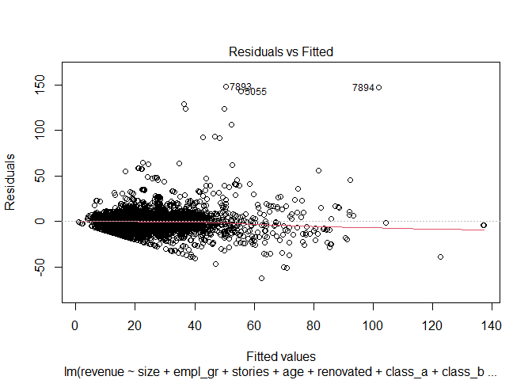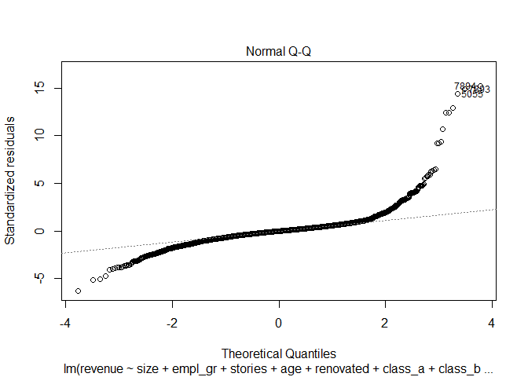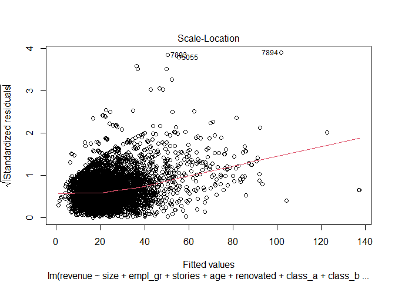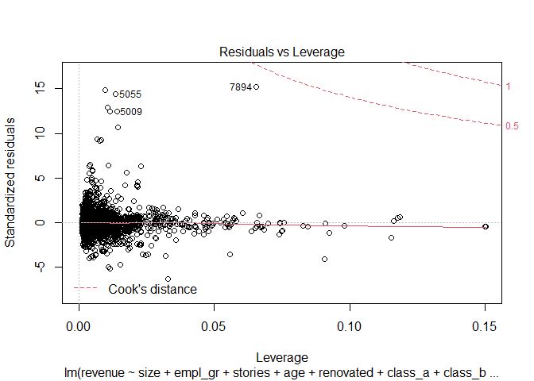

### Then is about the four tree models we learnt from the class

### Model2: Classification and Regression Trees

    ## Call:
    ## rpart(formula = revenue ~ size + empl_gr + stories + age + renovated + 
    ##     class_a + class_b + green_rating + amenities + total_dd_07 + 
    ##     Precipitation + Gas_Costs + Electricity_Costs + City_Market_Rent, 
    ##     data = gb_train)
    ##   n= 6256 
    ## 
    ##           CP nsplit rel error    xerror       xstd
    ## 1 0.30719786      0 1.0000000 1.0002252 0.06150827
    ## 2 0.11183757      1 0.6928021 0.6985889 0.05099277
    ## 3 0.03943215      2 0.5809646 0.5974864 0.04097219
    ## 4 0.03058487      3 0.5415324 0.5636910 0.04087172
    ## 5 0.02324163      4 0.5109476 0.5517198 0.04116988
    ## 6 0.01474224      6 0.4644643 0.5086725 0.03840643
    ## 7 0.01016058      7 0.4497221 0.4884582 0.03854349
    ## 8 0.01000000      8 0.4395615 0.4862437 0.03900535
    ## 
    ## Variable importance
    ##  City_Market_Rent Electricity_Costs     Precipitation       total_dd_07 
    ##                47                13                 9                 8 
    ##              size         Gas_Costs           empl_gr           stories 
    ##                 7                 6                 5                 4 
    ## 
    ## Node number 1: 6256 observations,    complexity param=0.3071979
    ##   mean=24.12245, MSE=243.404 
    ##   left son=2 (4331 obs) right son=3 (1925 obs)
    ##   Primary splits:
    ##       City_Market_Rent  < 32.1625    to the left,  improve=0.30719790, (0 missing)
    ##       Electricity_Costs < 0.0318248  to the left,  improve=0.17376950, (0 missing)
    ##       total_dd_07       < 6279.5     to the right, improve=0.09357581, (0 missing)
    ##       empl_gr           < 1.17       to the right, improve=0.08417575, (0 missing)
    ##       Gas_Costs         < 0.01027147 to the left,  improve=0.07729792, (0 missing)
    ##   Surrogate splits:
    ##       Electricity_Costs < 0.0318248  to the left,  agree=0.764, adj=0.234, (0 split)
    ##       Gas_Costs         < 0.01429911 to the left,  agree=0.734, adj=0.135, (0 split)
    ##       empl_gr           < 1.17       to the right, agree=0.730, adj=0.123, (0 split)
    ##       total_dd_07       < 3056.5     to the right, agree=0.721, adj=0.094, (0 split)
    ##       Precipitation     < 45.64      to the left,  agree=0.717, adj=0.079, (0 split)
    ## 
    ## Node number 2: 4331 observations,    complexity param=0.03943215
    ##   mean=18.35751, MSE=74.27958 
    ##   left son=4 (1585 obs) right son=5 (2746 obs)
    ##   Primary splits:
    ##       City_Market_Rent < 20.2875    to the left,  improve=0.18664540, (0 missing)
    ##       class_a          < 0.5        to the left,  improve=0.09134630, (0 missing)
    ##       age              < 44.5       to the right, improve=0.06478874, (0 missing)
    ##       total_dd_07      < 2191.5     to the right, improve=0.06315229, (0 missing)
    ##       Gas_Costs        < 0.01027147 to the left,  improve=0.05218727, (0 missing)
    ##   Surrogate splits:
    ##       Gas_Costs         < 0.01027147 to the left,  agree=0.747, adj=0.310, (0 split)
    ##       empl_gr           < 3.33       to the right, agree=0.730, adj=0.261, (0 split)
    ##       total_dd_07       < 7178.5     to the right, agree=0.704, adj=0.191, (0 split)
    ##       Precipitation     < 47.815     to the right, agree=0.673, adj=0.107, (0 split)
    ##       Electricity_Costs < 0.02169062 to the left,  agree=0.651, adj=0.046, (0 split)
    ## 
    ## Node number 3: 1925 observations,    complexity param=0.1118376
    ##   mean=37.0928, MSE=380.9089 
    ##   left son=6 (1722 obs) right son=7 (203 obs)
    ##   Primary splits:
    ##       City_Market_Rent  < 51.9       to the left,  improve=0.2322525, (0 missing)
    ##       Electricity_Costs < 0.04163247 to the left,  improve=0.2161865, (0 missing)
    ##       Precipitation     < 47.43      to the left,  improve=0.2161865, (0 missing)
    ##       total_dd_07       < 5906       to the left,  improve=0.1902770, (0 missing)
    ##       size              < 712000     to the left,  improve=0.1685105, (0 missing)
    ##   Surrogate splits:
    ##       Precipitation     < 47.43      to the left,  agree=0.950, adj=0.527, (0 split)
    ##       Electricity_Costs < 0.04163247 to the left,  agree=0.950, adj=0.527, (0 split)
    ##       total_dd_07       < 5906       to the left,  agree=0.941, adj=0.438, (0 split)
    ##       size              < 852020     to the left,  agree=0.899, adj=0.039, (0 split)
    ##       stories           < 54.5       to the left,  agree=0.897, adj=0.025, (0 split)
    ## 
    ## Node number 4: 1585 observations
    ##   mean=13.45658, MSE=40.87382 
    ## 
    ## Node number 5: 2746 observations,    complexity param=0.01016058
    ##   mean=21.18635, MSE=71.69523 
    ##   left son=10 (1869 obs) right son=11 (877 obs)
    ##   Primary splits:
    ##       City_Market_Rent < 26.45      to the left,  improve=0.07858727, (0 missing)
    ##       class_a          < 0.5        to the left,  improve=0.07209602, (0 missing)
    ##       size             < 143345.5   to the left,  improve=0.05779679, (0 missing)
    ##       age              < 44.5       to the right, improve=0.05466292, (0 missing)
    ##       empl_gr          < 2.3        to the left,  improve=0.03145006, (0 missing)
    ##   Surrogate splits:
    ##       Electricity_Costs < 0.01961571 to the right, agree=0.755, adj=0.234, (0 split)
    ##       stories           < 2.5        to the right, agree=0.700, adj=0.060, (0 split)
    ##       Precipitation     < 44.06      to the left,  agree=0.699, adj=0.058, (0 split)
    ##       total_dd_07       < 2507.5     to the right, agree=0.689, adj=0.026, (0 split)
    ##       empl_gr           < 41.46      to the left,  agree=0.686, adj=0.018, (0 split)
    ## 
    ## Node number 6: 1722 observations,    complexity param=0.02324163
    ##   mean=33.86339, MSE=208.8179 
    ##   left son=12 (1314 obs) right son=13 (408 obs)
    ##   Primary splits:
    ##       City_Market_Rent < 41.01      to the left,  improve=0.09623645, (0 missing)
    ##       size             < 36663      to the left,  improve=0.09552202, (0 missing)
    ##       amenities        < 0.5        to the left,  improve=0.09072221, (0 missing)
    ##       stories          < 7.5        to the left,  improve=0.08931592, (0 missing)
    ##       class_a          < 0.5        to the left,  improve=0.08229387, (0 missing)
    ##   Surrogate splits:
    ##       Gas_Costs         < 0.01410661 to the left,  agree=0.836, adj=0.306, (0 split)
    ##       empl_gr           < 1.46       to the right, agree=0.798, adj=0.147, (0 split)
    ##       Precipitation     < 45.64      to the left,  agree=0.798, adj=0.147, (0 split)
    ##       total_dd_07       < 5381.5     to the left,  agree=0.787, adj=0.103, (0 split)
    ##       Electricity_Costs < 0.04163247 to the left,  agree=0.782, adj=0.078, (0 split)
    ## 
    ## Node number 7: 203 observations,    complexity param=0.03058487
    ##   mean=64.48704, MSE=1001.804 
    ##   left son=14 (190 obs) right son=15 (13 obs)
    ##   Primary splits:
    ##       size      < 1191018    to the left,  improve=0.22900890, (0 missing)
    ##       stories   < 31.5       to the left,  improve=0.16753100, (0 missing)
    ##       class_a   < 0.5        to the left,  improve=0.05220736, (0 missing)
    ##       amenities < 0.5        to the left,  improve=0.04216900, (0 missing)
    ##       age       < 38.5       to the right, improve=0.04050264, (0 missing)
    ##   Surrogate splits:
    ##       stories < 44.5       to the left,  agree=0.97, adj=0.538, (0 split)
    ## 
    ## Node number 10: 1869 observations
    ##   mean=19.56036, MSE=62.92407 
    ## 
    ## Node number 11: 877 observations
    ##   mean=24.65153, MSE=72.7459 
    ## 
    ## Node number 12: 1314 observations,    complexity param=0.02324163
    ##   mean=31.36543, MSE=149.7062 
    ##   left son=24 (1305 obs) right son=25 (9 obs)
    ##   Primary splits:
    ##       size      < 1455906    to the left,  improve=0.18390450, (0 missing)
    ##       stories   < 50         to the left,  improve=0.18390450, (0 missing)
    ##       amenities < 0.5        to the left,  improve=0.10502870, (0 missing)
    ##       class_a   < 0.5        to the left,  improve=0.09024628, (0 missing)
    ##       age       < 44.5       to the right, improve=0.06254787, (0 missing)
    ##   Surrogate splits:
    ##       stories < 50         to the left,  agree=1, adj=1, (0 split)
    ## 
    ## Node number 13: 408 observations
    ##   mean=41.9083, MSE=314.3756 
    ## 
    ## Node number 14: 190 observations
    ##   mean=60.52506, MSE=713.5128 
    ## 
    ## Node number 15: 13 observations
    ##   mean=122.3929, MSE=1632.782 
    ## 
    ## Node number 24: 1305 observations,    complexity param=0.01474224
    ##   mean=30.92969, MSE=123.0172 
    ##   left son=48 (239 obs) right son=49 (1066 obs)
    ##   Primary splits:
    ##       size      < 27405.5    to the left,  improve=0.13983370, (0 missing)
    ##       stories   < 8.5        to the left,  improve=0.11383300, (0 missing)
    ##       amenities < 0.5        to the left,  improve=0.09963285, (0 missing)
    ##       class_a   < 0.5        to the left,  improve=0.08016976, (0 missing)
    ##       age       < 44.5       to the right, improve=0.05893945, (0 missing)
    ##   Surrogate splits:
    ##       stories < 2.5        to the left,  agree=0.841, adj=0.134, (0 split)
    ##       age     < 99.5       to the right, agree=0.828, adj=0.063, (0 split)
    ## 
    ## Node number 25: 9 observations
    ##   mean=94.54842, MSE=2.019484e-28 
    ## 
    ## Node number 48: 239 observations
    ##   mean=22.17041, MSE=117.8332 
    ## 
    ## Node number 49: 1066 observations
    ##   mean=32.89354, MSE=103.1208

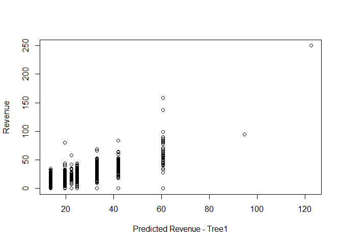

### model3: bagging method

    ##        Length Class      Mode   
    ## y      6256   -none-     numeric
    ## X        14   data.frame list   
    ## mtrees  150   -none-     list   
    ## OOB       1   -none-     logical
    ## comb      1   -none-     logical
    ## err       1   -none-     numeric
    ## call      6   -none-     call

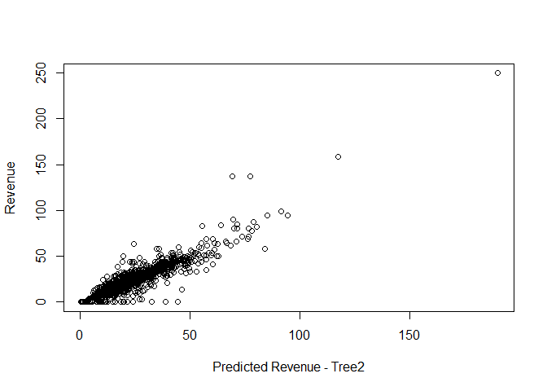

### model4: random forests method

    ##                 Length Class  Mode     
    ## call               4   -none- call     
    ## type               1   -none- character
    ## predicted       6256   -none- numeric  
    ## mse              500   -none- numeric  
    ## rsq              500   -none- numeric  
    ## oob.times       6256   -none- numeric  
    ## importance        28   -none- numeric  
    ## importanceSD      14   -none- numeric  
    ## localImportance    0   -none- NULL     
    ## proximity          0   -none- NULL     
    ## ntree              1   -none- numeric  
    ## mtry               1   -none- numeric  
    ## forest            11   -none- list     
    ## coefs              0   -none- NULL     
    ## y               6256   -none- numeric  
    ## test               0   -none- NULL     
    ## inbag              0   -none- NULL     
    ## terms              3   terms  call

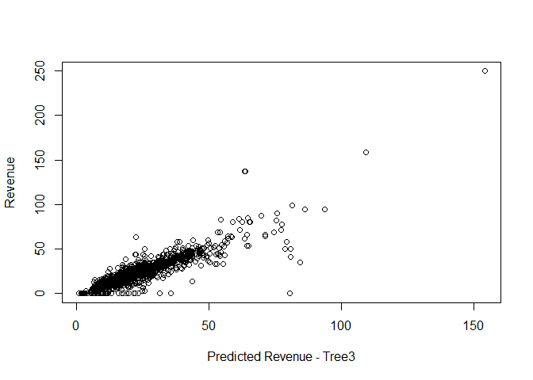

### model5: boosting method

    ## Distribution not specified, assuming gaussian ...

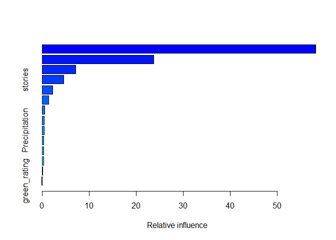

    ##                                 var     rel.inf
    ## City_Market_Rent   City_Market_Rent 58.20025577
    ## size                           size 23.71891378
    ## age                             age  7.12309494
    ## stories                     stories  4.55162369
    ## Electricity_Costs Electricity_Costs  2.25009909
    ## class_a                     class_a  1.39925558
    ## renovated                 renovated  0.54765632
    ## amenities                 amenities  0.49241494
    ## Precipitation         Precipitation  0.47070696
    ## Gas_Costs                 Gas_Costs  0.37233020
    ## class_b                     class_b  0.32361056
    ## empl_gr                     empl_gr  0.30190110
    ## total_dd_07             total_dd_07  0.17454482
    ## green_rating           green_rating  0.07359225

### After finishing all the prediction, we can now compare the result they generated. In this situation,we choose to compare the rsme comparing the rmse.

    ## [1] 10.0832

    ## [1] 10.4986

    ## [1] 6.313627

    ## [1] 7.252892

    ## [1] 9.030609

### From the result we know that Tree2 and Tree3 generate the smallest. Therefore, bagging and random forest may be the best model.

### Now lets using k-fold cross-validation standard error to make the final choice confirming the best model.

    ## Random Forest 
    ## 
    ## 7820 samples
    ##   14 predictor
    ## 
    ## No pre-processing
    ## Resampling: Cross-Validated (10 fold) 
    ## Summary of sample sizes: 7037, 7038, 7039, 7038, 7038, 7039, ... 
    ## Resampling results across tuning parameters:
    ## 
    ##   mtry  RMSE      Rsquared   MAE     
    ##    2    8.321246  0.7262783  4.755493
    ##    8    6.872231  0.8075781  3.390367
    ##   14    6.937188  0.8032005  3.456322
    ## 
    ## RMSE was used to select the optimal model using the smallest value.
    ## The final value used for the model was mtry = 8.

    ## Bagged CART 
    ## 
    ## 7820 samples
    ##   14 predictor
    ## 
    ## No pre-processing
    ## Resampling: Cross-Validated (10 fold) 
    ## Summary of sample sizes: 7038, 7038, 7038, 7039, 7037, 7039, ... 
    ## Resampling results:
    ## 
    ##   RMSE      Rsquared   MAE     
    ##   10.18796  0.5749803  6.369928

### From the results shown above, we got to know that the least RMSE lies when mtry = 8 and using the random forest model. In this way, we can create the best prediction model:

    ## 
    ## Call:
    ##  randomForest(formula = revenue ~ size + empl_gr + stories + age +      renovated + class_a + class_b + green_rating + amenities +      total_dd_07 + Precipitation + Gas_Costs + Electricity_Costs +      City_Market_Rent, data = greenbuildings, mtry = 8, importance = TRUE) 
    ##                Type of random forest: regression
    ##                      Number of trees: 500
    ## No. of variables tried at each split: 8
    ## 
    ##           Mean of squared residuals: 46.32738
    ##                     % Var explained: 80.98

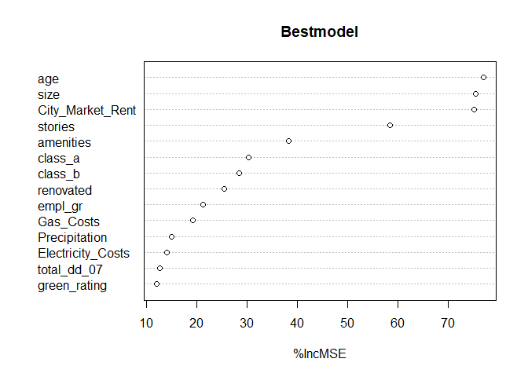

### Then we create a plot using greenrating vairable and revenue to get an idea of the partial influences between the two.

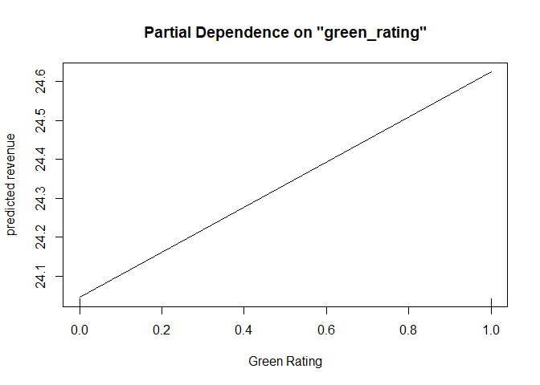

### From the picture, we know that the the average change in rental income per square foot associated with green certification, holding other features of the building constant is 0.5.

### Conclusion:

### Among the five models we used to do the prediction, the best model we can choose is the Random Forest prediction model.Also, the partial influence we get above tells us that green certification has a positive influence on the rental revenue.

# Problem 4 - Predictive model building: California housing

### About this problem, our idea is to find the best prediction model first, using the same method as problem3(4 different Tree models). Then pick out the best model and do the ploting.

### Just like problem3, we will use four different tree models to pick out the best prediction model

    ## Distribution not specified, assuming gaussian ...

### Now we have created four models. The next step is to find out which one is better.We’ll checking the rmse outcome of them.

    ## [1] 76186.81

    ## [1] 49316.66

    ## [1] 51127.23

    ## [1] 51708.96

### From the result shown above, we know that model2 has the least rmse. we will now set it as the best prediction model.

### Now we are going to plot the pictures as required

### plot1 - original data

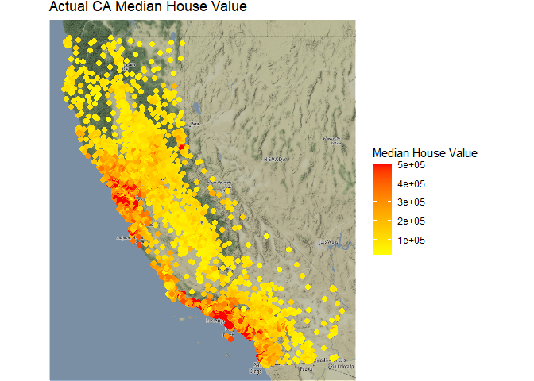
\#\#\# From this picture, we can have a rough idea of what is the median
value distribution of CA houses.The original data tells us that mid-west
and southwest parts have relatively higher price.

### plot2 - predicted data

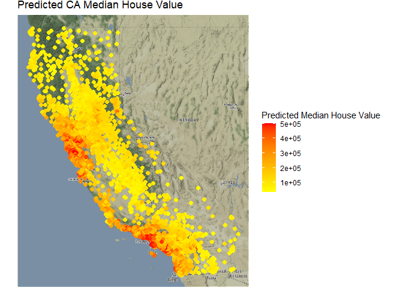

### The second picture uses that predicted data to present the distribution of CA house’ median value. It looks very similar to the first picture. That is the mid-west and southwest parts have relatively higher price.

### plot3 - residuals data

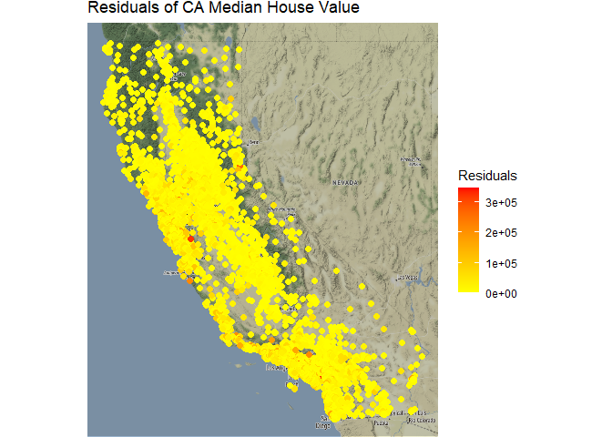

### The last picture shows us the residual distribution. As all the points shown on the map tend to be “yellow”, it means that the residuals are mostly very small. That is to say, our prediction model is a good fit to present the median value of California’s Housing Situation.
